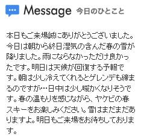
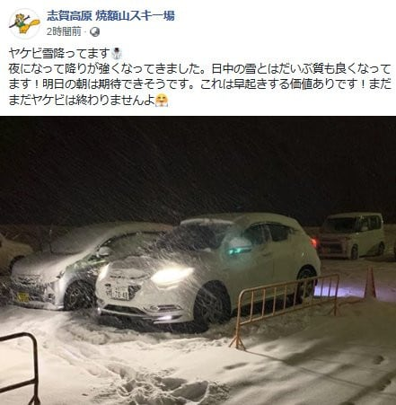
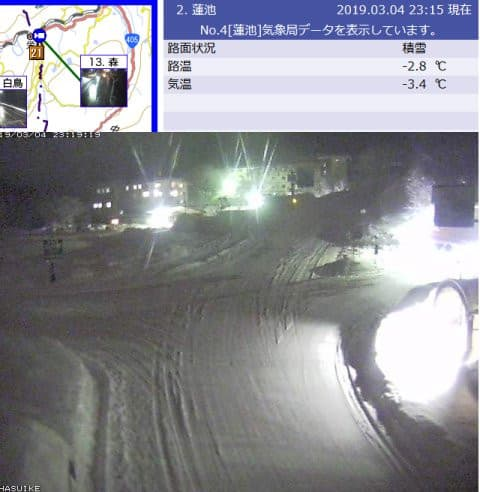
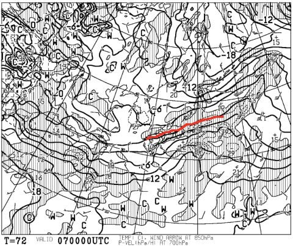
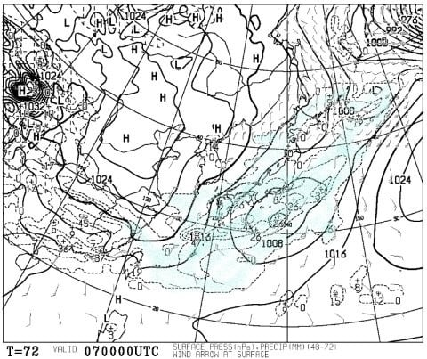
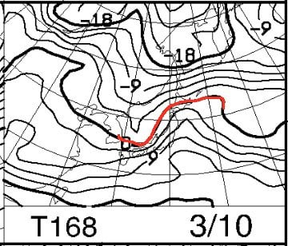
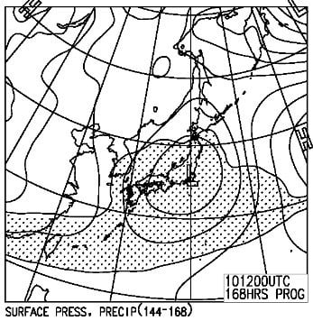
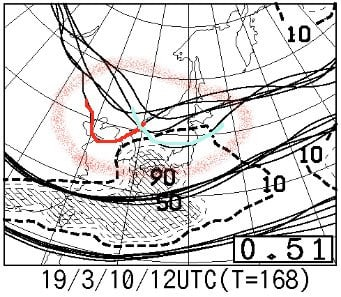

# これから一週間，スキー場に雪は積もるのか？それとも壊滅的な雨が降るのか？そして，週末の天気は？？…志賀高原詳細レポートはまた明日やります

📅 投稿日時: 2019-03-05 00:10:33

🏷️ カテゴリ: [スキー天気予想](c6554f5c3c106093b511a8daae23757e8.md)

ってなことで．

液体が空から降ってくるのでは…？？

と，心配していた本日月曜ですが．

そうです．

私の全身全霊の冷え冷え踊り

のおかげで．

焼額山では，空から降ってきたのは

液体ではなく．

雪だったようです…！！

（[焼額山HP](http://www2.princehotels.co.jp/ski/shiga/)より）

かなり重い雪だったようですが…

でも，液体よりはマシ！！

いや．

先週の天気図を見ると．

絶対に雨

としか思えない天気図だったのに．

雪になってくれたのは．

…そうです．

繰り返しますが，

私の全身全霊の冷え冷え踊りのおかげです！！←違うから

ふはははは！

見よ，霊験あらたかな，冷え冷え踊りの

効果をっ！！←絶対違うから

で．

志賀高原．

本日月曜の夜．

なんと，かなりの雪が

積もってるようです！

（[焼額山FB](https://www.facebook.com/yakebitaiyama/posts/2069520346476634)より）

深夜になっても，結構な

雪が降っているようで…

（[北信建設事務所HP](http://hokushin-camera.org/)より）

で．さらに．

明日は朝には晴れてきそうなので．

…もしかすると．

明日は結構いいコンディションに

なるんじゃないだろうか…？？

すごいぞ，冷え冷え踊り！←だから，あなたが踊ったから雪になったんじゃないから

そして．

3月7日の木曜は．

850hpaの0℃線も志賀より南にあるし…

そして，降水域も志賀高原に

かかっているので．

7日の木曜も，そこそこ雪が降って，

積もってくれるかも…！？？

で．金曜，土曜と晴れそうで…

さらに金曜は，晴れた上に気温も

それほど上がらなさそうなので．

…結構いいコンディションになりそう！

とりあえず．

ここまではいい感じ．

ここまでは…

ただ，10日の日曜の天気図は．

…相変わらず，0℃線が志賀高原より

北にあって…

そして．

降水域も日本全国を覆っているので．

10日日曜．

このままの天気図なら，志賀でも

液体が降ってきそうな，

ヤバい感じ…

でも．

10日の500hpa特定高度線ばらつきを見ると．

どうやら，初期値鋭敏性が高い領域に

入っているようで．

赤く囲った，5400m線の予想ばらつきが

非常に大きいのだ…！！

5400m線が，これらのうちのどれが

当たるのか，まだ分からない状況なので．

まだ，日曜の天気図の予想精度は，

異常に低い状況なのだ…っ！！

この，5400m線が．

赤線のところに来るか，

青線のところに来るかで．

低気圧の接近タイミングが，

丸1日以上ずれてしまう状況で．

…左側の赤線の位置なら．

低気圧の通過は11日の月曜になりそうで．

その場合，10日は晴れるはず！

ってことなので．

予想がこんなにばらついている日曜は．

アンサンブル平均の地上天気図を

見ても，役に立たないのだ．

この通りの天気図になることは，

まずないのだ！！

つまり．

10日の日曜日，まだ液体が降る

とは限らない．

まだ，分からない．

…だもんで．

引き続き．

空から液体が降ってこないように，

わたしが全身全霊を込めて祈り，

踊り続けますので．

きっと，今週も．

土日はいい天気になるはず！！！←あなたが志賀高原の天気を決めてるんじゃないから…

…なんだか．

日曜志賀高原詳細レポート記事の

前フリのつもりで書いてたんだけど．

ここまでで，普通のBlog記事の

長さくらいになっちゃいましたね…

（そして，ここまで書くのに一時間近く

　かかってしまった（涙））

ってなわけで．

すみません．

日曜の志賀高原詳細レポートは，

また明日にやります…

明日をお楽しみに！

## 💬 コメント一覧

### 💬 コメント by (地元民)
**タイトル**: 志賀はガスの中でした
**投稿日**: 2019-03-05 00:52:19

雪でしたか。おめでとうございます。

里から見たら、１２００ｍ位から上がガスの中だったので、「雪かもな～」とは思ってました。

夜はおおむね８００ｍ位から上が雪みたいですよ。

スキーっ子だった＆気象マニアにとって、おもしろいは～、このブログ。更新大変でしょうが、頑張ってくださいね～。

### 💬 コメント by (Skier_S)
**タイトル**: 地元民さま
**投稿日**: 2019-03-05 01:00:44

かなり重い湿った雪でしたが…

なんとか雪だったようです！

しかし，地元民さまも気象マニアなんですね…

更新頑張りますので，これからも読んでやってください～！

### 💬 コメント by (tatskl)
**タイトル**: 為になる天気情報ありがとうございます
**投稿日**: 2019-03-05 08:06:55

日曜の朝，第1ゴンドラ山頂でお声掛けさせていただいた者です。

（昨年，あさま2000でお声掛けさせていただいた者です。）

突然のお声掛け失礼いたしました。

今シーズン初の志賀で，またお会いするとは思ってなかったのですが，

お見かけしたのでお声掛けしてしましました。

実は，今シーズン初で志賀に来たのは，

他のスキー場の気温が高そうなので，避難してきた次第です。

日曜も，ゲレンデ状態は今の気候を考慮すれば良い方ですし，

3時ごろ少し降ってきましたが（奥志賀にいました），

それが雨ではなく雪だったのが，さすがだと思いました。

（でも，寺子屋はすごく残念な状態でした←クローズ早そう）

昨日も，志賀高原はなんとか雪だった様で，

少しでもシーズンが長くなるよう願うばかりです。

（このブログ的には踊る！べきなのか？？）

### 💬 コメント by (Skier_S)
**タイトル**: tatsklさま
**投稿日**: 2019-03-06 01:34:14

コメントありがとうございます～！

初志賀で，見事発見されましたね(笑)．

今シーズン，他のスキー場はかなり悲惨ですが．

志賀はまだマシな方だと思います．

夕方に降ったのも雪だったので，良かったですね…（安堵）

とりあえず，これからも冷え冷えで雪が積もってくれるよう．

踊り続けてください…！

今シーズン，これからもまた雪のいい志賀へお越しください～

その際はまたお会いしましょう！

