# 子連れコモドダイビングクルーズagain　その19　コモドドラゴン登場！

📅 投稿日時: 2011-09-17 02:20:59

ちょっと残念な感じのダイビングを終えて．

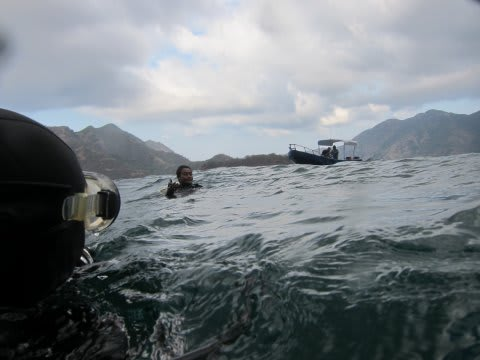

エグジット後．本船に戻ると

娘はなんだかゴキゲンで留守番しててくれましたね．

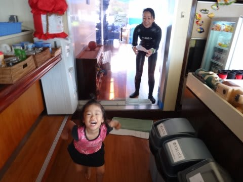

で．ダイビング後のシャワーを浴びていると．

リンチャ島の海岸に，いる．

あいつが．

海岸に堂々と出てきている！

というので，みんなで見ていると．

2匹．います．

そう．

コモドドラゴン様の登場です．

ボート出すよ～！

ということで，急遽ドラゴン見物へ出発．

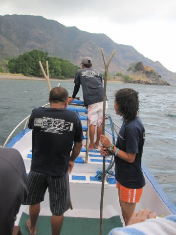

あー．

ガイドが手にしている棒は，いざというときにドラゴンを

追い払うための棒です．

んで．

最初は2匹だったけど…

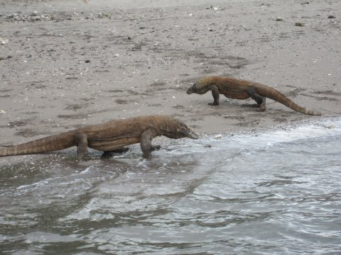

しばらく眺めていると，あと2匹登場．

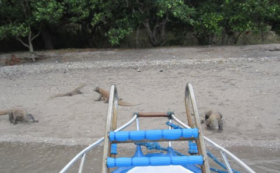

トータル4匹のドラゴンがボートの周りをうろついてます…

うーむ．あさって，コモドドラゴン見物のために上陸予定だけど．

そのときより，じっくりドラゴンが見れるかも…

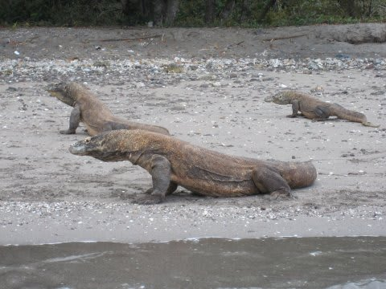

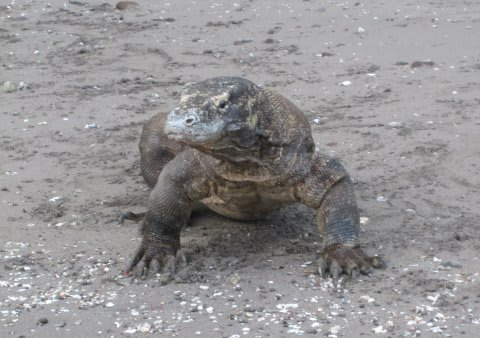

それに，海辺で水につかるドラゴンってのも，めったに見れるものじゃないかも．

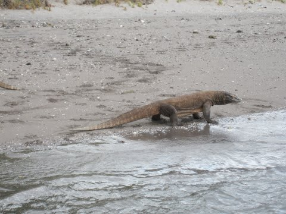

たっぷりドラゴン見物を満喫！

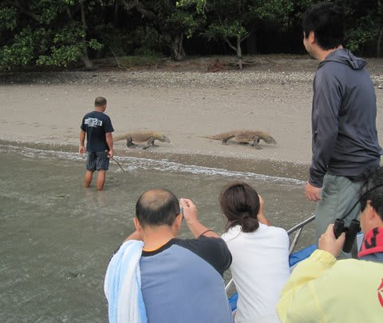

本船に戻ると…

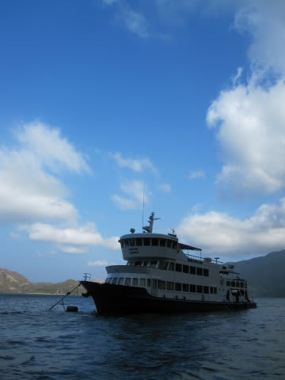

予期せぬドラゴン見物で，本来の朝ごはんより30分以上遅れての朝ごはん．

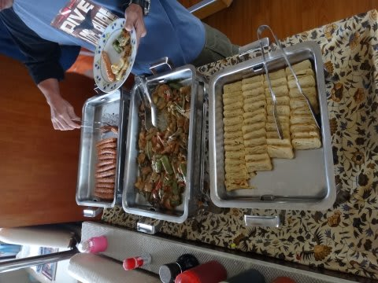

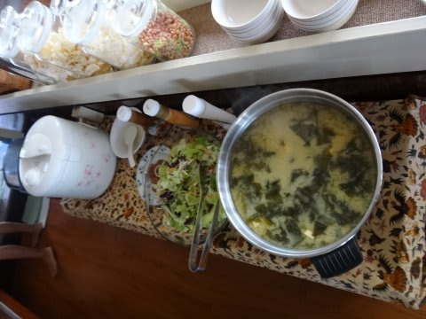

…今日はご飯と味噌汁．

うちの娘にも嬉しい，和食の朝ごはんですね．

食後は，2本目までしばし休憩タイム．

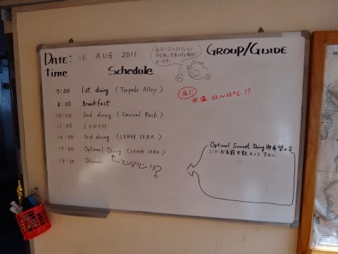

しかし，コモドドラゴン見物があったから，あんまり時間は無いですが…

ほんと，このクルーズって盛りだくさんなんだよなぁ…
