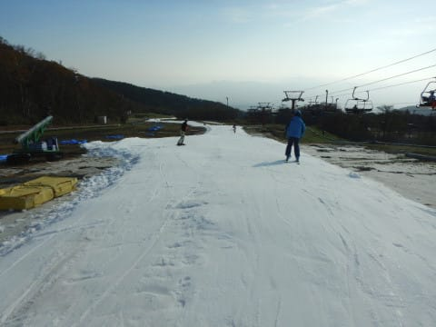
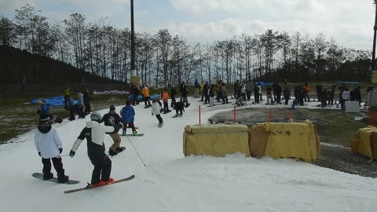

# 2019/11/2(土)，2020シーズンオープン1週間後，3連休初日のイエティは…昼間は結構空いてたよ！午後は雪は荒れたけど（涙）ナイターは激込み

📅 投稿日時: 2019-11-03 00:56:21

えー．

本日，行ってまいりました．

今シーズン2回目のYetiへ…

まだ，シーズンインから1週間ですが．

今シーズンはイエティのオープンが遅かった

ので，早くも11月なんですね…

あぁ…あとひと月ちょいで志賀高原の

シーズンが始まるのか！！

ってなことで．

本日のイエティのレポートに行きます～！

えー．

まず．

本日．

東名の集中工事で，大井松田インターから先の，

右ルートー左ルート分岐．

左ルートが東名集中工事による

通行止めのため．

朝6時から東名下りが渋滞（涙）

なんてこった…っ！！

この渋滞のおかげで…

こんなすっきり晴天の朝なのに．

営業開始に遅れてしまい．

屈辱っ！！

ってなことで．

8時営業開始なのに．

Yetiに到着したのは8時10分過ぎ（涙）

リフト券売り場の行列ももう終わって

います…

とりあえず．

本日の気温は+5℃と，

そこそこの冷え込み．

日が射すと暖かいけど，

日が陰るとウエアのジャケット無しだと

かなり厳しい寒さ．

11月ですね～！

てなことで．

営業開始に10分ちょい出遅れたけど．

朝日が射す，そこそこ冷えたゲレンデへ！

朝のうちは，適度な柔らかさの雪で，

さらにコース幅も先週よりはちょいと

広がった感じで．

人も少なく，気持ちよく飛ばせる，

この時期に滑れるコンディションとしては

最高級に近いレベル！

朝のうちは，ホントに人も少なく．

そのせいでゲレンデもそれほど

荒れておらず．

コース幅から大回りとは言えないまでも．

そこそこの幅を取ったターンができるよ！！

朝9時ぐらいまでは，リフトもほとんど

待ちが無いし．

フラットで，この時期のイエティとしては（←強調しておくところ）

人が少なめで．

いい感じで滑れますね～！！

いや…

シーズンイン2回目というのに．

早くも，何も考えずにひたすらに

自由落下するモードに突入して

しまいました…！

…が．

こんなシアワセな時間は，いつか

終わりが来るもの．

今日はなぜか混み始めが遅く，

9時半過ぎまでの1時間半という

比較的長い時間，シアワセタイムが

続きましたが．

9時半を過ぎると，ちょっとリフト待ちが出てきて…

コース上の人口密度も上がっていきます（涙）

…10時ごろになると．

もう，好きなラインを取ることは

不可能ですね（泣）

そして．

リフト待ちも伸びてきましたね…（涙）

とはいえ．

今日の混雑は先週日曜ほどじゃなく．

さらには，10時過ぎにはクワッドリフトに

並行してかかるペアリフトも運転し始めたので．

（ほとんど誰も乗ってなかったけど…）

今日のリフト待ちのピークは，

11時半ごろのこの程度．

大体平均的に，この程度の

リフト待ちだったでしょうか…

この時期のイエティとしては（←強調しておくところ）

リフト待ちが少なかったですね～！

そして．

今日は昼前には太陽が隠れてくれて．

そのおかげで，雪がひどくドロドロに

溶けちゃくこともなく．

板は比較的滑る雪だったのですが…

でも．

ゲレンデは，途中に雪の薄いところがあって．

昼ごろには…

うーん．

ちょっとところどころ，茶色く

なってきましたね…（涙）

そして．

午後になると．

茶色い部分が広がっていき…

ゲレンデのところどころ，穴が

開いてきました（泣）

午後2時ごろになると．

ゲレンデに空いた穴と，

午後のゲレンデ整備のための

雪山で，まともに滑れるコースが

あんまりない感じになってきます…（涙）

16時のゲレンデ整備開始に向けて，

コース上に作った雪山が成長して，

コースに広がってくるので．

コース幅がかなり狭くなってきて．

ネットの横，わずかを通らなくては

ならないようになり…

その部分も，かなりヤバい感じに

なってきて．

最後は，コース幅いっぱいに土が

出始める，かなり危険な部分も

ありましたが…

ヤバい部分以外は，まぁこんな感じで．

決してコースの最初から最後まで，

全てがヤバい感じじゃないので，

そこはご安心を…

ってな感じで．

16時になると，一旦コースクローズして，

圧雪車整備が入るので．

シマシママニアの私としては，

当然のごとく，17時からの

コースオープンのシマシマを狙って

コース入り口に並ぶわけで．

…そして，今日は予定通りの17時に，

コースオープン！！

先週と違い，ポールポジションは

とれなかったものの．

圧雪車かけたての，いい感じに板が

食い込むシマシマバーンに飛び込む！

人も前には1-2人しかおらず，

気持ちよくかっ飛ばせるフラットバーンの

1本！！

…あぁ…

この1本だけでも，今日来た甲斐が

有ろうというもの…

…という，快感の1本が終わったら．

今日はどうやら，昼間よりナイターの方が

人が多いみたいで…

2本目以降は，あっという間にコースも荒れて．

人口密度も昼間より高く…

…そして，なぜかリフト待ちも，昼間より

長いんですが（泣）

ってなことで．

ナイター開始1時間ほどで，まだまだこれより

リフト待ちが長く伸びそうな気配だったので．

本日は18時ごろに切り上げました…

ってな感じで．

昼間は意外と，先週より混まず．

さらに午前中は雪もそれほどひどくなく，

結構楽しめた，3連休初日のYetiでした～！

…明日の日曜は，混むんだろうなぁ…

## 💬 コメント一覧

### 💬 コメント by (musi)
**タイトル**: Unknown
**投稿日**: 2019-11-03 14:26:16

こんにちは。musi一家は軽井沢プリンスの、長野県スキー開き？イベントに参加して来ました。四、五本滑ると足取られるくらいの雪面の穴が開いて来たのと、並びが面倒で、早めに切り上げて、各スキー場さんの、ガラポンを回って温泉入って帰って来ました。今年は、クジ運に恵まれず、車山高原のリフト券くらいしか、収穫はなく、期待値の高い志賀高原ブースでは、饅頭とティッシュしか当たりませんでした。

そうそう、あと、Sさんにご報告なのですが、ウチの奥様がゲットした、長野県のスキー場共通シーズン券の裏には、各スキー場のシーズン終了まで有効と記載されてました、これは？なかなか当選しないけど、Sさんにも利用価値あり？では。

### 💬 コメント by (Skier_S)
**タイトル**: ＞musiさま
**投稿日**: 2019-11-04 13:51:17

軽井沢行ってこられたのですね！

軽井沢にしては混んでなかったと聞いています．

長野県スキー場共通シーズン券，シーズン終了までなんですね！

3月末までだったらあまりうれしくないですが，

シーズン終了までなら価値はありますね…！

