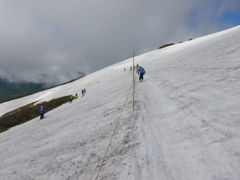

# 6月17日（日）月山で夏スキー！詳細その１…リフト降り場からは歩くけど，乗り場へは朝は滑っていけたよ

📅 投稿日時: 2018-06-20 04:46:44

ということで．

日曜に24時間以上起き続けていた反動で．

月曜は死ぬほど眠く．

仕事から帰宅後，死んだように寝てました…

Blog記事は書けなかったけど…

仕事中に寝なかっただけ，偉い！←それが普通だから

ということで．

ちょっと遅くなりましたが．

日曜の月山の詳細レポート！

長くなりそうなので，2日に渡って連載です…

…ってなわけで．

まず．

日曜の朝イチ．

月山に近づきますが…

うーむ．

月山，雲の中に隠れてますね…

ガスってなきゃいいけど…

駐車場に到着し，ゲレンデに向かいますが…

もう，リフト乗り場までの道はずっと

舗装路が出てますね…

雪が多い年は，まだこのあたり，

雪の上を歩くんですけど…

今年は雪が少ないようですね（涙）

で．

沢コースが滑れなくなっているので．

本日滑れるのは大斜面とTバーのみに

なっちゃってます…

うーむ．

去年は6月18日でも，[まだ沢コースが余裕で
滑れた](d20170621.md)のに…

今年は雪が少ないのね（泣）．

だのに．

リフト券は割引が無く．

一日券4600円ですか…（涙）

いつもなら，そろそろリフト券が

割引になる時期ですが．

今シーズンは，月曜から割引になるようで，

今日までは正規料金なのね…

ってことで．

リフト乗り場へ向かいますが…

あれ？？

まだ，リフト乗り場に滑りこめるようです！

普通なら，沢コースが滑れなくなる時には，

このリフト乗り場への雪も途切れて．

[リフト乗り場からはるか離れたところから，
かなり歩かないとリフトに乗れない](e0aebce3e150fe9b0eecf8c9628728fd4.md)ように

なっちゃうのですが…

今年はまだ，リフト乗り場に滑りこめるのか！

リフトは，夏仕様の低い位置に

架けかわってます．

当然，もう板を履いてはリフトに

乗れません…

で，リフト降り場へやってきますが…

…リフト乗り場はリフトまでぎりぎり

滑りこめましたが．

リフト降り場の方は，リフトを降りてから

矢印部分まで歩かないとゲレンデまで

たどり着けない，最終夏仕様になってますね…

えっちらおっちらと…

こんな感じで，足場が悪いところを

歩くこと，数分間．

やっと雪があるゲレンデにたどり着けます…

上から見ると，リフト降り場からこれだけ

歩かないとゲレンデに出れないので．

リフトを降りてから，ゲレンデに出るまでに

かなり体力を消耗します…

でも．

雪があるところにたどり着いても．

まだ気持ちよく滑れるわけでは無いのだ！

沢コースがあれば，ここからすぐに

滑り出せるんだけど．

沢コースが終了し．

大斜面しか滑れない本日．

ここからまだ，修行（？）は続くのだ！

ここから大斜面までは，こんな感じの

かなり長いトラバースラインを，

ストックでえいこらえいこら漕ぐこと数分間．

やっと大斜面上部に到着！

リフトを降りてから，まともに滑れる

大斜面まで，10分近くかかります…（涙）

でも．

大斜面はまだまだ雪がたっぷりありますね～！

大斜面の中間点から下は，完全コブ斜面．

一番狭い部分でもこのくらいのコース幅が

あるので．

大斜面はもうしばらく大丈夫そうですね…

ってことで．

大斜面を滑り終え，リフト乗り場に向かいますが…

うむ？？

矢印部分，ヤバそうな感じ…

この部分

これは…

ヤバそう．

朝イチでこれだから，

昼ごろには切れちゃうかも？？

この部分の先も，もうヤバ気な

感じで…

最後のリフトの直前．

もう，かなり藪が出始めてきてて…

うむ．

滑れるのは右側30cmだけか…

今は何とか，リフト乗り場直前まで

滑りこめるけど．

これは，午後はどうなることやら…？

…ってあたりで．

ちょっと長くなったし．

もうご無体時間なので…（泣）

明日，その2へ続きます．
