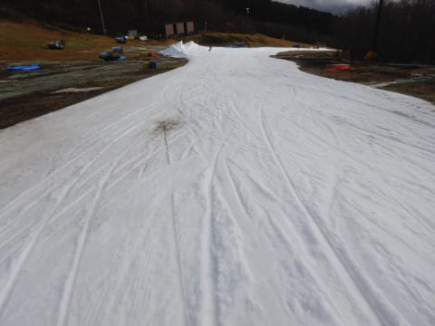
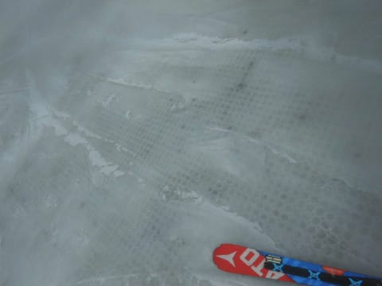
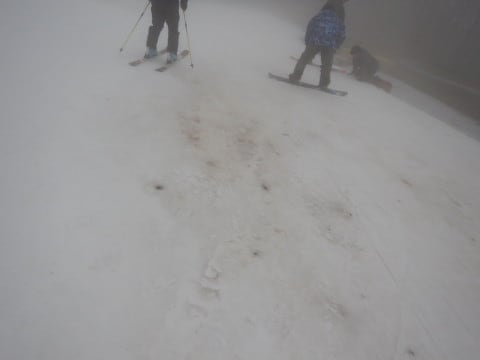

# 2019/11/24(日)のイエティの詳細レポート！…朝は曇り時々雨．午後はガス（涙）結構混んで，ゲレンデ荒れ荒れ（泣）

📅 投稿日時: 2019-11-26 00:28:41

ということで．

ひどい高温＆雨に悩まされ，

雪が消えてしまったこの週末でしたが．

本日，26日(火）はちょいと冷えるものの．

人工降雪機が動かせるかどうか微妙なレベル…

そして，27日(水）はまた気温が上がって，

人工降雪は無理と．

この2日間，ゲレンデ状況の回復は望めそうも

ありませんが…

…ですが．

来ます．

28日から，来ます．

28日～30日まで，平年より4～8℃

気温が低い日がやってきます！

…ただ．

冷えるものの，雪はそんなに

降らなさそうなので．

今回も人工降雪機頼みです…

とりあえず，28～30日の冷え込みに期待！！！

ってなところで．

本日は，昨日速報＆動画を掲載した，

日曜のイエティのゲレンデレポートを

お送りします！

…えー．

まず，この日．

朝8時までかなり激しく降っていた雨が，

ちょうどリフト営業開始と同時に止み．

うはははは！

私が滑り始める朝8時のリフト開始

と同時に雨が止むとは！

これは，私の日ごろの行いがいいからに

他ならない！←いつも言ってるけど，違うから．完全に間違えてるから

ってなことで．うっすら太陽も見えるなか，

1本目のゲレンデへ！

あさイチは，人も少なくて，

うっすら日も射して，

雪も結構滑っていい感じだったけど…

でも．

オールナイト営業明けのこの日．

ちょっと朝イチから，ゲレンデは

もう荒れ気味なんですけど？？

そして，すでにうっすら茶色く

なりかけてるところもあるんですけど？？

そして，最後の急斜面は，朝イチから

もう凸凹なんですけど！？？

それでも，あさイチはコースは

人が少なくて，まだマシだったものの．

うーむ．

ゲレンデが予想以上に荒れている…（涙）

昨日の雨で，かなり雪がやられたみたいで，

もう，朝イチからゲレンデのところどころ，

雪が薄くなってます（泣）

先週はもっとましだったのに…

…しかし，あさイチでこれって，

午後はヤバいのでは…？？

ところどころ，コース幅も狭くなってます（涙）

とはいえ．

朝のうちは，雨も降っておらず．

リフト待ちも少なく，

グルグル滑ってられたので

ゲレンデ状況が多少悪くても，

まだ良かったものの…

営業開始から1時間．

朝9時を過ぎてくると…

うむ．

コース上に，人が増えてきましたね（涙）

10時ごろになると…

うむ．

コース上の人口密度，

かなり厳しい状態になってきましたね（泣）

そして，小雨も降ってきたうえに…

リフト待ちまで長くなって

きたんですが…（涙）

ダメだ…

なんだか，ちょっとダメな感じ…

そうこうしているうちに．

10時半ごろには，雨が本降りに

なってきました（激涙）

レインウェアを着てないと

厳しいレベルだったので．

その一瞬はリフト待ちが短く

なりましたが…

しかし，雨も20分ほどで止み．

11時前には，また日が射すほどに

晴れてきたので．

また，ゲレンデの人が増えてきて…

なんだか，コース上はすごい人口密度に

なった上に…

リフト待ちも伸びてきました（泣）

ただ，このタイミングで，並行して

かかる青のペアリフトが運転開始して

くれたので．

クワッドリフトの待ちは，これ以上

ひどく伸びることは無く．

最大でこのくらい，5分程度の

待ち時間だったのが救いか…

ペアリフトの待ちは，終日

待ちゼロでしたよ～！

…ってなことで．

雨が止んだ午後．

なぜか先週よりリフト待ちは

伸びたものの，壊滅的な

待ち時間にはならずにすんだものの．

…しかし．

コース上の人口密度は…

うむ．

楽しくないレベルですね（涙）

そして．

さらに追い打ち．

午後1時ごろには．

この混んでいるゲレンデ全体，

ガスがかかり始めました…（泣）

この，ただでさえ見えにくいゲレンデ．

リフトを降りてすぐは，雪も

かなり薄くなってたし…

ところどころ完全に穴が開いて，

下の土が表れてきてたり…

コース上，かなりヤバい状況に

なってきました（涙）

さらには，全く見えない凸凹に足元を

取られたりして，かなりエキサイティングな

状況なんですが…（激涙）

なんにしろ，午後2時にナイター照明が

点灯してしまうほどのガスの濃さ（泣）

このひどいコンディションのおかげで，

リフト待ちは幾分マシになったものの．

ゲレンデコンディションは，

ガスで見えない中．

人口密度が高く，

雪も薄く，

見えない凸凹がある，

かなり楽しくない状況で．

この日は用事があったこともあり，

午後2時過ぎには退散したのでした…

いや．

この日は，用事があって早く帰らなきゃ

いけない日だったから．

私がゲレンデに悔いを残さないよう，

後ろ髪ひかれることなく帰れるよう，

きっと神様が，私の帰る頃になって，

天気を悪くしてくれたに違いない…

と，自分に都合よく解釈して，

帰路についたのでした…

でも，ホントに．

天気も良く，ゲレンデコンディションも

良いのに帰らなきゃならないとなると，

たぶん暴れてた．

おそらく，「帰りたくない～！！」と

転がり回っていたことでしょう．

悔いなく帰れる天気にしてくれた神様に

感謝…っ！！←すごい自分に都合のいい解釈をしてないかい？？

## 💬 コメント一覧

### 💬 コメント by (naoちゃんねる)
**タイトル**: Unknown
**投稿日**: 2019-11-26 17:28:22

yetiも散々だったようですね…😢

友人に聞いたところ、軽井沢はリフト待ち40分までいった様ですし、私達の行った鹿沢も午前中はリフト待ち15分位まで行きました。

リフト降り場は土の上を滑る事になったし…お昼過ぎはこの時期なのに気温があがり過ぎて妖怪板掴みがおでましに…😢

13時にはリフト待ちはほぼ無くなりましたが、楽しくないので低学年組と親父組はやめちゃいました(涙)

それなのに高学年の二人は帰るぞと止めるまでいつまでも滑っていました。

リフト待ちがゼロになったので、楽しくなってきたそうです(笑)

スキーに必要なのはSさんのようにポジティブシンキングなんですねぇ…😩

### 💬 コメント by (BOB)
**タイトル**: Unknown
**投稿日**: 2019-11-26 21:29:15

はじめまして〜昨年から拝見しております。

24日はナイターでイエティ行きましたがガラガラでしたよ。なんで？と思いましたが昼はこんなに悲惨な状況だったのですね。。

### 💬 コメント by (Skier_S)
**タイトル**: 今週末，スキー場オープンしてくれるかなぁ…
**投稿日**: 2019-11-27 01:44:05

＞naoちゃんねるさま

Yetiもひどかったですが…

まぁ，他のスキー場よりはマシだった気がします．

しかし，高学年2人組，すごいですね…

今シーズンはゴールド達成かも！？？？

＞BOBさま

始めまして～！！

コメントありがとうございます～！！！

24日のナイター，ガラガラだったんですね…

視界や雪のコンディションは良かったんでしょうか？？

うーむ．

昼間があまりにも残念すぎたので…

またこれからもコメントよろしくお願いします～！

志賀高原にもぜひお越しください(笑)．

