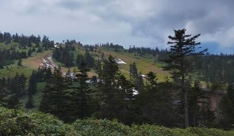

# 2022シーズンモデルのスキー板，試乗レポートその3…ROSSIGNOL Super VIRAGE VI LIMITED

📅 投稿日時: 2021-06-02 00:55:29

🏷️ カテゴリ: [スキー板試乗](c0bd8048615710cee890e403a36cc9a2b.md)

渋峠スキー場の営業が終わって，2日たった

わけですが．

いつものおこみん特派員とは別の特派員が，

本日の渋峠写真を送ってくれました～！

これ，下の方はまだ雪が残ってますが…

コースの上の方を見ると…

え！？？これ…むちゃくちゃ一気に雪が

減ってない…！？？

…とても，一昨日まで滑れていたと思えない…

ちなみに，一昨日はこんな感じで

まだ繋がっていたんですけどね～…

いや．これを見ると．

よく5月30日まで営業したものよ…

本来，6月1日…今日までの営業を狙っていた

みたいだけど．

黒魔術でも使わないと6月1日までの営業は無理

だった感じですね…

ってなことで，本題へ．

今日も続く，2022シーズンスキー板の

試乗レポート．

今日はロシニョール編です！

○ROSSIGNOL Super VIRAGE VI LIMITED

基礎小回り用．

この板も，去年のSuper VIRAGE V LIMITEDと

比べると．デザインが変わって

数字(V⇒VI)がひとつ増えてますが，

基本的には昨年の板のコスメチェンジの

ようです…

Super VIRAGEシリーズは，

トップモデル，VIRAGE VIシリーズが3種類．

最上位のR22プレート付きがVIRAGE VI LIMITED，

(2021シーズンはVIRAGE V LIMITED)

R22より優し目のKONECTプレート付きがVIRAGE VI TECH，

(2021シーズンはVIRAGE V TECH）

センター幅広めののKONECTプレート付きがVIRAGE VI VERSATILE，

(2021シーズンは，VIRAGE V VERSATILE)

そして，さらにそれより下位のモデルが，

VIRAGE V　(2021シーズンはVIRAGE IV) 

VIRAGE IV　(2021シーズンはVIRAGE III) 

VRAGE III　(2021シーズンはVIRAGE II)

となり．

トップモデル以外も数字がひとつづつ

進化しているようです…

ということで．VIRAGEシリーズの

最上位となるVI LIMITEDですが．

履いてみたところ…

かなりずっしりした感じで，スピードを出した

安定感はバツグン！！

荒れた斜面も，荒れを感じずにちょっとした

凸凹なら踏みつぶしていくような感じ…

スピードを出していないと，簡単に

ずらせるけど．

スピードを出していくと，ガッツリグリップ

して，気持ちよく回っていきます．

張りが強いので，ハイスピードで

板がたわみすぎてどうしようもなく

小さく回ってしまう…ということもなく．

ガンガンスピードを出していたた中でも，

気持ちよく中～適度な小回りで，

いい感じで板が回っていきます．

スピード耐性が強いので，ガンガンスピードを

出していきたくなるような板．

これ，硬い斜面でスピードを出していくと．

その板の重さ，強さがあるだけに，

かなり快感度が高いマシンになるのでは？？

でも，この板．

結構板自体が重く，強いので，低速や中速で

滑っても本領を発揮できず，

あんまり面白くない．

硬めの雪で，ガンガンスピードを出していくと

板の秘めた性能が引き出される感じで，

スピードを出して落ちていった中で

快感度が上がっていく板ですね…

乗り手に高いレベル(スピード耐性)と

強い横Gに耐える脚力を求めます．

うーん．

ちょっと重くて硬いので，コブ斜面は

結構つらいかな？？

スイートスポットが広い，どんな雪でも

どんなスピードでも…という万能板では

ないけど．

整地を速いスピードでかっ飛ばすには，

いい感じで切れて回っていく

カービングマシンで．

体力・脚力に自信があれば，かなり

楽しめる板だと思います．

ただ，これ1本で何でもできる板じゃ

ないので，コブや荒れた斜面の時に気

楽に履ける板を持っている人が，

いいバーンコンディションの時に，

ハイスピード小回りを楽しむのに履く…

という感じかな．

## 💬 コメント一覧

### 💬 コメント by (Northfox)
**タイトル**: Unknown
**投稿日**: 2021-06-02 23:36:30

ロシニョールのDEMO ALPHA LTD～Super VIRAGE VI LTDは私の一番のお気に入りの板です。

しかしSuper VIRAGEと名が変ってからどうもモデル名が分り難いです．．．

来季モデルのコスメは今期よりも落ち着いた感じで悪くないと思います。

でも既にDEMOの二郎君を保有しているので買わないですけどね。

でもビンディング無しで板だけ買えるのなら．．．．イヤ考えてはダメですね。 (^^;

### 💬 コメント by (Skier_S)
**タイトル**: ＞Northfoxさま
**投稿日**: 2021-06-03 03:30:50

ここは三郎君行っておかないと！

たぶん，もう一郎君はヘタってますよ…（笑）

と，悪魔の誘いをしてみる

### 💬 コメント by (ikkun)
**タイトル**: Unknown
**投稿日**: 2021-06-03 18:31:29

(^-^ゞ  私し自身 好きな乗り心地でした❗おっしゃる通りにコブはムズいかもですが スピードに乗った滑りは気持ちいいですし「評判いいんですよ🎵」と野沢での係員様でした❗ 後少しはデザインとbindingですかね？

### 💬 コメント by (Skier_S)
**タイトル**: ＞ikkunさま
**投稿日**: 2021-06-04 03:31:46

この板が好きとは，結構強い板が好きなのですね…

確かにスピードに乗った滑りは気持ちいいですよね！

