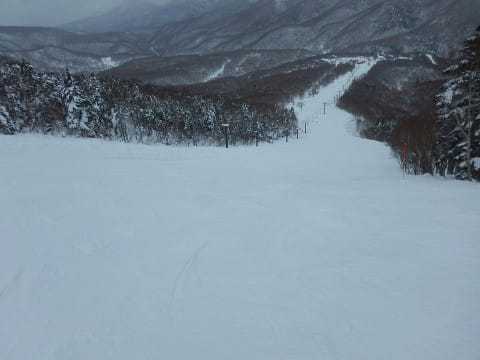

# 2019/1/14(月)の志賀高原スキー場詳細レポート！…3連休最終日はガラガラ！時々小雪舞う曇り空だったけど，穏やかな天気で雪も良く，恵まれた3連休だったなぁ

📅 投稿日時: 2019-01-16 06:44:12

🏷️ カテゴリ: [2019スキー滑走日記](c3e4496fc0fb7f9c17ff21214a35b1ace.md)

ということで．

昨日速報レポートした，3連休最終日の志賀高原．

今日は詳細レポートをお送りします…

まず．

あさイチは，いつも通りの焼額第1ゴンドラ

スタート！

営業開始前に待っていた人は20～30人程度と，

それほど多くなく．

ゴンドラであさイチの山頂へ上がると…

　朝の放射冷却が入らなければ，

　朝は－8～9℃程度かな．

と，予想した通りの-9℃！

素晴らしいぞ，私の予想！←昨日は朝の予想気温，外してたけど…？

山頂の天気は…

うっすら太陽が顔を出す，うす曇りで．

うーむ．

すっきり晴れではないけど，空は明るい，

まぁまぁのコンディション．

そして，ゲレンデは当然，シマシマっ！！

結構締まり気味で，いい感じでかっ飛ばせる，

最高シマシマコンディション！！

シマシマを数本楽しむと，一瞬日も射して…

なんて素晴らしいスキー日和なんだ！

…と．

一瞬思ったものの．

残念ながら日が射したのはわずか数分間．

また太陽は雲に隠れていき…

曇り空になるとともに．

ちょっとゲレンデの人が増えて来ました…（ちょい涙）

ただ，ゲレンデの人は増えてきたものの．

今日はゴンドラはそれほど混まず．

焼額第1ゴンドラはほぼ終日飛び乗り！

とはいえ．

今日はちょっと焼額の呪いを解いてみて．

焼額以外に遠征に行ってみました…

まずは奥志賀から．

奥志賀ゴンドラもそれほど混んでおらず…

ゴンドラ側のダウンヒルコースも…

リフト側のエキスパートコースも…

人が少ない！

昼間の気温は-2度と，この時期の志賀高原

としては上がったけど．

雪質が悪くなるほどの気温ではなく．

寒すぎず，過ごしやすい気温なのに．

ガラガラで．

かつ雪質がいいという，恵まれた

コンディション！

続いて，一の瀬方面方面へも遠征してみましたが．

ファミリー正面バーンは，さすがにちょっと

人がいたものの．

でも，好き放題のラインが取れるほどの

空き具合で．

雪はかなり締まり気味でスピードが出る，

スピード派にはいい感じ！

…だけど，パーフェクターコースは

取りつき部分にまだブッシュが出てます．

今シーズン，まだ例年より雪が少ないんだなぁ…

ただ，コース上の雪は十分！

それよりヤバかったのは寺子屋．

ガラガラで，すごく良さそうに見えますが…

ええええ！

コースのそこかしこに，うっすら

土が出てきてます…

数か所出てきてる，というレベルでなく，

まさにあちらこちらで出てきてる，

ちょっと危険なレベル．

だもんで．

直ちに寺子屋を脱出して．

東館山から…

ブナ平クワッドが撤去されてしまい，

寂しい感じのブナ平を移動していきますが．

ブナ平クワッド乗り場あと．

圧雪車がぽつんと置いてあり．

寂しさを増します…

うーん．ここにリフト乗り場があって，

高速クワッドがかかっていたとは，

信じられない感じ．

クワッドリフトが，こんなにあっさり

撤去されてしまうとは…

ブナ平の下部は，評判の悪いジグザグコースに

改悪されたままなのも，ちょっと残念…

で，西館までやってきましたが．

西館も人が少なく…

そして，雪質も良く，ブッシュなんかも出ておらず．

今日は西館が結構良かったかな！！！

そこから，高天ヶ原と移動して．

焼額方面への帰路につきますが…

高天ヶ原も，まだところどころに

ブッシュが…（涙）

今シーズン，正月の積雪で焼額は

なんとかまともなレベルになったけど…

まだ例年に比べて全然雪が少ないんだな…

て感じで，

志賀高原をぐるっと回って．

夕方に焼額に戻ってくると…

なんだ，この人の少なさは！！！

いや，これは人が少ないというより．

ゴーストタウンだよ…！！

という感じで．

人が少なかったので，夕方になっても

荒れていない，フラットな貸し切りバーンを

思う存分かっ飛ばして．

今日もラストゴンドラまで滑り倒したのでした…

いやーーー．

天気はすっきり晴天とは言えなかったけど．

この時期の志賀高原としては穏やかで

寒すぎず．

人も少なくて．

雪も良く，午後まで荒れず．

結構恵まれた3連休だったなぁ…

…でも．

焼額以外を巡ってみると．

もう少し雪が積もってほしいなぁ…

と思った，Skier_Sだったのでした．

## 💬 コメント一覧

### 💬 コメント by (とりっくすたー)
**タイトル**: いつもありがとうございます
**投稿日**: 2019-01-16 12:31:14

時々、拝見しています。

スキー・スノボが下火なのは仕方なきですが、あまり人が少ないとスポーツ自体ができなくなるかもしれないなと危惧する今日この頃です。

昔、志賀も白馬も黒山の人だかりで、リフト待ちしたのが懐かしい(笑)

### 💬 コメント by (かず)
**タイトル**: Unknown
**投稿日**: 2019-01-16 19:37:03

予報が結構変わってきましたね　明日期待薄です　金土日　雪次第で月もにします

### 💬 コメント by (新潟のスキーヤー)
**タイトル**: Unknown
**投稿日**: 2019-01-17 00:48:31

お久しぶりです！

風邪大丈夫ですか？ 

私は年末に腰を痛めていまだに本調子で滑れてません！泣

20日の午後には志賀高原入りする予定なので

お見かけしたらお声掛けさせていただきます！

ちなみに私はカラーの組合せがおかしいアトミック履いてます！笑

### 💬 コメント by (Skier_S)
**タイトル**: 今週末は行けなさそう（涙）
**投稿日**: 2019-01-17 03:18:54

＞とりっくすたーさま

コメントありがとうございます～！

今から25年ほど前は，関越道もスキーの車であふれてたし，

日曜の昼にゲレンデを出て，ひたすら渋滞を走って，

帰宅が深夜12時を回るというのがパターンでしたね…

今はどこのスキー場も経営が大変そうです．

志賀高原の中央エリアは，次々リフトの廃止やら運休やら，圧雪無しといった状況が続き，

さらにお客さんを減らしてそうです（涙）

混みすぎるのもイヤだけど，人が少なすぎるのも

困りものです．

＞かずさま

今週の天気予想，木金の予想も付け加えてみました．

月曜は…今のところだと，日曜の夜から雪が降り続け，

ある程度の雪が積もりそうな感じがありますが．

まだ，日曜以降は天気図が変わりそうな予感があります．

＞新潟のスキーヤーさま

風邪は，なんとか良くなってきました．

…でも．

20日は残念ながら，志賀高原に行けません（涙）

滅多にないことなのですが…

ってか，スキーに行きたくて仕方がないのですが．

申し訳ないです．

お会いしたかったのですが…

また，次の機会に…

