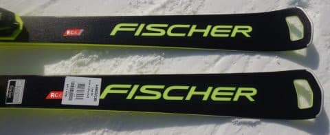
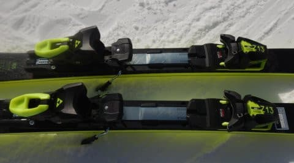
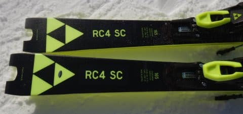
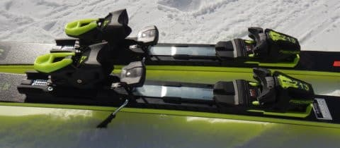
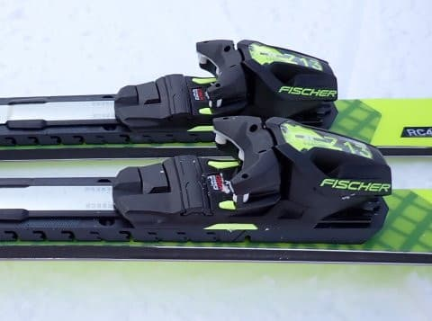
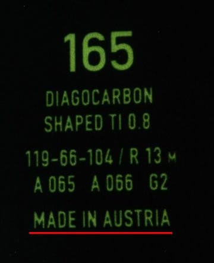
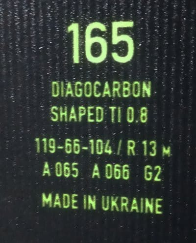

# 試乗レポート番外3…2023モデルのウクライナ製FISCHER RC4 WC SC PROを試乗してみた

📅 投稿日時: 2023-08-07 06:02:00

えー．

2024シーズンモデルの試乗レポートは

終わりましたが．

おまけの試乗レポートがもう一発あります．

実は，試乗でものすごく好印象だった，

[オーストリア製の’23モデルの
FISCHER RC4 SC Pro](e987349984f149be3ae8d6c1ecb1daa55.md)．

昨シーズンの物欲選手権に負けて

購入するはずだったのですが…

エキップさんには，試乗したオーストリア製と

異なるウクライナ製が入荷してしまい．

どうやら23シーズンモデルは，試乗板は

オーストリア製だったけど，市販品は

ウクライナ工場が復活したのでウクライナ製に

なったということらしく．

今回，オーストリア製が手に入らなかったので，

試乗してなくて，性能がどうだか未知数の

ウクライナ製を買うのはちょっとリスキーかな…？

と，購入をキャンセルしていたんです…

ただ今回の試乗チャンスで，ウクライナ製が

どんなものか試す機会があったので，

ウクライナ製の2023シーズンモデルを履いて

みました～！

今シーズンモデルの板の試乗レポート番外編．

フィッシャー編です．

では，どうぞ～！

〇FISCHER RC4 WC SC Pro 165㎝

基礎小回り

2024シーズンモデルはイエローになりましたが．

こいつは2023シーズンモデルの黒色のやつ．

そして，2024シーズンモデルはMプレートですが，

こいつは2023シーズンのM/Oプレートという

違いがあり，プレートのトゥピース下の部分が

プレート本体からゴムで浮いた黄色い別部品に

なっています…

ちなみに，2024シーズンのMプレートは，

トゥピースの下まで黒い一体のプレートに

なっています．

で．

この板．

昨シーズンも試乗しましたが…

昨シーズンは，ウクライナ工場の火災の影響で，

前シーズンの3月に先行で販売店に入った

試乗板はオーストリア工場製だったんですが…

（昨シーズンの試乗板）

6月ごろにウクライナ工場は火災から復旧

したらしく，シーズンインのころに

販売される板はウクライナ工場製に戻った

という経緯があり．

今回の試乗板は，スペックは全く同じながら，

昨シーズンの試乗の時と違って，

ウクライナ工場製の板になります…

ちなみに，昨シーズンに試乗したときは，

2021・2022シーズンからモデルチェンジ

なしの継続モデルのはずなのに，

自分が持っているウクライナ製の2021

モデルと全く違ってものすごく好印象で，

「さすがレースモデルを作っている

　オーストリア工場製…！！」

と感動していたのですが．

果たして，再びウクライナ製に戻ったSCの

乗り心地や，いかに…？

滑ってみると…

昨シーズン試乗したオーストリア製のほうが，

もう少ししっとり感とバネ感が強かった

気がするけど…

それより大きな違いを感じたのは．

2024シーズンモデルのSC PROのMプレートと

M/Oプレートの違い！

やはり，2023シーズンのM/Oプレートに比べ，

2024シーズンのMプレートのほうが硬くて

たわみが出しにくいのか．

2023シーズンモデルのほうが，しなやかに

感じる…！！

いや，2024シーズンモデルと比べて

柔らかいというより，いい意味でしなやか．

2024シーズンモデルは，たわむときにちょっと

突っ張るような感じがあるけど，

2023シーズンモデルのほうがしなやかに

たわんでいきます．

2023モデルのほうが大きくたわむ分，

深く回っていけて，さらに大きくたわんだ

バネが返ってくるような返りの強さも

感じられて，元気があるように感じます…

それに比べると，2024モデルはグリップの

強さは2023モデルと同じくらいですが，

たわんで行ったときにぐっとこらえる感じが

あり，ターン弧が2023モデルより浅めに

なる感じ．

ホントのトップスピードのスピード耐性は

2024モデルのほうが上かな…？

でも，2023シーズンのほうも十分なグリップ

があり，さらにしなやかなフレックスで深く

回れる感じがあるので．

私は2023シーズンモデルのほうが好きだな…

で．

オーストリア製とウクライナ製の違いですが．

…オーストリア製の板を履いた時は，

「おおおおお！！すげーーいい！！！」

と思ったけど．

ウクライナ製の板を履いた時は，その時の

感動と期待値があるからか．

「いい．かなりいい！

　いい板で，2024モデルより好きだけど…

　でも，もう少し感動した気がする…

　こんなもんだったかな？」

という感じ．

でも．

すっとしなやかにたわんで谷回りに

入っていき，トップからテールまでの

エッジががっつり食い込んで深く丸い弧を

描いていき，板が丸く弧を書いたまま

次ターンにすっと抜けていく…

という．

私の好きな気持ちよさは十分備えた板．

そして．

エキップの鈴木社長曰く，

「工場が燃えて，機械が全部新しくなった

　から，以前のウクライナ製より良くなった」

とのことらしく…

オーストリア工場製ほどじゃないにしろ，

確かに2021シーズンモデルよりはしなやかさが

増した感じがします．

うーん．

来シーズンモデルはめちゃくちゃ

値上がりするし．

来シーズンモデルより，2023モデルの

ほうが好きだということになると…

ウクライナ製でも，2023シーズンモデルは

結構お買い得かも…！？？？
