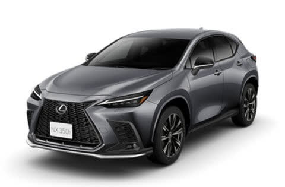

# なぜかLEXUS NX 350hに試乗してきた

📅 投稿日時: 2024-07-16 02:21:00

えー．

この3連休．

いろいろあって，一緒に出かけた人の

2023年モデルのLEXUS NX 350hのFsportsを

しばらく運転する機会に恵まれたので…

ちょっと簡単に試乗レポートしてみます！

人の車の写真をBlogに載せるのはちょっと

あれなので，LEXUSのホームページから

写真をもってきましたが．

今回試乗したのはこいつですね．

（[LEXUSホームページ](https://lexus.jp/request/estimate_sim/option?car_name_en=NX350h&car_type_cd=B&sale_office_car_style=AAZH20-AWXLB%28F%29)より）

今年マイナーチェンジしているので，

マイナーチェンジ前のモデルになりますが…

2.5Lエンジンのハイブリッド車で，4WDの

モデルです．

内装は…14インチの巨大ディスプレイが

真ん中に鎮座していて．

このディスプレイ，写真で見るより

大きく感じて，存在感があります…

そして，フロントガラスに情報を映す

ヘッドアップディスプレイに，いろんな

情報が表示されるし．

そのほか，内装のつくりは高い車だけ

あって，結構な高級感がありますね…

とりあえず．

走り出してみると．

さすがストロングハイブリッド！

モーターパワーがかなりあるので，

アクセルを踏んだ直後のパワー感が

かなりあります．

電動車特有の，エンジンや変速の

ラグがない，ピックアップがすごく良い

加速感が味わえます…！

ただ．

ボディが1.8tを越えるからか．

スタートの1-2秒経ってからの

伸びが思ったほど無くて，そのあとの

加速感は驚くほどではないのですが…

もう少しパワー感があってもいいかも？

と思ってしまうところ．

モードをSモードやS+モードにしても，

トルクはあるものの，そこまでパンチの

ある加速感はないなぁ…と思っちゃいます．

ただこれは，私がターボラグがある車に

乗り慣れているというのがあるのか．

ターボラグがある車のように，最初の

加速度よりあとからぐんぐん加速度が

盛り上がっていくほうが「加速感」があって．

この車のように最初にぐっとダッシュして，

そのあと加速度の盛り上がりがないと，

あまり加速感を感じられない…

という，人間心理の問題も大きいかも．

実際は十分速いです！！

そして，エンジン音はかなり静か！！

加速時には，あえてちょっとだけ

エンジン音を聞かせて，加速度と

リンクしてエンジン音が上がっていくのを

を聞かせることで加速感を感じさせる…

という演出っぽいかな．

加速時以外は，ものすごい静かな車で，

低いロードノイズしか聞こえません…

エンジン音やその他の音が一切聞こえず，

タイヤが転がる音以外無音に感じる，

かなり静かな車です．

ブレーキフィールも，ハイブリッド車の

回生ブレーキにしてはかなりいい感じ．

ブレーキパッドが食いつくような

初期制動の立ち上がり感があって…

このあたり，もしかしたらかなり

メカブレーキに近く感じるように，

回生ブレーキの減速Gの立ち上がりを

味付けしてあるのかも．

回生ブレーキから低速のメカブレーキに

移っていくトランジションも全くわからず，

かなりブレーキフィールは良くできてる…

このFスポーツ，かなりでかくて赤く目立つ

ブレーキキャリバー着けてるけど．

普通に乗っているとほとんど回生ブレーキ

ばっかりで，ここまででかいブレーキが

本領発揮する場面はなさそうなんだけどな…

と思ってしまいましたが．

とりあえずこの車の回生ブレーキの

フィーリングは気持ちいい！

…でも．

ハイブリッド無しのガソリン車に乗り慣れて

いるからか…

この車のアクセルワークに，微妙に違和感を

感じるタイミングが何度かありました．

なんというか…

アクセルを完全オフにすると，

普通のガソリン車は空走するわけですが．

この車でアクセルオフにすると，

ちょっと回生ブレーキが効いてわずかに

減速するようなんですね…

メーターを見ていると，アクセルオフで

エネルギーフローが少しチャージ側に

流れていて，アクセルオフでは空走じゃなく，

わずかな減速Gを出すような設定に

なっているようです．

だもんで，底からアクセルを踏むと．

ちょっとアクセルを踏み込んだところで

回生ブレーキが0になり定速走行が

できるところがあり，

そこからさらにちょっと踏み込むと加速

する…

という感じになっているのか．

アクセルを少し踏み込んだ先に，

加速する領域があるな…

という感じ．

これはこの車がこういう風に作ってある

というだけなので，この運転感覚に慣れば

済むだけの話ですが．

なるほど～…電動回生・モーター出力が

大きい，電動車に近いハイブリッドって，

アクセルペダルに対する加速・減速を

どうプログラムするかかなり大きな自由度が

あるから．

昔のエンジン車に近くして，昔の車から

乗り換えても違和感のない設定にするか，

ハイブリッド車らしい操作ができる設定に

するのか．

このあたりのフィーリングの作りこみは

難しそう…

とりあえず．

従来のガソリン車に乗り慣れている人には，

ちょっとわずかにアクセルペダルに慣れが

必要かもしれませんが．

乗ってるとすぐに慣れる領域なので

それほど気にならないと思いますし．

それ以外のブレーキフィールやらエンジン音，

立ち上がりダッシュのレスポンスの良さは，

高級車だけあって素晴らしいです…

そして．

足回りですが．

助手席や後ろ座席に乗った時の

いわゆる乗りごちというやつは，スバル車と

えらい違い…！

高周波成分である路面のざらつきや細かな

突き上げ感が，ものすごく上手くフィルタリング

されています…！！

すごい上手いこと高周波成分がシート上に

伝わるのを抑えてます…

ここまで高周波がしっかりフィルタリング

されているのは，高周波成分までしっかり

コンプライアンス成分をもてるブッシュの

材質なのか，

あるいはかなりゆるゆるで容量が大きい

ブッシュを使っているのか…？？

なにか，タイヤからボディまでの各所各所に

高周波成分を吸収するシートみたいなものが

挟まっていて，突き上げの角や路面のガタガタ

などが見事に吸収され，

路面に追随する，きれいな低周波成分のみ

ボディ上に伝わる感じ…

これが，乗り心地の高級感を生んでいます．

助手席やリヤシートに乗った時の

振動の少なさやノイズの少なさは，

私が高級車に乗り慣れてないからか，

かなりの驚きを感じるレベルでした…！！

でも．

高周波をカットするため，容量の大きい

ブッシュが各所に入っているからなのか．

サスのサブフレームとボディの結合部分，

あるいはサスアームのリンク部分など，

柔らかくて振動を伝えなようになって

いるけど，その代わりステアリングの

動きや車の動きに対しても，

少し緩やかさがある感じで．

私のLEVORGに比べると，フロントの

反応のクイックさがそこまでない感じ…

でも，もともとが車高が高いSUVだし．

助手席やリヤシートに乗っている人の

乗り心地はすごくいいし．

同乗者がびっくりするくらいの，ちょっと

強めの横Gを左右連続で出すときに気になる

程度のレベルで，普通のペースで山道を

走っているくらいじゃ気にならないレベルだし．

車の性格を考えると，そこまでクイックさは

要らないだろうから…

うん．人を乗せてゆったりと走って，

同乗者にも不快感を味あわせないという

車の性格を狙っているのであれば，

この足回りはすごくよくできていますね…！

ただ…

ハンドルを握って強めの横Gをかけて，

タイトにコーナーを曲がっていくには

もう少しフロントタイヤが早く食いつき，

クイックに頭がインに回っていく感じが

あるほうが楽しいけど…

この車はタイトコーナーをガンガン

攻める車じゃないので．

高級感がある乗り心地というのは，

こういうことを指すのだよ！！

という狙いをそのまま具現化した車

ですね…

低速でのステアリングはちょっと軽めだけど，

高速になるとしっかり重みが増して

安定感を感じるようになり．

さらに高速道路でもエンジン音が全く

しないこともあり，驚くほどスピード感が

ないまま高速で走れる安心感，安定性と言い．

アイサイトEXみたいなオートレーンチェンジや

自動発進はないとはいえ，車に運転を任せても

違和感を感じることはない前車追尾式

オートクルーズやレーンキープ機能も

完成度は高いし．

うーん．

さすがかなりのお値段の車だけありますね…

とりあえず．

予算的に，自分が買うことはない車ですが．

お高い車というのは，こういうところを

作りこんでくるのか…

と，いろいろ勉強になった今回の試乗

だったのでした．

## 💬 コメント一覧

### 💬 コメント by (take)
**タイトル**: Unknown
**投稿日**: 2024-07-16 07:04:12

LEXUS RX 350hのFsportsというグレードはないはず。

### 💬 コメント by (Unknown)
**タイトル**: Unknown
**投稿日**: 2024-07-16 07:47:08

RXではなくてNXの事ですよねこれ。紛らわしい

### 💬 コメント by (ニャンコ)
**タイトル**: Unknown
**投稿日**: 2024-07-16 09:21:47

文章はRX

写真はNX

そしてRXに３５０hのＦスポは存在しません

バージョンＬになります

筆者はあまり詳しくないんだろう

自分はNXの３５０hのＦスポに乗ってるので！

### 💬 コメント by (副院長)
**タイトル**: Unknown
**投稿日**: 2024-07-16 16:21:33

レクサスって、大きいセダンしか乗ってないですが、ゆったりさせる雰囲気もっていていいですよね。いけずされてもおおらかになります。でも、志賀エキスプレスのために、丸4つの８に変更しました。こっちは結構スポーツカーです。運転席マッサージがお気に入りです。

### 💬 コメント by (Skier_S)
**タイトル**: すみません．間違えてました
**投稿日**: 2024-07-17 01:35:11

＞takeさま，Unknownさま

すみません！なぜかRXって書いてました…

なんでだろう．NXだと認識していて，写真はNXのを張り付けているのに…（涙）

ご指摘ありがとうございました。

＞ニャンコさま

すみません…NXの間違いです．ってか，NXに乗ったと認識して写真はNXのページから切ってきたのに，

なんで本文とタイトルにRXって書いたのかな？

LEXUSは私が買える価格帯の車じゃないので，仰せの通り全く詳しくないです（涙）

＞副院長さま

え？？車買い替えたんですか！！

〇四つの８って…Aですか？Qですか？

志賀エクスプレス用って言ってるから，やっぱりQuattroですよね．

### 💬 コメント by (副院長)
**タイトル**: Unknown
**投稿日**: 2024-07-17 20:29:11

＞ Skier_S さんへ

＞ すみません．間違えてました... への返信

A8です。

### 💬 コメント by (Skier_S)
**タイトル**: ＞副院長さま
**投稿日**: 2024-07-18 23:52:22

あ，Aの方ですか…かなりでかい車ですね．

そして，またセダンなんですね…やっぱり（笑）

### 💬 コメント by (名無し)
**タイトル**: Unknown
**投稿日**: 2025-01-18 15:50:04

NX・・最近のレクサスに言えることですが・・システムに対してバッテリーが弱い！

バッテリーといってエンジンをかけたり　アクセサリーに電気を供給する補助バッテリーのことなのですが・・二週間もほっておくと・・容赦なくバッテリーが上がりが発生します

バッテリーが上がると・・NXの場合　ドアすら開けることができません

海外旅行などで　空港駐車場に置いておいた日には　とんでもないことに・・これって　欠陥ですよね～・・

おまけに　キーと携帯のBluetoothでドライバー確認をして　シートのメモリーポジションを決めているのですが・・車のデータ更新や何らかの事情で　メモリーの誤動作もするんですよ

レクサス・・やっぱりTOYOTAですね・・

### 💬 コメント by (Skier_S)
**タイトル**: ＞名無しさま
**投稿日**: 2025-01-18 22:55:33

あぁ…トヨタのハイブリッドシステム，補器バッテリーが弱いと聞きますが，

レクサスもそうなんですね…

2週間置いとくと起動できないとはちとつらいですね．

そしてメモリの誤動作って…そんなバグを仕込んだままリリースされてるんですか…？？

NX,すごいよくできた，かなり魅力的な車なんですが…

