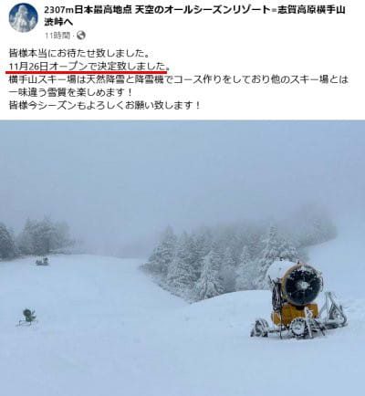

# 11月24日(日)オープンの鹿沢スキー場の特派員レポート！…そして月曜熊の湯、火曜は横手山スキー場・かぐらスキー場オープン！

📅 投稿日時: 2024-11-25 02:32:49

🏷️ カテゴリ: [日記](cc4b5682fb7b8b144980957a978653fb0.md)

えー．

今日はちょっと内容が盛りだくさんなので．

イエティの詳細レポートは明日に繰り越して，

いろんなニュースをお送りします…

まず．

なんと．

私が気づかないうちに，鹿沢スノーエリアが

オープンしていたようで．志賀高原常連の

特派員から写真が送られてきました…！！！

鹿沢のホームページを見てみると，確かに

11/24(日)にオープンしていたようですね…

気づかなかった…

([鹿沢スノーエリアFacebook](https://www.facebook.com/kazawasnow/posts/pfbid0zzbGjDPGvW21hteE8JCSw3751mxdNRSFsgFHkzRdUDEPtFJTPfGdYDj26eqmRSoPl)より）

ちなみに，それ以外のスキー場を見てみると．

日曜オープンには間に合わなかったけど，

熊の湯スキー場は11/25(月)にオープン

です！！！

幅20～40mってことなので，現時点で

コンディションが最もいいスキー場かも？

([熊の湯スキー場ホームページ](https://www.kumanoyu.co.jp/lift/)より）

そして熊の湯からさらに1日遅れ，

横手山はの11/26(火)のオープンが決定です！！！

([横手山スキー場Facebook](https://www.facebook.com/yokoteyama2307/posts/pfbid02EW4hXvDMCvL99YR7tnFbWFxA2k5vhPYydzbgnrh5LvLoW6G8QfywCYJ1xY76o6VEl)より）

同じくかぐらも11/26(火)のオープンです！！

([かぐらスキー場Facebook](https://www.facebook.com/snowkagura/posts/pfbid02BX5Nc8MSWU39tXk1TTA9LMe638XPpXwBgvuH2biW157Zvr9dVXFa8vcw23bRjTPXl)より）

で．かぐらのFacebookに26日は強風・悪天候と

書かれてますが…

確かに26日はかなり南風が強くなりそうで．

ゴンドラやリフトが動かせないかもしれないけど．

ヤバいのは27日(水)なのだ…

27日…というか，26日深夜から27日の

午前中にかけて，強烈な高温＆激烈な雨に

なるのだ（涙）

27日は，ギリギリの雪の厚さのゲレンデは

ちょっとヤバそうな感じ…(泣)

そのあとは平年並みの冷え込みに戻るので，

数日でゲレンデは復活すると思いますが．

うーん．

なんでやっと冷えたのに，また高温の

雨が降るかなぁ…(涙)

ってなことで．

何とかこの冷え込みで次々スキー場

オープンの情報が入ってきたわけですが．

今日は日曜に鹿沢を滑ってきた特派員の

レポートをお送りします…！！

まず．

朝は10時オープン．

あさイチはシマシマで，結構幅が

あるように見えますね…

でも，滑れたのはこの白く見える部分の

3/4程度．

雪はそれほど硬くはなかったようで…

1時間もすると，結構荒れ始めたみたい

です（泣）

（これはオープン1時間後ではなく，午後の写真かな…）

感覚的に，コース幅は軽井沢の倍，

イエティの3倍くらい…ということのよう

なので．

結構ボコボコになってきても，

幅がある分イエティよりマシととらえる

べきか…

で．

リフト乗り場・降り場の雪はちょっと

薄めだったようで．

乗り場は雪の上というより，ほぼ完全に

ブラシの上を滑る感じですね…これは．

で．

午後になると完全にボコボコになって

なってしまったゲレンデ．

雪が薄かったこともあり．午後になって

ボコボコになったゲレンデは，かなり雪に

穴が開いてきたようで…

リフト乗り場付近の雪もかなり薄くなり．

降り場のあたりも，結構ヤバい感じに

なってきてますね…

とはいえ．

まぁ，この日のラストの段階でも，

これだけの幅で，これだけの斜度のコースを

滑れるんだから．

どれだけ傷ついてもいい捨て板を持っている

人は，行ってみる価値があるかも…

ということで．

この週末の冷えで，いくつかのスキー場の

オープンの便りが聞こえるようになってきましたが．

…26日夜から27日の高温の豪雨で，

オープン直後にあっという間にクローズ

という，今シーズンのイエティで起きた

悲劇が繰り返されないように，

スキーヤーの皆様は，日頃の行いを

限りなく良くするように心がけ，

天気の神様への祈りと，

冬将軍を待ちわびる踊りと，

このBlogへの感謝を忘れぬよう，

必死に努力してください…←なんか最後の奴だけ余計じゃないか？？
