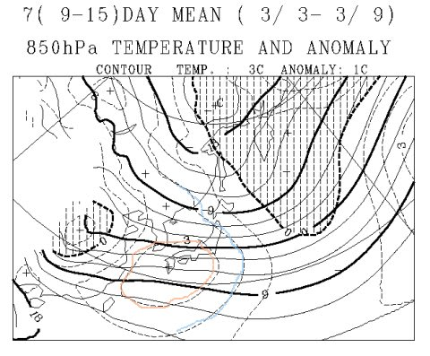
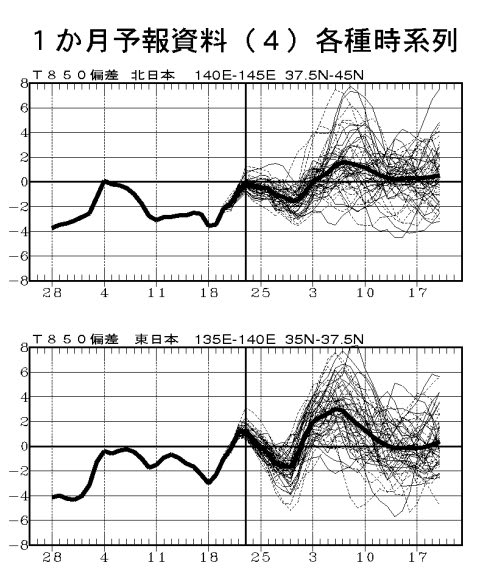

# 1日の壊滅的な雨は避けられそうなのだが…

📅 投稿日時: 2012-02-29 00:13:39

🏷️ カテゴリ: [スキー天気予想](c6554f5c3c106093b511a8daae23757e8.md)

[前回のレポート](e93ab83f0d0ec476e6af19a4a44f138d0.md)の最後に．

また，3月1日に超破壊的な雨が降るのだ(激泣）．

と書きましたが．

何とか1日の雨は避けらそうです．

低気圧が当初予想よりわずかに南にずれました．

みんなの祈りが届いたのでしょうか…

志賀高原くらいの標高なら，29日は雪になりそう．

＃標高が低いところでは，29日午後は雨かかなり湿った雪かな．

で．気温がすごい上がる1日は，低気圧が南にずれたおかげで

降水域が日本から南に離れていくので．

気温が上がるものの，雨が降らずに済みそうですねー．

良かった，良かった．

2日は何とか雪になるでしょう．

3日の土曜はまだなんともいえないけど．

今のところ，晴れるかな．

気温は上がりそう…

で．

で，だ．

これまで，例年より寒い日が続いてましたが．

この3月は．

暖かくなりそう…

こんな感じで，3月3日から9日までの850hpa平均気温，平年よりプラス3度の赤い線が

西日本をすっぽり覆い．

平年よりプラス2度の線が北海道を除く日本全域を覆ってます．

3月全体の平均気温も，例年より高くなりそう…

1月28日～3月20日までの850hpaの気温の実績と予測を見てみると．

例年より低めに推移していたこれまでに対し．

これからは例年より高めに移行しそう…

ということで．

3月は周期的に南岸低気圧が日本を襲い．

数日おきに雨…

という状況になりそうな感じ．

うーーーーーん．

春スキーシーズンが短くなったらいやだなぁ…

## 💬 コメント一覧

### 💬 コメント by (雪上の翁)
**タイトル**: 良かったです
**投稿日**: 2012-02-29 19:28:24

今晩は(^^)

壊滅的な雨は回避出来そう、と言う事で安心しました～。

しかし今日は関東も降りましたね。

週末じゃなくて良かった～

(^。^)

### 💬 コメント by (Skier_S)
**タイトル**: 雪上の翁さま
**投稿日**: 2012-02-29 23:19:38

いやー．

今日はきわどかった．

関東は雪でしたが，志賀は結構湿った雪．

中野市街は雨だったようで…

気温がプラスに上がった午後は降雪が

なかったという…

これから明日にかけて，かなり気温が上がるんですが，

何とか降水量がないまま行ってくれそうです．

ただ，この週末まで，あんまり雪の積み増しはなさそうですね～．

1日は乗り切りましたが，現時点では5日～6日にかけて，壊滅的高温＆雨に

さらされそうです（涙)

