# 5月27日のラストかぐらはどんなだったか？

📅 投稿日時: 2012-05-28 00:34:51

🏷️ カテゴリ: [2012スキー滑走日記](cca3a0e9524e0203150f790b1fc3c71ad.md)

ってことで．

本日はかぐらの営業最終日だったわけですが．

あー．

どんな感じだったかというと．

混んでた．

かなり．

雪は荒れ荒れのコブコブだった．

…でも．

楽しかったよ～．

朝…駐車場は結構いっぱいですね～．

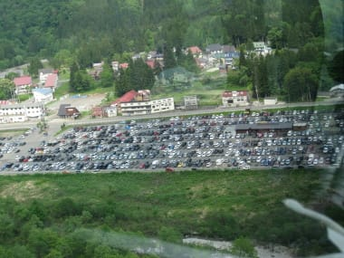

これは混みそうだ…

と思ったけど．

意外と朝イチロープウェーは待たず．

朝7時半の営業開始5分後くらいに列に着いたら，

1台待っただけで，その次にはすぐ乗れましたね～．

で．

ロープウェーを降りると…

なんと．

まだバスではなく，みつまたリフトに乗って移動できます．

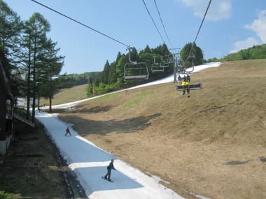

うーん．

自分の経験では，かつて2006年に一回あったっきり．

まさか5月最終週までみつまたまで滑ってこれるとは！

今年のGWの志賀の状況を考えると，信じられない…

みつまたリフトを降りてゴンドラに降りるコースも，

廊下状ながら十分滑って降りれます．

向こう側に，ゴンドラコースの帯状の雪が見えてますね…

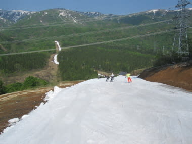

で．気温は13度と，結構あったかい…というより，日が差すと暑い感じ．

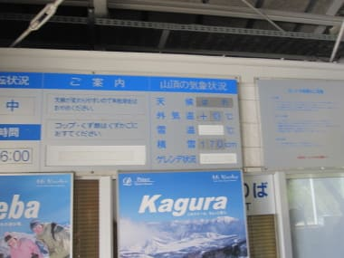

…積雪170cmってほんとかいな？？

って感じで．ゴンドラを降りると…

そこは，夢の世界が広がってました．

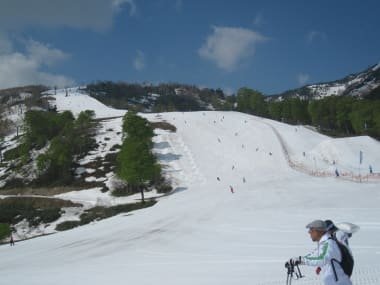

ををを！

すばらしい！

メインコース，まだほとんどコースいっぱい雪がついている！

…でも，残念ながら．

ジャイアントコースは数日前にコースが途切れて

滑れなくなった様子．

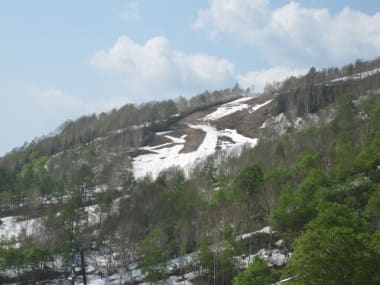

テクニカルコースも雪がなくなって寂しい状況でしたが…

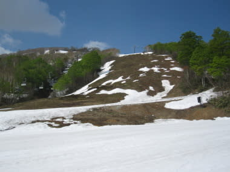

和田小屋からリフト乗り場までは，まだ雪がたっぷり．

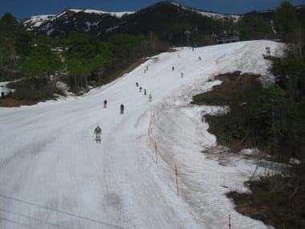

そして朝イチのメインコースは…

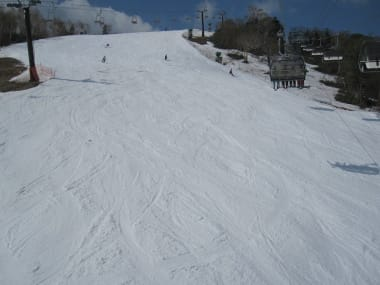

よだれじゅるじゅるものの圧雪整地がっ！

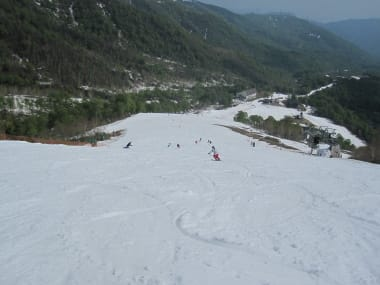

トップスピードで大回り可能！

よいのかっ！

5月末でこんなに楽しくてよいのかっ！

…しかし．

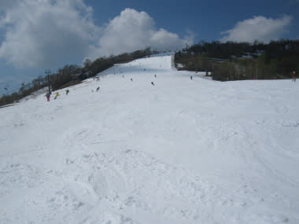

こんな幸せは長く続かないもの．

時間がたつとともに．

なんか，ひとが増えてきた…

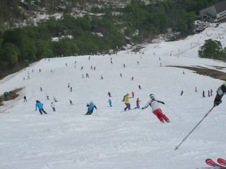

何じゃこの人口密度は…（涙)

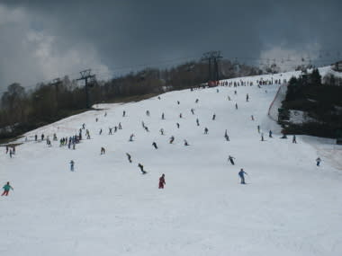

当然，ひとが多いのでコースはあっという間に荒れだし，9時半には

大回りがつらいかなぁ～．

って感じで．

11時にはコブになってきました…

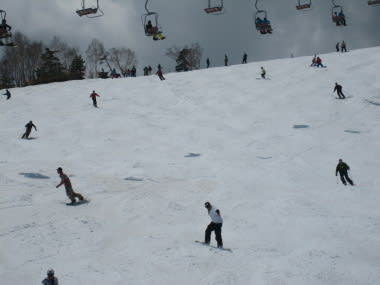

でも，リフト待ちは先週より少なかったかな～．

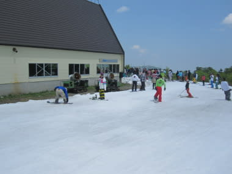

最大5分，平均2-3分ってところでしょうか．

昼食時間帯とかは，ほぼ待ちなく乗れたりしました．

それほどひどいリフト待ちじゃなかったのが救いですな．

昼ごろにはちょっと雲が出始め．

なぜか午後2時前にはぽつぽつと雨が降ったりしましたが．

一瞬強くなったりしたものの，にわか雨で済んだ感じ．

しかし，雨にもめげず多くの人がコブ活動をしてましたね～

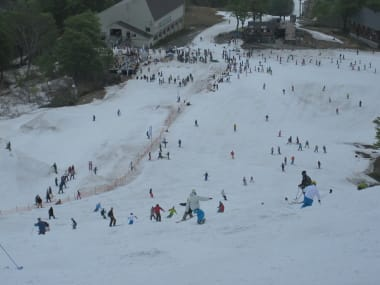

私も負けじとコブ活動．

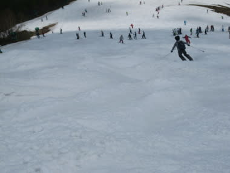

この時期にしては，コブ溝に土が出てくることも

それほどなく，コブを楽しめましたね～．

この時期のコブはやわらかいし適当にブレーキがかかるので，

楽に滑れて楽しいなぁ…

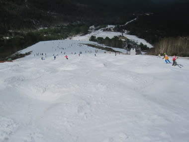

そして午後，コース全面深くなったコブをたっぷり満喫したあとは…

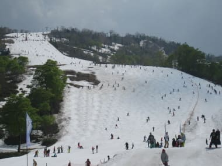

下山．

ゴンドラコースも雪がたっぷり．

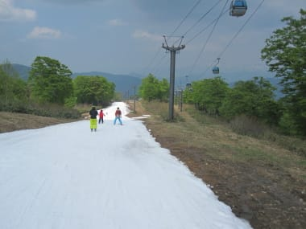

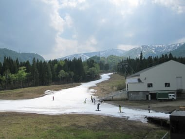

でも，みつまたコースはかなりぎりぎりっぽい感じ．

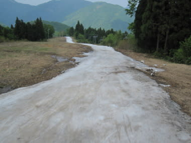

こ…これは見事だ．

よく，今日までもたせたもんだなぁ…

とりあえず，ゲレンデ整備スタッフに拍手っ！

という感じで．

たっぷり楽しめたファイナルかぐらだったのでした．
