# 2016年8月　子連れで再訪！モアルボアル旅行記その16…2日目の夜

📅 投稿日時: 2017-09-23 01:28:30

ということで．

スキー場オープン情報が次々出てきている

この時期なので．

しばらく，スキーネタやら車ネタが

続きましたが．

本日は久々の，不人気のダイビングネタ復活！

では，モアルボアル旅行記の続きです．

では，どうぞ～！

---

って感じで．

本日の3本目．

夫婦2人で貸し切りだった，

満足のイワシダイブを終えて，エグジット．

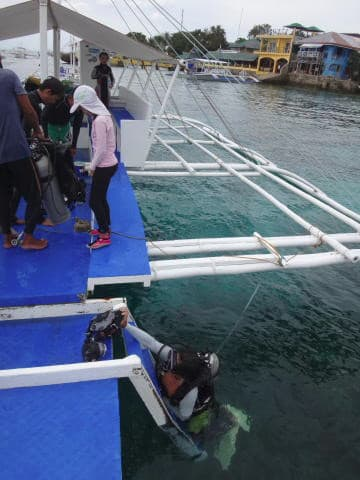

エグジットポイントは，ホテルの目の前ですね…

だもんで．

ボートがショップ前に戻るまで，わずか1分．

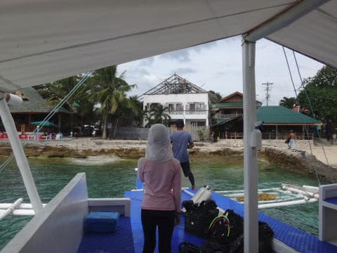

ショップへ戻ってきました…

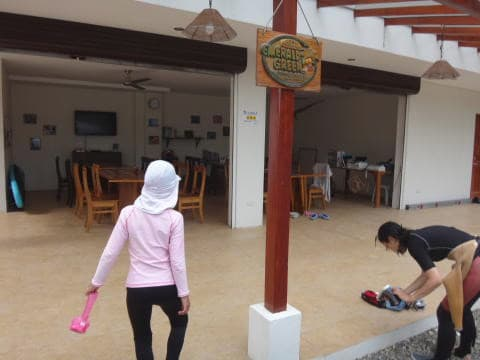

ここで，ウェットを脱いで．

夕方のログづけタイムの時間を決めて．

また，ホテルへ戻ってきます…

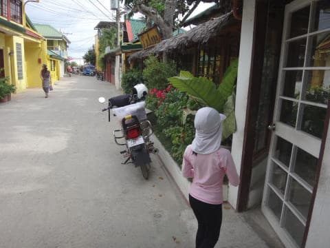

ホテルに着くと．

娘と遊んでくれた子供たちが．

待ってましたと言わんばかりのお出迎え…！

ダイビング中，ゆっくり休んでいて，体力回復したのか．

また，ひたすら遊びだす娘．

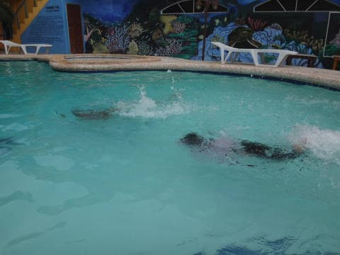

まさに，水を得た魚（？）

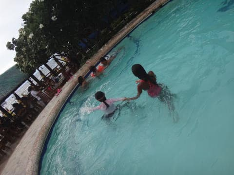

全く言葉が通じないのに．

むちゃくちゃ仲良く遊んでますね…

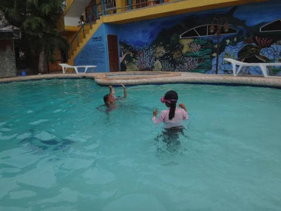

我々両親は，この子供たちの親と一緒に

ダベりながら，プールサイドのテーブルで過ごします…

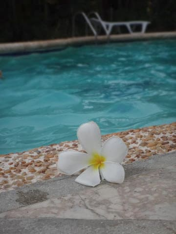

ってことで．

この子たちの両親とお話ししながら過ごしたわけですが．

へぇ．

イタリアから毎年，モアルボアルに

来てるんですか…

ヨーロッパからフィリピンって，遠いのに．

良くこんなところまで来ますね～．

あ，奥さんがフィリピンのこのあたり出身？？

国際結婚ですか！

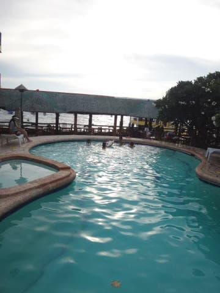

いや，日本からフィリピンは近いから．

Direct Flightで5時間かからないし．

むしろ，Narita Airportってすごいアクセス不便で，

TOKYO-CEBUのフライト時間より．

家を出てから飛行機に乗るまでの時間の

方が長いくらいですよ～ははは～

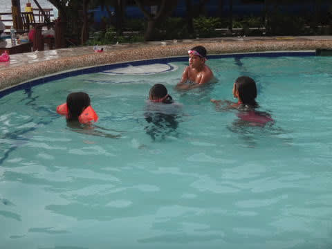

…とか，子供が遊んでるのを

見ながら話し込んでいると．

なんだか，日が暮れてきました…

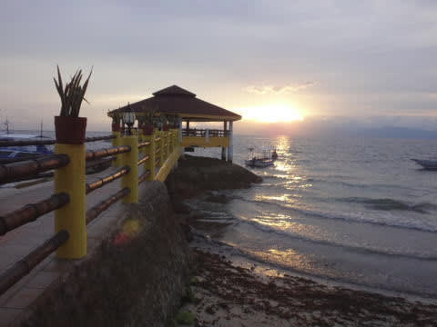

…なのにまだ，遊び続ける子供たち．

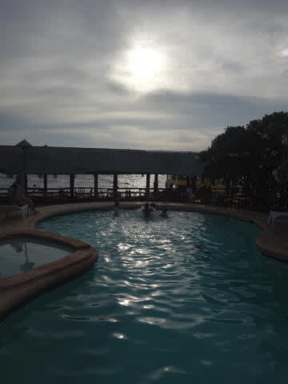

しかし，さすがに日も暮れて．

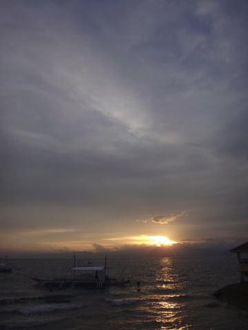

暗くなってきたので，みなさん解散．

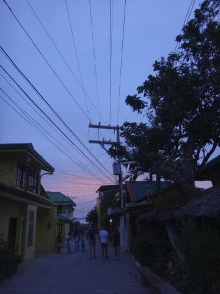

そして，暗くなる中，我々はダイビングショップへ向かって…

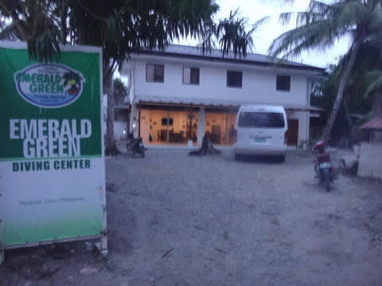

ショップでのログづけタイム！

…今日は，娘がプールで遅くまで遊ぶだろうから．

それを見越して，ログづけタイムは

遅めの時間を設定してもらいました…

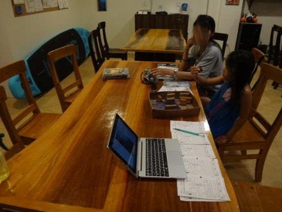

本日のダイビングで撮影した写真をパソコンで

確認しつつ，ログづけをして…

その後，モアルボアルの町へ，

夕食を食べに行きます．

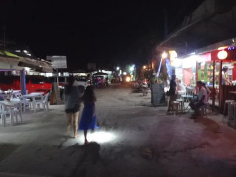

うーむ．

相変わらず怪しい街だの…

今晩の食事は，カレーがおいしいということで

ショップオーナーの小宮山さんおススメのお店，

「Lantaw」

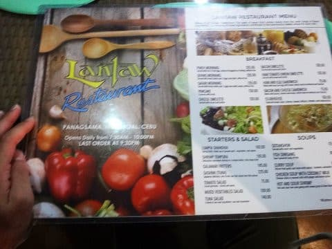

こんな感じで，建物2Fにある，

窓がないテラススタイルのお店．

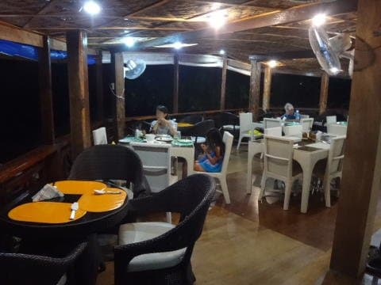

メニューは，タイ，インドネシア，インド，

フィリピン料理など．

エスニック系がメインですが…

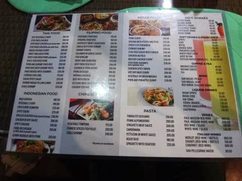

おススメのカレーもなかなかイケますし．

平均で一皿200ペソくらい．

日本円だと，500円～600円程度の感じでしょうか．

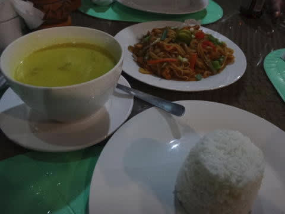

ビールも50～60ペソ，100円から150円くらいなので．

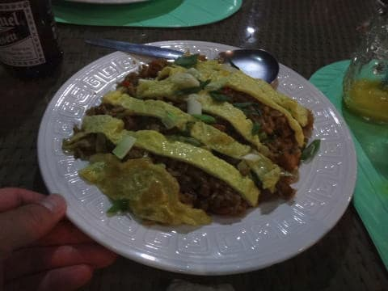

子連れ3人で腹いっぱい食べても，会計は

2000円程度…

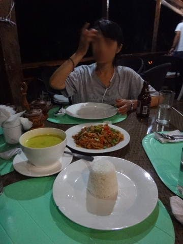

うむ．

フィリピン，物価他安くていいな！

って感じで．

夕食を食べ終わると，夜9時近く…

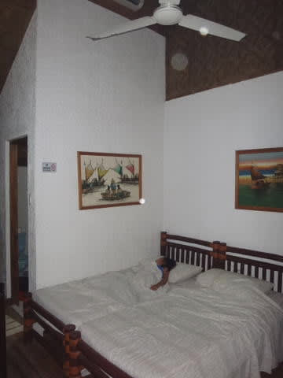

宿に帰ると，遊び疲れた娘は，

速攻で熟睡でした…
