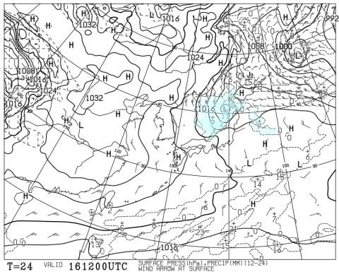

# 1月18，19日の週末の志賀高原スキー場の天気は？…土日とも晴れ！土曜午後から気温が上がり，日曜はかなり暖かくなりそう

📅 投稿日時: 2025-01-16 03:04:23

🏷️ カテゴリ: [スキー天気予想](c6554f5c3c106093b511a8daae23757e8.md)

えー．

本日水曜の志賀高原は，昼間に

30cm近く積もったみたいで…

そして，夜中の今も雪が積もってる

みたいですね…

金曜も降りそうなので，また今週末は

いいコンディションになりそうな予感が

ありますが…

なんと．

先週末は3連休だったので，

今週は4日仕事すれば週末じゃないか！

そして，2日しか仕事してないのに

もう水曜じゃないか！！！

ということで．

水曜深夜定例の，週末の志賀高原の

天気予想です！

えー．

まず，16日(木)の850hPa気温図を見ると．

志賀高原には水色の-6℃線がかかっている

くらいなので…

まぁ，この時期の平均的な感じで，

冷えた寒い日になりそう．

そして，この日の地上天気図は…

ギリギリ日本海岸まで降水域がかかって

るけど，志賀までは伸びてないので…

志賀は朝までは降っても，昼間は

積雪がなさそう．

そして，17日(金)の850hPa気温図を

みると…

この日，志賀にかかっている水色線は

-9℃線ですね．

これは朝は-10℃を大きく下回って，

結構冷えそうな感じ！！

で，この日の地上天気図は…

うーん．ちょうど志賀高原の北の

あたりに降水域がポツンと孤立して

ある感じなので…

これは麓に降らず，北風で山に降る

パターンかな．

続いて肝心な週末，18日(土)の850hPa図を

見てみると．

うううーーむ．この日は志賀にかかる水色

線は-3℃．前日と比べて，一気に気温が

上がってきそう…

まぁ，気温が上がるといっても1月にしては

上がるというレベルで，雪が解けるとか

そんなレベルの高温ではないのでご安心を．

で，土曜の地上天気図は…

本州はすっぽり高気圧に覆われ，志賀には

降水域のかけらもかかってないので．

金曜に降って週末の土曜に晴れる，

いいパターンになりそう！！

続いて19日(日)の850hPa気温を見てみると…

うぎゃーーー！！

赤い0℃線が志賀高原にかかってますよ！！

1月にしては気温が上がりますよ，これは！

山頂でも，昼間は0℃を越えてくるかも…

そして，日曜の地上天気図を見ても，

高気圧が東に遠ざかりつつあるものの，

まだ高気圧圏内なので…

日曜も一日晴れそうで．

うーん…山頂でも気温が0℃を越え，

日差しもありそうなので…

標高が低くて日当たりがいい斜面は，

ちょっと雪がしっとりするかも．

まぁ，志賀高原の標高なら雪がザブザブに

なるほど気温が上がらないので，

そこまでひどくならないと思いますが…

志賀より標高がずっと低いスキー場は

ちょっとヤバい感じです（涙）

ってなことで．

まとめると…

16日(木)：前の夜からの積雪は15cm程度．

　リフト営業開始のころには雪もほぼ止む．

　朝イチは柔らかめの圧雪の上にごく

　わずかの新雪で，

　朝イチの気温は-12℃程度と冷え冷え！

　昼頃から晴れるかも．

　前日に雪が降って，昼からはバーンも

　見やすくなっていい感じ．

　夜中から雪．

17日(金)：前日夜中から降り出した雪は，

　朝までに10～20cmほど積もってそう．

　朝はこの日も-12℃近くまで冷える．

　朝イチは圧雪の上に数㎝の軽い新雪．

　朝から降りは弱くなるが，午後まで

　雪がぱらつきそう．

　バーンは柔らかいので午後はわずかに

　荒れる

18日(土)：前日からの積雪は無し．

　朝はちょっと雲が多めかもしれない

　けど，この日は終日晴れ！

　朝イチの気温は-9℃くらい，

　柔らかいけどエッジが食い込む

　トップシーズンシマシマバーン！

　おそらくコンディション最高．

　昼間は日が射して暖かさも

　感じるくらいだけど，気温はぎりぎり

　マイナスをキープして雪は緩まず，

　午後は急斜面はちょっとバーンが

　荒れてくると思うけど，

　晴れて雪質が良い絶好のスキー日和．

19日(日)：前日からの積雪は無し．

　朝イチの気温は-5℃程度と高め．

　朝からすっきり晴れて，締まり

　気味のいい感じのハイスピード

　シマシマバーンが楽しめる日！

　この日も終日晴れる．

　気温は山頂でも0度を越え，かなり

　暖かい．

　標高が低く，日差しが当たる

　南斜面はちょっと雪がしっとりする

　かもしれないけど，それ以外は

　雪は緩まず．

　午後までバーンは結構フラットで，

　たぶんこの日もいい感じのスキー

　日和！

という感じで．

この週末，気温は上がりそうだけど，

土日とも晴れて，コンディションが

すごい恵まれた週末になりそう…！！

この週末は，スキーに行くべし！！

## 💬 コメント一覧

### 💬 コメント by (おぼう)
**タイトル**: Unknown
**投稿日**: 2025-01-16 05:30:00

いつも楽しく読ませてもらっています！

今週末、日月火で志賀高原へ行きますので、

厚かましいお願いで恐縮ですが

月火（20,21）の予想を教えていただけないでしょうか

### 💬 コメント by (レインボー77)
**タイトル**: Unknown
**投稿日**: 2025-01-16 15:53:46

木曜日の志賀高原情報

朝の湯田中は重い新雪10。蓮池はなんと-11℃。朝圧雪の白樺、唐松、GSは新雪数センチでかみかみ極上バーン。夕方圧雪のオリンピックは新雪30強。

私は早めに三高のイースト老人保養所でリハビリ。ここなら安心です。明日は大雪強風予報。私なんぞは即座にふるい落とされそうですが、エス様を何とかふるい落とす方法はありませんか？

### 💬 コメント by (Kyotoヒロシ)
**タイトル**: Unknown
**投稿日**: 2025-01-16 18:00:25

450キロのロングドライブも鼻歌歌いながら走れそうな

良いコンデションが待ってそうな予報ですね

楽しみです😊

### 💬 コメント by (アリス)
**タイトル**: Unknown
**投稿日**: 2025-01-16 23:35:13

skier_S様

今日から志賀高原参戦です。

タンネスタートですが、リフト営業開始まで待てず斜面を少し登り一気にダイヤモンド経由でヤケビへ。

9時過ぎから晴れてきて、ダイヤモンドダストが朝日に反射して白樺、サウス、GSとフワフワ快適バーンでしたが、オリンピックはボコボコ(^_^;)

バーンが荒れるのが早いです。

明日は一番にGSとオリンピック行きます。

### 💬 コメント by (Skier_S)
**タイトル**: Unknown
**投稿日**: 2025-01-17 02:50:59

＞おぼうさま

月曜も気温は平年より高めで曇り空，ときどき雪が舞う程度．昼間は晴れ間もあるかも．

火曜は弱い冬型になり終日チラチラ雪が降る感じでしょうか…

ふぶくようなことはなさそうです！

＞レインボー77さま

木曜は良かったんですね…

金曜は雪が降りますが，風はそこまで強く吹かないんじゃないかな…と思ってます．

＞Kyotoヒロシさま

この週末はいいと思いますよ～！

450km走る価値は十分ありますよ！！

＞アリスさま

今日は天気も良く，かなり良かったのではないでしょうか．

明日は一日雪降り，午後になって晴れていく感じですが，明日も午後は

バーンが荒れていくと思います…

### 💬 コメント by (おぼう)
**タイトル**: 
**投稿日**: 2025-01-17 08:35:17

月火の予想、ありがとうございます。

話しはそれますが、

志賀中野有料道路が３／１６から無料になるんですね。

もしかしてご存知でしたか。

http://www.ndoro.or.jp/news/7323.html

いつも６時過ぎちゃったら迂回してたので

迂回しなくてよくなります(･∀･)

### 💬 コメント by (Skier_S)
**タイトル**: ＞おぼうさま
**投稿日**: 2025-01-18 00:49:35

そうなんですよ…志賀の100円道路が3月から無料になります！

シーズン中ほとんど使うことがないのですが，3月以降は使うことになりそうです…

