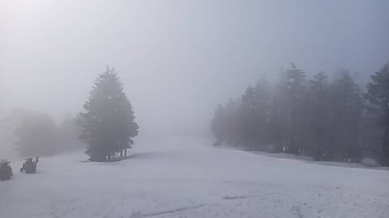
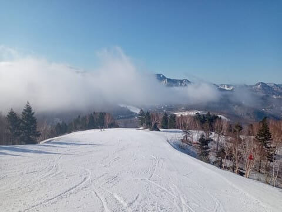
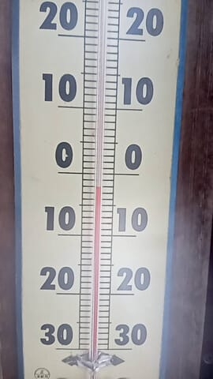
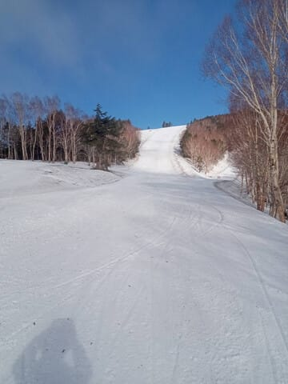
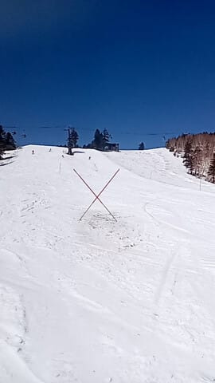
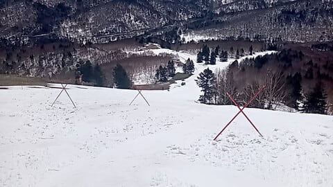
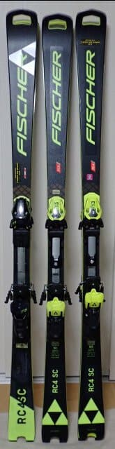

# 2022シーズンモデルのFISCHER RC4 WC SC Proのオーストリア製とウクライナ製を履き比べてみた！

📅 投稿日時: 2025-05-04 02:16:29

🏷️ カテゴリ: [スキー雑談](c1f9d2cb7478308da16419928ea3945e9.md)

ってなわけで．

昨日は志賀高原全面運休という悲しい

1日を過ごし，現在は帰宅中なのですが…

GW4連休初日の本日の5/3も，志賀高原の

特派員から写真が送られてきました～！

まず…

明け方は，昨日までの雨の名残の曇り空

だったようですが…

早朝営業が始まるころには，うっすら

霧っぽい程度で，太陽も顔を出し始め…

早朝営業開始からしばらく経つと，

すっきり晴れたようです…！

…ただ，バーンは圧雪後に雨が降って

融けたので，朝イチからシマシマじゃ

ないのが惜しい．

早朝開始直後の時間は，氷点下まで

冷えていたみたいですが．

昨日の雨で雪温が上がったからか，

早朝のバーンはそこまで硬くなかった

のかな…

4連休初日ということで，GWの谷間より

人はいたものの，そこまで混まなかった

ようで．

早朝のバーン，人が少ないですね…

で．昨日の雨のせいで，GSコースは一部

雪が薄くなったところも出てきたみたいで，

雪の薄い部分は，ポールで注意喚起が

されていたようですが…

うーん．

複数個所で土が出てきてますね（涙）

昨日の雨はかなりの豪雨だったので，

バーンはかなりやられちゃったか…

でも，まだ雪はたくさんあって，コースの

外からたくさん雪をもってこれるところが

あるので，明日にはかなり補修されると

思います…

ってなことで．

晴天でそこまで混まず，

雪の滑りも午前中はそこまでひどく

悪くならず．

GSコースに土が出てきた以外は，

結構よいコンディションでGWラストの

4連休を迎えられたのかな…

今日の昼間は晴天だったけど，夜に雨が

降ったみたいですが…

明日4日の朝までには雨は完全に止んで，

明日も午前は雲が多めながら，

だんだん晴れていきそうな感じです…！

…ってなことで，本題へ．

以前の[物欲選手権番外編](e16ffeabceee8dac4d26ae4d3244fe1c1.md)において

激レア品である，2022シーズンの

FISCEHR RC4 WC SC Proのオーストリア製

モデルを手に入れてしまい．

なぜか現在，手元に2022シーズンモデルの

FISCHER RC4 WC SC Proの

オーストリア製とウクライナ製の両方が

揃うという，おかしな状態になったわけ

ですが…

（一番左端はひん曲げてしまった2021モデルのSC Pro)

これまで，オーストリア製とウクライナ製の

それぞれを別々に履いてみたことは

あるものの，同時に履き比べたことが

無かったので…

今回，同じモデルのオーストリア製と

ウクライナ製を，同じ日に同じゲレンデで

履き比べてみました～！！！

まずはオーストリア製ですが…

久しぶりに履いてみた感じ，やっぱりい板

ですね！！

かなりしっとりした感じで，よくたわむのに

張りとバネ感があって，

ターン前半にすっとたわんでくれて，

トップからテールまでしっかりエッジが

効いて，たわみに沿ってスッと曲がって．

ターン後半の仕上げでそのたわみが

気持ちいいバネ感ですっと返ってきてくれます．

バネ感は気持ちいいけど，返りは意外と

ゆったりと帰ってくる感じなので，

小回り強制板という感じではなく，

ガッツリ踏んでいけばたわみは強く出て

旋回半径は小さくなるけど，スピードを

出して板に圧が強く溜まるように

なってきても，板が強制的に反対に

飛んで行って小回り強制になるような

ことはなく，比較的ゆったりとミドルターン

程度の切り替えで回って行けます．

それでいて，キレイにたわみが出てグリップが

強めなので…

反動を使って，身体を中心に板が左右に

飛んでいくような小回りではなく，

大きくたわんでグリップして回っていく

板に乗って身体も左右に回っていくような，

腰や内側の手が着く深いターン弧を

描いていけます！

当然，たわませなければ大回りに近い

ところまで行けるので…

かなり回転弧の自由度が高く，

やっぱりこの板は名機だな…と思わせる，

かなりい板ですね…

うん．

こんないい板が，中古でGetできて良かった…

…と，オーストリア製を満喫したあと，

今度はウクライナ製に乗ってみますが．

滑ってみたところ…

うむ？

オーストリア製と比べ，ちょいとだけ

フレックスが硬めかな？？

踏んだ時のたわみ量がオーストリア製より

少なめに感じ，ちょっとだけ硬さを感じるので

しっとり感がオーストリア製より弱いけど…

でも，トップからテールまできれいに

たわんで，かなり強めのグリップで

たわみに沿っていたが回っていき，

バネ感はあるけど返りがそこまで早くなく，

小回り強制にならないのにスッと板の

抜けで自然に切り替えができて．

たわみ量のコントロールでの回転弧の

自由度もあるし…

わずかに硬さの違いを感じるくらいで，

当たり前ながら性格は全く同じ！

むしろ，硬めのブーツを履いて脚力が

ある人なら，柔らかめのオーストリア製より

ちょっとだけ強く感じるウクライナ製の方が

いい！…って言う人もいそうな感じ．

フレックス以外の違いはほとんどわからず…

ひん曲げてしまった’21のウクライナ製より

どちらもしっとり感と滑らかさが増した

感じで，フレックスも製造ばらつきによる

個体差のレベルかも？？

直接履き比べれば違いは判るけど，

完全にブラインドで，数日間間隔を開けて

乗ったら，ウクライナ製かオーストリア

製か正しく答えられないかも…

という程度の違い．

うん．

’22のウクライナ製．

’21の工場火災からの復興の時に，機械が

すべて新しくなったので品質が上がった…

という噂があるけど．

確かに工場火災前の製造だった，’

21モデルのウクライナ製より良くなって，

オーストリア製との差が小さくなってる

気がする…

ということで．

ウクライナ工場が火災から復活した後の

’22モデルでは，オーストリア製とウクライナ

製の違いはフレックスのわずかな違い以外，

ほとんど差が無くて．

好き嫌いでどっちがいいか意見が分かれる

レベルだと思うので．

’22のRC4 WC SC PROはウクライナ製でも

オーストリア製でも，文句なくどちらも

名機だということを，改めて感じたのでした…
