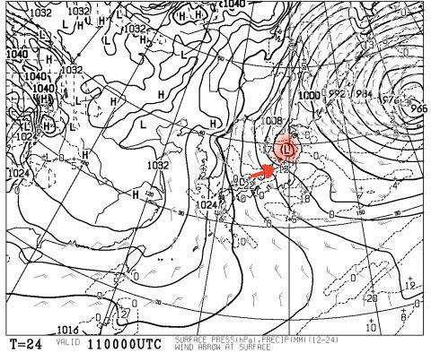

# そして今週末もいつも通りの志賀高原だけど…

📅 投稿日時: 2017-02-10 23:33:57

えー．

明日の天気図ですが．

こんな感じで，赤くマークしたところにプチ低気圧が

発生する予想になりました…

んだもんで．

矢印の向きに西風が入るので．

雪が積もりにくい西風になった

明日の朝の志賀高原は…

当初予想より，積雪が少なくなるかも…？？

まぁ．

でも．

土曜朝の積雪が，当初予想のスネ～太ももパフに比べ，

多少少なくなるかもしれないけど．

雪降り＆パウダーデーであることには変わらない

土日です…

ってことで．

あと2時間で出発です～

＃今日もほとんど寝られない…

今週末志賀高原に来る方は．

焼額でお会いしましょう！

## 💬 コメント一覧

### 💬 コメント by (れお)
**タイトル**: 今夜の降雪も楽しみです〜
**投稿日**: 2017-02-11 16:29:06

志賀行き、明日に変更になりました〜 笑

でも、太板スキーには、明日が良いんじゃないかとも思ってます〜

なので、今夜のレポート楽しみにしてます。

よろしくお願いします〜

### 💬 コメント by (Skier_S)
**タイトル**: れおさま
**投稿日**: 2017-02-11 22:35:00

やはり変なプチ高気圧ができたおかげで，

今日はそんなに積もりませんでした…

朝はブーツパフ．

その後も時々晴れたり雪が舞ったり．

今もそれほど降ってないので，

明日の朝はブーツパフ，

運が良ければ脛パフくらいでしょうか…

では，また明日！

