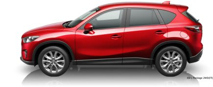
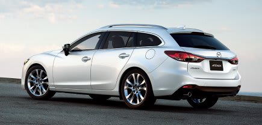

# プロジェクトX，まだ続く…MAZDA ATENZAとCX-5ディーゼルに乗ってみた

📅 投稿日時: 2013-05-21 00:46:16

🏷️ カテゴリ: [車試乗](c07dec5709d34bd74e1f6cb9c8291061b.md)

えー．

[21.2万km熟成済み＠ゴーグルやストックと同程度の価値しかない我が車．](e8cd496c93b61989ddc0cc8ce1d324576.md)

こいつを買い換える，プロジェクトXが始動しているわけで．

まず一つ目の候補者…ならぬ，候補車は，先日の記事に書いた[BRレガシィE型](ec9532ac507ed012a0f7f04d3a2c46687.md)ですが．

次の候補として．

今回はマツダの車を試乗してきたんですね～．

で．

マツダといえば．

Skyactiveのディーゼルエンジン．

2.2リッターターボで，40kgmを超える超絶トルクのくせに

20km/Lという低燃費で，乗る人をとりこにするという噂のエンジンですが．．

今回，こいつに乗ってきました…

ということで．

まずはCX-5のディーゼルです．

(Mazdaの公式HPより借用)

乗ってみたところ．

…

なんじゃ，こりゃっ！！！！！

すげーー！！！！！

さ，さすがトルク42.8kgm！

普通の車の加速は．ステップATにしろ，CVTにしろ．

アクセルを踏むと，ATロックアップ解除，あるいはCVTのギヤ比が変わって，

そこでエンジン回転数が上がって，

エンジンパワーが出てきたところで車が引っ張られていく…

という感じで，アクセルを踏んでから加速まで，しばしのラグを感じますが．

なんというか．

このディーゼルは．

まったくシフトダウンすること無く．

エンジン回転数がぐっと上がることも無く．

これまでの回転数のまま，何事も無かったかのように

怒涛のトルクで車を引っ張っていきます．

かなりの上り坂でも，まったくキックダウンすることなく，そのままの

ギアで，2000回転くらいでありえない加速をしていきます…

なんなんだ～っ！これは！

そして，エンジン音もガソリンなみ．

いや，加速時や登坂時は，回転数がガソリンより低い分，

より静かかも…

そして．

なんと．

ディーゼルなのに，アイドリングストップがある！

…昔のディーゼルに乗ったことある人は，かなりの驚きではなかろうか…

＃この車にグローというものはない←グロー知ってる人どのくらいいるかな…

うーむ．

CX-5のディーゼル，すごい…！

エンジンだけでなく，ブレーキフィールも結構良く．

なかなかですが．

…でも．なかなか良いんだけど．

ちょいとリヤシートが狭いし，チープ．

後ろ座席メインの娘からは不評…

ダイビングにスキーにと，がんがん使ううちにとっては，

トランクもちと狭いかな～．

ということで．

CX-5は残念ながら，候補から落選．

ってことで．

次はアテンザワゴンのディーゼルに試乗です．

(Mazdaの公式HPより借用)

こいつも…怒涛のトルクですね…．

エンジンのトルク感はCX-5のバケモノトルクそのままですが，

足回りの出来が，こっちのほうが良さそう．

過剰に硬くはないけど，比較的締まった足．

リヤシートも思ったより広いし，各部の操作感も

アテンザのほうが高級なタッチ＆フィール．

内装，フロントシート，リヤシートも含め，結構質感がいいなぁ．

…惜しむらくは，電動パワステに，ステアリングインフォメーションが

ほとんど無いことくらいかな…

でも．

でも．

アテンザ．

致命的な欠点が．

…なんと．

4WDがないのだっ！

志賀高原でおじさん5-6人が立ちはだかる，

「4WD以外は，チェーンを履かないと上がらせてあげないよ～(笑)」

っていう，志賀高原の雇用対策チェーンチェックがあるからには．

4WDじゃないと候補から落ちるのだ…

4WDじゃないと，だめなのだっ！

アテンザワゴンに4WDがあれば…

アテンザ，いい車なだけに．

ちょいと惜しいっ！

まぁ，どっちにしろマイナス20度になる志賀高原，

燃料が凍りかねないディーゼルはつらいでしょうけどね…

…ってことで．

残念ながら，マツダ車は．

ちょっと残念な感じで候補から落ちちゃいました…

だけど．

このディーゼルはすごかった．

売れるのは良く分かる…

## 💬 コメント一覧

### 💬 コメント by (miya)
**タイトル**: Unknown
**投稿日**: 2013-05-21 09:55:20

私もBRのA型買うときに、ATENZAも検討して試乗しましたよ。

当時のモデルはディーゼルはまだなかったんですが、

4WDの設定はありましたね。

試乗した感じはなかなかよかったんですけど、

同じく後席重視の我が家では、後席の窓面積が少なくて

圧迫感があったのと、後席のリクライニングがなかったので

見送りになりました。

アコードワゴンも検討しましたが、後席が同じような状況で

4WDもなかったので見送り。。

結局BRの欠点がなく、BHから買い換えましたー。

プロジェクトX楽しみにしてますー。

いろいろ検討してくださいー。

### 💬 コメント by (ひろりん)
**タイトル**: Unknown
**投稿日**: 2013-05-21 22:48:01

あの雇用対策、なんとかならんのでしょうか・・・

ウチのクルマ、取説に「チェーンつきません」って書いてあるんです（爆）まぁ、チェーンをつける隙間ないんですがね（汗）

FRだって、勢いつければあとは気合と根性でどうにかなります！登れなかったら、やり直せばいいんです(キリ

4駆って言い張ってみようかな？どうせわかりゃしないだろうし。雪道歴長いけど困ったこと、2回くらいしかないし。なのでスタックボードと牽引ロープは常備です♪

で、クルマ選びは・・・

ハンコ押すまでが楽しいんですよね～

### 💬 コメント by (Skier_S)
**タイトル**: ぷろじぇくとX
**投稿日**: 2013-05-22 03:17:01

>miyaさま

いやー．

そういえば，先代モデルのアテンザは，4WDがあったんですよね～．

あと，アコード・アコードツアラーは，この3月をもって販売終了のようです…

プロジェクトXの候補車はまだ何種類かありますので，

お楽しみに…！

>ひろりんさま

いやー．

あの雇用対策がないと，上り坂でスタックする車がもっと増えるのかも…

私の知り合いでも，「口先4WD」でチェーンチェックを乗り切っている

人がいますが…

「どう考えてもこの車に4WDモデルはないだろ～」

って車(プリウスとか…)は，無条件にチェーン付けさせられてます．

どうでも良いですが，私は4WDしか乗ったことが無いので，

スタック経験は0です(笑)

