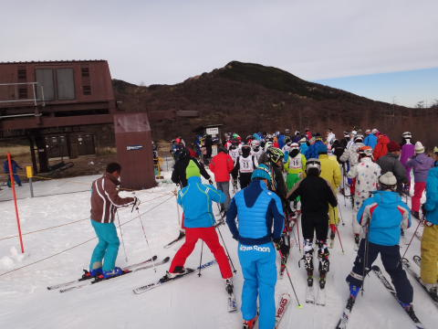

# アサマ2000 2011/2012シーズンのオープン！　11月27日のアサマは…

📅 投稿日時: 2011-11-28 01:12:49

🏷️ カテゴリ: [2012スキー滑走日記](cca3a0e9524e0203150f790b1fc3c71ad.md)

という感じで．

例年なら勤労感謝の日くらいにオープンするアサマ2000．

26日土曜日に，無事オープンしましたね～．

この週末．

高速リフトが動き出したかぐらや，リフト2本動いている丸沼も

魅力的ではありますが．

この時期，大回りできる幅がある中斜面を気持ちよく滑れる

アサマ2000の魅力が一番ですな．

…ということで．日曜にアサマ2000へ行ってきました．

この時期，峠の向こう側は凍結していることが多いですが．

道路は積雪もなく，夏タイヤで突っ切れるレベル．

さてさて．

この時期のアサマ2000．

朝イチは，こんな感じで，見ただけでよだれがじゅるじゅる垂れてしまいそうな

おいしそうなシマシマバーンが広がってます．

この，整地したての一番いいコンディションを狙おうと，

朝イチリフトですでに5分待ち．

アホが多いなぁ…（自分もその一員であることには気づかないフリ）

そして，朝イチオープン！

うひゃーーーー．

気持ちよさそうっ！！！！

しかし．

このスキー場．

トレーニングにちょうどいい中斜面で．この時期にしては人工雪も

そこそこ広い幅につけてあるので．

いわゆる「その筋の方」が殺気立って練習をしています．

相変わらず，スキーヤーの平均レベルとゲレンデの平均滑走スピードが

異常に高いスキー場だなぁ…

で，私も朝イチバーンに飛び込みます．

朝イチは，バーンもピカピカなフラット．

斜度も結構あり，かなりスピードが出せるっ！

きもちいいっ！

これだっ！

これだよっ！

スキーってのは，やっぱりこうじゃなきゃ！

…この斜面を滑ってしまうと．先週までのYetiは，どっちかというと

「スキーらしきもの」

「シーズンを迎えるための儀式」…って感じがしてきた．

この朝イチアサマ2000．

半年間忘れていた，きれいな整地を大回りする快感が復活！

でも．

しかし．

リフト待ちは9時半～10時に5分～最長7分程度にまで伸びちゃいます．

まぁ，これだけバーンコンディションが良いから仕方ないか…

しかし．コンディションがだんだん悪くなってきて．

コース途中に人が溜まるようになってくると…

リフト待ちも短くなり，10時半には3分，12時ごろには1分くらいに．

このスキー場，昼ごろになると．アイスバーンの小回り道が

でき始め，雪が荒れて大回りができなくなってくるので．

本気の練習モードの人は，昼ごろには帰っちゃう人が

多いんですね～．

午後から人が増えてくるYetiとぜんぜん違う…

昼を過ぎると，リフト待ちはほとんどなくなります．

しかし．

しかし．

昼過ぎのバーンコンディションは，

エッジをしっかり研いでいる人じゃないと恐怖心を感じる

アイスバーンの小回り道と，その間に溜まったもさもさ雪の

ストライプ．

(右側にコブラインが1本できてます)

…あんまり楽しくない…

けど．

滑っている人は，やっぱりレベルが高い…

どうしてこのアイスバーンの斜面，何事もなかったように降りて

来れるんだろう…

(午後3時ごろにはこんな感じに…)

とりあえず．

先週までのYetiと違って，神経が何本か切れてる人が多いこのスキー場ですが．

この時期，（午前中だけだけど)これだけいいコンディションで

滑れるってのはいいんじゃないでしょうか…．
