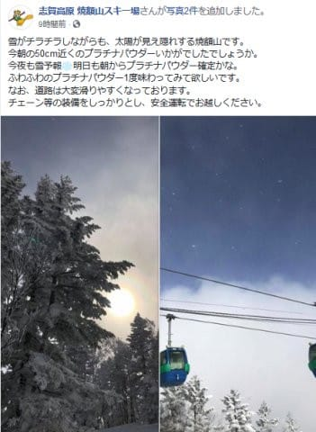
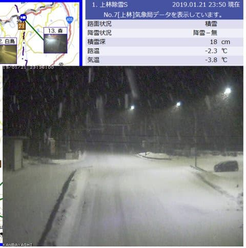
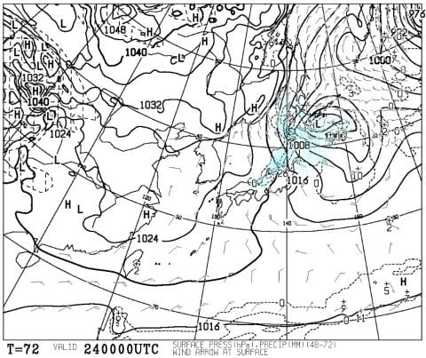
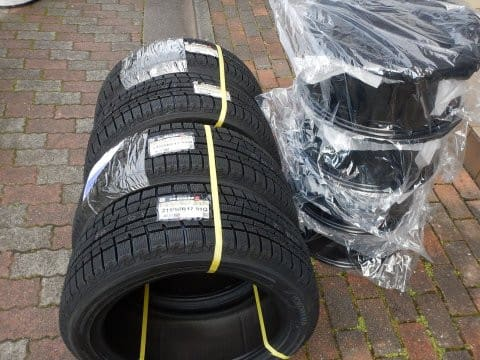
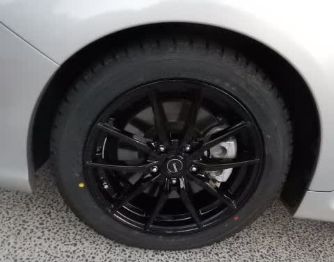
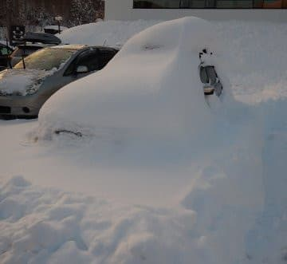

# VMGレヴォーグに履かせたスタッドレス，YOKOHAMA IG5Plusで7000kmほど走ったインプレッション

📅 投稿日時: 2019-01-22 01:25:23

🏷️ カテゴリ: [車](cba0e8330b3f2ded7c1addfacc75d4547.md)

うーむ．

週末にスキーに行ってないので．

スキー場レポートが書けず．

スキー場レポート以外のネタを

多数書かねばならぬ今日この頃．

皆様いかがお過ごしでしょうか←季節の挨拶

ってなことで．

今日，月曜日ですが．

朝はけっこう積もったみたいですね…！

焼額では，積雪50cmって言ってますが…

ホントにそんなに積もったのかな？

（[焼額山FB](https://www.facebook.com/yakebitaiyama/posts/2007879525974050)より）

そして．

深夜0時現在も，志賀高原ではドサドサ降ってる

ようです…

（[北信建設事務所HP](http://hokushin-camera.org/)より）

ふもとの上林チェーンベースでこれですから，

かなり気合の入った降りですね…！

これから明日，火曜の朝にかけて．

かなり積もりそうですよ～！

また，パフパフ新雪になりそうですね…

そして．

火曜朝だけじゃなく．

24日木曜の朝の天気図を見ると…

…この日も，風向きがどうなるかで，

志賀まで雪雲が届くか微妙だけど…

日本海側はドサドサ降りそうな

天気図ですね．

風向きによっては，志賀もドサドサ

降りそうな感じ…！

で．

この週末は．

-15℃レベルの激冷え週末になりそうです．

…残念ながら，太陽には恵まれなさそうですけど．

冷え冷え最高雪質で滑れるかな～．

って感じで．

ここまでが本題じゃないの？と思える，長い前フリの後は．

本題へ．

本日は，LEVORG 2.0GT-Sに履かせた

[YOKOHAMA IG5Plus](ea8a4c7dd515219417167a3871ffdc9c3.md)．

このスタッドレスを履かせてから，

早くも7000kmほど走ってみたので．

こいつのインプレッションをば，書いてみましょうか…

えー．

まず．

アスファルト路面で走ってみた感じですが．

純正の夏タイヤが，かなりロードノイズが

大きいタイヤだからか．

スタッドレスにした方が，ロードノイズが

静かになったような気がします…

音は高周波になったけど，低周波成分が

抑えられた感じで，全体的な音圧は

低周波が響く夏タイヤより，スタッドレスに

履き替えてからの方が低くなった気がする…

そして．

タイヤサイズを，夏タイヤの225/45R18から

215/50R17に変えて，ホイールサイズが小さくなり，

扁平度が抑えられた分．

タイヤの縦バネが効くようになったので，

バネレートが落ちたような，マイルドな

乗り心地になりましたね…

普通の街乗りでは，音も抑えられ．

段差の乗り越えも丸くなったので．

ドライバー以外は，スタッドレスの方が

乗り心地がいいと思ってしまうのでは…？

という感じ．

だけど．

このタイヤ．

ブロック剛性もしっかりしており．

さらに，インチダウンしたとはいえ

まだ50扁平のため，サイドウォールも

十分強いようで．

普通にアスファルトの山道をハイペースで

走る程度ならば．

ブレーキングや横Gをかけても，全然普通に

走れちゃいます．

かなりのハイペースで飛ばしても，

トレッドがヨレてタイヤが逃げていくような

感じはほとんど無く．

スタッドレスで走っているのを忘れるほど．

…よっぽど，前のBRレガシィの夏タイヤの方が，

アスファルト路面でのグリップが弱かったかも…

夏タイヤでも，簡単にフロントタイヤがスキール音

たててたもんなぁ…

ガンガンに攻めたわけでは無いですけど．

普通の人なら，ちょっとびっくりするかも

というペースで走っても大丈夫だったので．

アスファルトのタイトな山道でも，

怖くなく走ることができます．

そして，肝心な雪道ですが…

今のところ，私には十分！

圧雪路面はかなりのペースで飛ばしても

しっかりグリップして怖くないし．

積雪した街中でのGo/Stopも不安は全く無く，

十分に効いてくれます．

新雪に埋もれるような駐車場からも，

ヤケビスタッフの人が，

「それで車出せるんですか？」

と驚くほどの，タイヤの前後の雪をちょっと

どかしてやっただけで．

問題なく脱出できたし．

（車を動かす直前の写真を撮っておけばよかった…）

ただ，ブラックアイスではさすがに

ちょいと滑りましたが…

でも，歩くのも困難なくらいのツルツル路面で，

これだけ効いてくれれば十分だろう…

というレベル．

とはいうものの．

馬力のあるLEVORG 2.0なので．

雪道で無造作にアクセルを踏むと，

いとも簡単にグリップ限界を超えてしまい，

VSCがガンガン効いちゃいますけど…

また，LEVORGで雪道を攻めた時の挙動に

ついては，別途レポートします～！

んで．

やっぱりこのタイヤの驚きは…

[前のBRレガシィに履かせたときも思った](e31c35ca3deed012deea99b3659e3218a.md)けど，

燃費がいいこと！

いや，最近のスタッドレスは，軒並み燃費が

良くなってるんでしょうけど．

インチダウン効果もあるのか，

夏タイヤよりも燃費がいい気が

するんですが…！！

まぁ，走行抵抗はトレッド幅に依存するので．

トレッド幅を225から215に減らした効果が

かなりあると思いますが．

スタッドレスに交換してからの高速燃費．

アイサイトで90～100kmくらいで定速走行すれば．

大体コンスタントに15km/L～17km/L

くらい走ってくれます！

わが家から志賀高原の往復，600km．

うち500kmちょいが高速道路になりますが．

この，志賀を一往復した時の燃費．

山道の上り下りを入れても，大体

リッター14kmは走ってくれますね～．

ってことで．

静かで乗り心地も悪くないし，

アスファルト路面でも不満は無いレベルだし．

雪道でも問題なく飛ばせるし．

なんてったって燃費がいい．

IG6にしようかどうしようか悩んだけど．

別にIG5Plusでも十分だよな～．

と思った，Skier_Sだったのでした…

## 💬 コメント一覧

### 💬 コメント by (いか)
**タイトル**: Unknown
**投稿日**: 2019-01-22 08:02:53

スタッドレスに替えると、燃費よくなりますよね(笑) 私のVMGも感覚で1km/Lほどよくなった印象です(タイヤは推奨サイズのVRXです)。次はヨコハマも検討してみたいですね。

2月と3月に1日ずつお邪魔しようと思っています。お会いしましたらよろしくお願いします〜

### 💬 コメント by (ほっぽ)
**タイトル**: 昨日のヤケビは
**投稿日**: 2019-01-22 09:11:54

Ｓさん

降雪５０ｃｍは盛り過ぎかなと思います。

３０ｃｍ程度だったと思います。

でも、終日ー１０℃近くをＫＥＥＰして志賀高原らしい

軽い粉雪が楽しめて、何時もは湯沢周辺で滑っているという同行者さん

こんな雪は体験できない、とえらく感激されていました。

ところで我が家のアルファードハイブリッド、

リアモーターのなんちゃって４ＷＤですが、

今年は既に２回、宿の駐車場からの脱出でスタック寸前になってます。

やはり、踏破力は本格的な４ＷＤには敵いません。

もう１台のＢＰレガシィなら何ら問題ないんですが、

こちらはバッテリーを小型化しちゃったので、日帰り限定の足になってます。

乗り比べると、スバル４ＷＤの性能には満足しています。

### 💬 コメント by (かず)
**タイトル**: Unknown
**投稿日**: 2019-01-22 17:45:02

仕事のSさんに申し訳無いですが昨日は最高でしたよ

駐車場で膝位　朝1ゴン1号機に乗り　オリンピックft　ヤケビ全面底付き無しだったので　16時まで楽しみました　今シーズン初の休憩無しB無しになりましたよ～笑

### 💬 コメント by (megalith)
**タイトル**: Unknown
**投稿日**: 2019-01-22 19:41:51

スタッドレスのインプレッションありがとうございました。

自分のBRは今年はノーマル&スタッドレスともに交換しなくてはならないので参考ななりました。

今の所ノーマルは評判の良いDUNLOPのLE MANS Vにしてようと思っていますが、スタッドレスはYOKOHAMA IG5Plus．が第1候補ですね。

ただ17インチになるといきなり高くなるので悩みまくっていますが。（笑）

あ、スタッドレスはインチダウンします。（汗）

### 💬 コメント by (若杉勲71)
**タイトル**: 志賀高原情報
**投稿日**: 2019-01-22 21:40:52

昨日あさ、ほっぽ手前で三台の事故を目撃。今シーズンは事故が少ないので、初の目撃です。一昨日は登れずにUターンのハイエースに会いました。

今日はオリンピックで35ほど。4日前ほどの感動はなかったけど、まずまず楽しめました。

そしてまた今日も、レインボークラブ員は虹、じゃなく２時で、帰路について宴会にうつつをぬかすのでありました。

### 💬 コメント by (つーちゃん)
**タイトル**: 頭文字Ｓ
**投稿日**: 2019-01-22 23:00:43

スキール音がするほどタイヤに仕事させたことが有りません

流石は志賀高原最速の男”Driver_S”ですね。笑

一度は助手席でＳさんの走りを見学してみたいものですっ！

バイクに乗せればスキーばりに傾くのでしょうか、

私のバイクのタイヤはショルダー余りまくり余リングですー

### 💬 コメント by (なるなる)
**タイトル**: Unknown
**投稿日**: 2019-01-23 00:17:49

実は私、S様に毒されてVMG買ってしまいました。

今週末、志賀まで行くと納車1.5ヶ月で走行距離が4,000Kmを軽く越えてしまうのですが…

納車1週間後には記事を参考に、内装をバラしまくってゴネゴネやってるし

なんか、かなり毒されているような気がしていますw

### 💬 コメント by (Skier_S)
**タイトル**: 大量のコメントありがとうございます…
**投稿日**: 2019-01-23 02:22:57

＞いかさま

推奨サイズということは，17インチにインチダウンですね．

やはり，225⇒215のサイズ変更が効いているのか，

燃費良くなりますよね…

2月と3月に，また志賀にいらっしゃるのですね．

また一緒に滑りましょう！

＞ほっぽさま

50cmはやっぱり盛りすぎですか(笑)．

でも，新雪パフパフだったようで，いいですね～．

しかし，雪道でスバル車に乗ると，もう他の4WDには

乗れなくなってきますね．

エンジンブレーキが4輪にしっかり効くとか，

深い雪の走破性能とか…

LEVORGは最低地上高が低いのでちょっと心配

していましたが，幸い今のところ問題になるような

状況にはなってないです．

＞かずさま

月曜はよかったみたいですね…

人も少なく，ラストまでパフパフだったんですか…

うらやましすぎます…

まだ確定ではないですが，今週土曜も結構パフパフ

行けるかも？？

明日また予想します～！

＞megalithさま

私は，BridgestoneはREVO GZ以降履いてないので，

最新のVRX2とかがどんなか分からないのですが，

iG5Plusは，少なくとも私が雪道を走って不満は無い

レベルです．

アスファルト路面は，REVO GZよりはずっといいです…

（VRXは良くなってると思うけど）

結構安く買えるので，コストパフォーマンスは高いと

思いますよ！

＞若杉さま

そういえば，私も今シーズンは志賀の登り坂で事故を

見てませんね…

今シーズンは事故が少ないですよね．

いつもなら，第2トンネルで突き刺さってる車が

1-2台いるのですが．

今日もオリンピックは新雪だったのですね…

あぁ…パフパフを滑りたい…

しかし．Skilineが無くなったら，どれだけコンディションが

良くても完全にレインボークラブ（2時上がり）なんですね（^^

＞つーちゃんさま

夏の山道とか走ると…タイヤ鳴かせちゃいませんか？

トランクの荷物がゴロゴロ転がりますが(笑)．

ちなみに，雪道で私の助手席に乗ると，お尻がむずむず

するらしいです(笑)．

バイクは昔は結構攻めてましたが…

今はこけると怖いので，バイクはそんなに攻められなく

なりました．

車はどれだけ攻めても転びませんから．

＞なるなるさま

え！

VMG買われたんですか！！

そして，内装バラしちゃいましたか…

このBlogから，悪い方向に影響を受けてますね(笑)．

しかし，納車1.5か月で4000kmですか…

走りこんでますね～！！

今週末，志賀ですか．

お会いできるといいですね～．

