# 2019年8月，座間味で小6の娘と親子ダイビング！その9…ダイビング2日目の3本目

📅 投稿日時: 2019-11-22 00:36:25

ということで．

昨日，21日は冷え込んでましたが．

これから気温が上がり始め．

22日朝には，人工降雪機を動かすのが

厳しい気温になっているかと思います…

その後，週末まで．

もう人工雪が打てるほどの冷え込みはありません．

つまり．

現時点の積雪量から週末まで，これ以上

雪が増えることはありません（涙）

それどころか．

本日22日の夜から，雨になりそう…（泣）

その代り，本来23日に降るはずの雨が，

早めに降り始めたということで．

雨が上がる時間も早まったので．

23日の朝までには雨がやみ，志賀高原は

23日は降らなさそうな天気になってきました…！！

…素晴らしいことに、

熊ノ湯の23日のオープン決定したようですが、

今晩の雨と今日からの高温にゲレンデが耐える

のか…

24日にまたクローズになる可能性も

あるかも…

これから26日くらいまでは，平年より

おかしいくらい気温が高い日が続きますが，

一応，27日あたりから平年並みの気温に

落ちてくれそうなので．

今週はもう期待せず，30日の週末に

期待したほうが，精神衛生上よさそうな感じです…

…ってことで．

まだ某国滞在中で，相変わらず夜中まで

日本と電話会議をしている状況で，

記事を書いている時間がないので．←いや，ここまでの記事で普通のBlog一回分はあるから

本日は，書き溜めておいたダイビング旅行記です．

…スキーシーズンに入ってもう1か月近く

経とうというのに←普通の人はまだスキーシーズンに入ってすらいないから

ダイビング旅行記です…

では，どうぞ～１

---

ってなことで．

本日のラストダイブ，3本目のポイントに

やってきました…

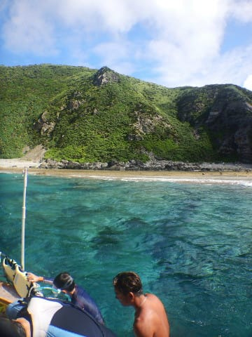

ポイント名は「ヤカビトンネル」

去年も潜った，地形ポイントですね．

で．

娘はなぜか，さっきの1本で耳抜きが

やりづらくて苦しんだらしく．

他の子どもと遊びたいというのも

あるのか，この1本は潜らずに

お留守番とのこと…

ダイビング大好きに育った娘としては，

ちょっと珍しいのですが．

まぁ，普通は1日3本潜ったら疲れる

人もいるので．

ダイビングフィーが一本分安く上がる

というのもあり．

「じゃ，お留守番しててね」

と．

娘を置いて，潜りに行く準備をします…

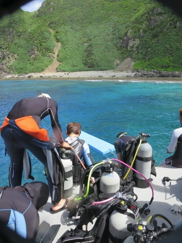

そして，3本目エントリー！

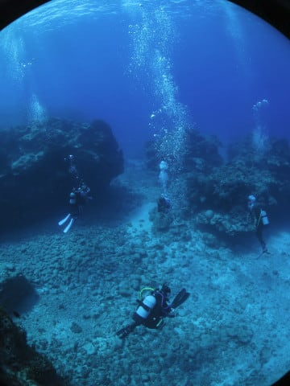

うーむ．

娘がいないと，何かが足りない感じが

する…

いつもは娘のことばかりを気にしながら

潜っていたというのが．

娘がいなくなるとよくわかりますね…

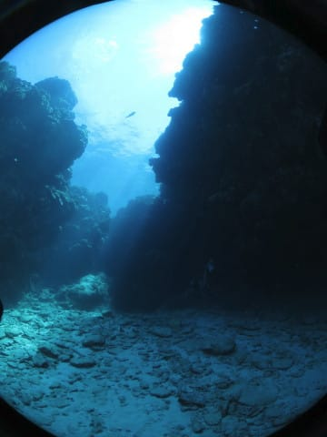

ってことで．

娘のいない，ちょっと気楽なダイビング

となった3本目ですが．

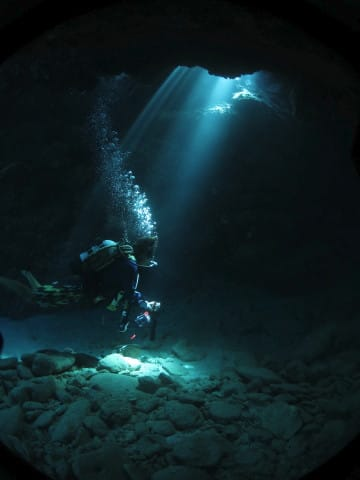

うーむ．

娘以外をモデルにして写真を撮っても，

ちょっと何かが違う感が

ありますね…

とりあえず．

地形ポイントなので，

いろんなトンネルの中を

進んで行きますが…

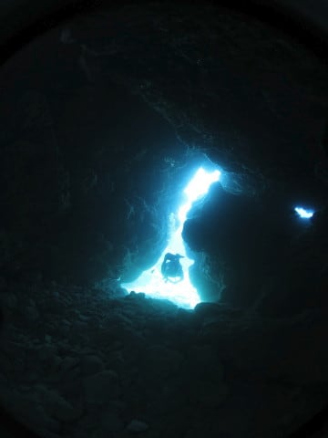

大体コース取りは去年と

同じなので．

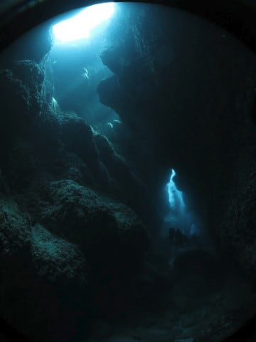

撮った写真は去年と同じ構図ばかりに

なっちゃいますね…

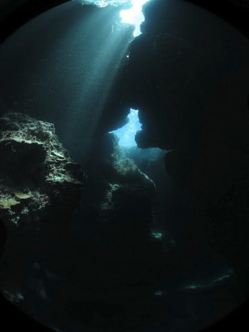

うーむ．

これも去年，全く同じアングルで

撮った気が…

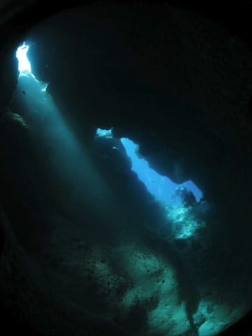

と．

何の進歩も感じられない写真ばっかり

撮っていると，トンネルくぐりは

終了．

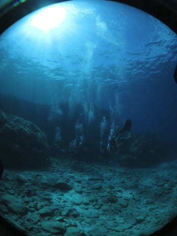

太陽がきれいに差し込むサンゴの

上を漂ったら…

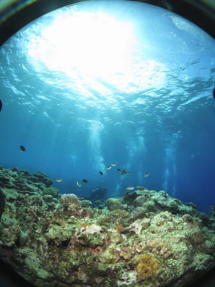

ボートの下に戻ってきます．

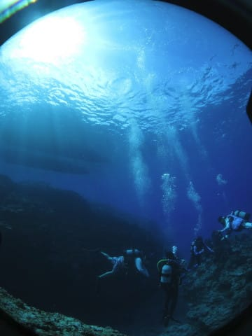

海の中から，青い空が見えて，

きれいですね～．

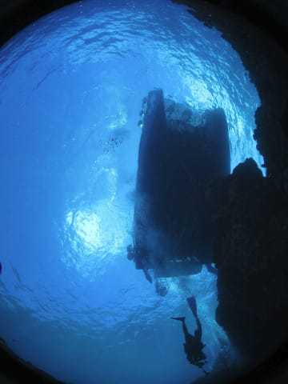

そして，エグジット．

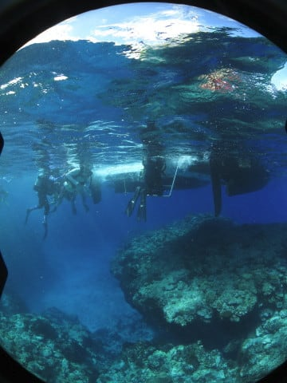

水面に浮かび上がると，

見事な青空が出迎えてくれます…

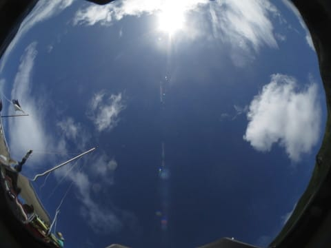

…しかし．

この3本目．

娘がいないと，写真の撮影枚数が

かなり少なくなることが分かって．

普段潜っている時は，娘をかなりの枚数

撮影していた事を思い知らされた

Skier_Sだったのでした…
