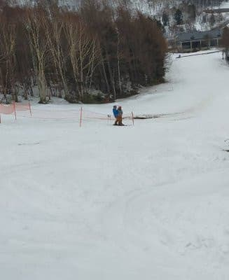

# 2021/4/5(月)の志賀高原スキー場は営業開始時には雨が止み，昼にちょっと雪が舞ったみたい

📅 投稿日時: 2021-04-06 10:39:38

🏷️ カテゴリ: [日記](cc4b5682fb7b8b144980957a978653fb0.md)

えー．

昨日は死んでたというより，

Blogを書く前に机に突っ伏して

熟睡してました(涙）

ってなことで，手短に朝更新！

…日曜は，5週連続の週末に雨となった

悲しい一日でしたが．

その雨は，月曜の早朝まで降り続け…

そして，ちょうど今朝のリフト営業開始

の頃に止んだようですが…

月曜の特派員からの写真は，雪が減った

ことを知らせたいのか，

雪が解けた残念な感じの景色での

おこみん写真からスタートでした…

日曜の段階でも雪が少ない

と思ったのに．

昨晩からの雨で，月曜朝はさらに雪が

減ってしまい…

もう営業してないないとはいえ，

サンバレーもゲレンデが穴だらけになり．

営業しているダイヤモンドも，写真の

左側のバーンの上の方，もう土が出始めて

来ています(涙）

こうなると，これまでの経験上，あと

2週間程度で雪が消える感じなんですが…

同じ場所の，昨日の写真と．

今日の写真の比較も送ってくれましたが．

一日でこんなに減るとは…っ！！

例年なら，人工雪をたっぷりつけて

GWまで穴が開かないように準備万端の

唐松コースも，日曜にはかなりの穴が

開いてたし．

月曜の奥志賀も，ダウンヒルコースは

かなり雪が薄くなり，コース脇に土が

見えるようになってきてたり．

焼額も，昨日でクローズになったSGSコース．

やっぱり，すぐに土だらけになってますね．

うーん．例年より3週間ほど雪の減りが早い気が？？

大体，例年なら4月末くらいの積雪量に

なってますね…(涙）

で．

今朝のゲレンデ状況は．

朝の気温は-1～2℃程度と，

ここ数日から見ると

そこそこ冷え込んでいたので．

ゲレンデはシマシマながら…

ダウンヒルはカチカチ絶叫バーン！！

第3ペア沿いはまだマシだったものの．

それでも朝は硬く…

10時ごろに全面緩み始めてきたけど．

緩み始めると一気に緩んでザブザブに

なってしまい．

昼ごろには，結構ダメダメな雪に

なっちゃったらしいです…

ただ，昼間でも0℃あるかないかの

気温だったので．

何だか，昼間近くになると，

ゲレンデに雪がチラチラ舞い始めたよう

です…！！

…ってなことで．

コメント回答はまた今晩…

## 💬 コメント一覧

### 💬 コメント by (レインボー73)
**タイトル**: Unknown
**投稿日**: 2021-04-06 13:57:23

火曜日の志賀高原情報

114日目、目標クリアです。

朝の車にはしっかり霜が。ありがたいことです。上林０℃　蓮池４℃。なんでだ！

１号トンネルの手前だけがかなりの氷。注意です。

山頂５℃、どうして？？？

暖かいけど滑るいい雪。お客様は皆無に近いし快適そのもの。リフトも昨日より速いので15分で回せる。

15分回し→４回し/時→48回し/12時

419m✕48＝20112m

ゴンドラがまずまずの速度でも12時間かかる。ゴンドラに本気出してもらうと、

7分04秒＋乗降2分＋滑り3分≒12分回し→5回し/時→

48回し/9時間36分

ゴンドラにフル稼働してもらって空いていれば、早朝＋昼間でいけるんじゃない？

でも、この二つの条件が難しそう。

そんなこと考えながら、目標の10本を11時前に完了。一日が長ーーーいです。

### 💬 コメント by (Skier_S)
**タイトル**: ＞レインボー73さま
**投稿日**: 2021-04-07 03:26:59

目標クリアおめでとうございます！

あとは，114日から記録をどこまで伸ばせるかですね(笑)．

焼額は早朝＆昼間で20000m行った方はいますが…

ゴンドラ待ちが無いことが必須条件ですね…

むしろ，昼間だけで奥志賀ゴンドラ48回乗った方がいるのが驚きだと思いますが(笑)．

