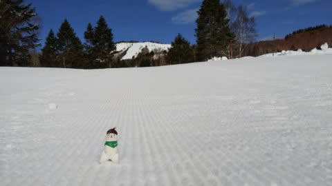

# だ，ダメだ…やっぱり今週はかなり厳しい（涙）

📅 投稿日時: 2021-03-17 05:02:13

🏷️ カテゴリ: [日記](cc4b5682fb7b8b144980957a978653fb0.md)

昨日の記事で．

いろいろ切羽詰まってるって書きましたが…

今日，仕事が終わったらこんな時間って

どういうこと？

これで，明日仕事できるのかな？

これから急いで寝ないと死ぬ…

とりあえず，

今日も特派員から写真を送ってもらったのですが．

午前は晴天だったけど．

午後は予想通り，雨もポツポツ落ちてくる

天気だったようです…

また夜に，2日分の特派員レポートを

お送りします！

…私に記事を書く余裕があれば…

ということで．

これから寝ます．

お休みなさい…ｚｚｚ

## 💬 コメント一覧

### 💬 コメント by (レインボー73)
**タイトル**: Unknown
**投稿日**: 2021-03-17 11:58:08

水曜日の志賀高原情報

朝の上林1℃　蓮池ー３℃、2ゴン上ー４℃。終日気温が大して上がらなさそうなので、緩むのが遅そう。

まずはパノラマから１ゴンへ。硬すぎ。

降り場で有名なゆ○○ん発見！バキューン！転ばない！

追いつくしかない。しかし敵もさるもの、追いつけない。

2ゴンでやっと捕獲。

その後、エキスパが超絶との報告が。私らはパノラマ回し。ひと滑りごとに緩んでくるのも面白い。

今日からシラカバが圧雪されて入れるようになりました。快適です。二高故障のため、プリンスバスが、二高から2ゴンまでピストン輸送してくれるとか。

ファミリーはフラットカチカチ山。こんな時にもあの高名なコ○○ケ様は、キレキレで楽しんでる。きっと夜な夜な包丁じやなくエッジを研いでおられるのでしょうか。

タンネには団体様が。緩む前に西たてを。

硬い所と緩い所が混在して快感はない。

そんな訳で、寺子屋はあとにして、今日も銀嶺でざる蕎麦です。

### 💬 コメント by (レインボー73)
**タイトル**: Unknown
**投稿日**: 2021-03-17 14:01:38

水曜日の志賀高原情報２

昼からの西たては、すっかり柔かくなっていたけど、均一なのでまずまず。

寺子屋は今日も楽しい。難を言えば少しの向かい風かな。

ここでアリス様からお声掛け。初対面なのにどうして？さては裕次郎に似てることがばれたのかなあ。

帰りのファミリーはまだ硬い。私レベルではどうしても横滑り多用ターンになってしまいます。

そして二高に戻ると、程なく巡回バスが。お抱え運転手みたいで幸せ！

こんなに便利なら、二高が故障しててもいいかな、なんて。

