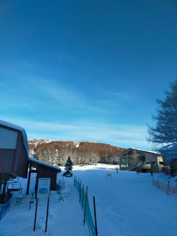
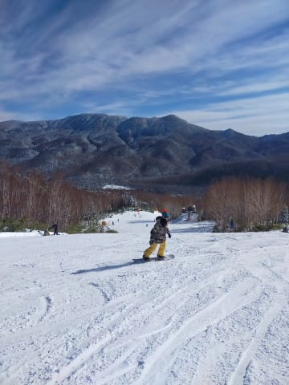
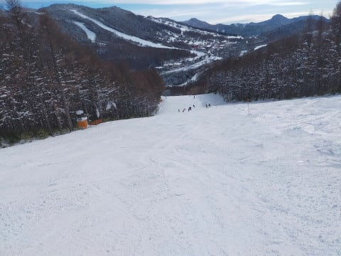
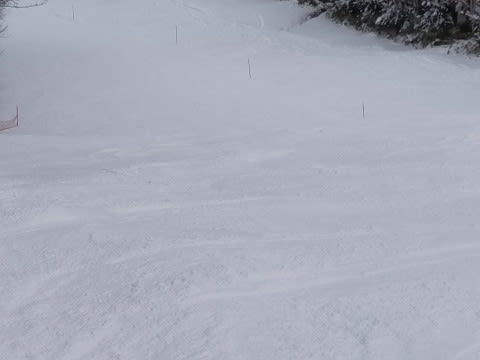

# 2023/12/24(日)の志賀高原の焼額山スキー場の詳細レポート！…夕方曇った以外はずっと晴天，でも冷え冷え！唐松コースは氷のコロコロがあったけどサウスは雪質Good！

📅 投稿日時: 2023-12-26 01:03:54

🏷️ カテゴリ: [2024スキー滑走日記](c453f687e8a0f05679e95831d0a02cd0c.md)

えー．

本日も志賀高原を滑っている特派員から

レポートが届きました～！

今日の志賀高原も，朝はすっきり晴天！

…でも，昼前から雲が増えて，午後2時

ごろには曇り空になったようですが…

あさイチは最高シマシマが楽しめた

ようですが…

でも．

晴れなくてもいいから，雪が降って

ほしい…

そして，奥志賀のほうも，第3はいい感じの

冷え冷えフラットバーンだし…

エキスパートコースも，天然雪だけの

はずなのに，もう全面きれいに雪がついて

いて．

意外にもブッシュが出てきてないし，

日曜は非圧雪だったけど，今日は圧雪

されていたようで，バーンはそこまで

ひどいコブコブになっておらず．

雪質はすごい良かったみたいです…！

一応，今晩（月曜夜）もちょっと雪が

降ったようですが，まぁ，せいぜい5cmって

ところでしょうか．

もっとドサドサ積もってくれないと…（涙）

この後も，27日朝に数cm降る程度．

あとは31日が雨にならずに雪になれば，

ちょっとは積もるかもしれないけど．

ゴンドラのコースが気持ちよく滑れる

ようになるのは，まだ先になりそう…（泣）

ってなことで，本題へ．

日曜の焼額山スキー場，詳細レポートです！

まず．

この日もすっきり晴れの天気で

スタートした一日でしたが．

あさイチは，放射冷却もあり-8℃程度

まで冷えて，かなり冷え冷えの

スタート！

この日も，焼額山スキー場は第2高速と

第4ロマンスの2本しか動かないので…

今日は第2高速スタートとしてみましたが．

朝8:30の営業開始から5分前に並ぶと，

まだこの程度しかいなくて．

今日はそんなに混まなさそう…

で．

あさイチのリフトでゲレンデに出ると…

うほーーー！！

シマシマッ！

昨日積もった雪が圧雪された，

結構柔らかめの圧雪で．

柔らかいのでスピードは乗らない

けど…

トップシーズンの雪ですよ！！

晴天シマシマは，スキーの快楽を

最大限に引き出す麻薬効果があるのだ！！

ってな感じで，人も少なく，数本は

気持ちよく滑れたけど…

今日も朝8:30～10時まで修学旅行生の

団体さんがいて，リフトが2本しか

動いてない状態ではちょいとコースの

人口密度が高くなったかな…

リフト待ちも多少伸びたけど，

混んだのは10時過ぎくらいまで．

10時のリフト待ちピークを越えると，

リフトもガラガラ！！

そして，ゲレンデの人口密度も結構

低くなり…

タイミングによっては，こんなクリアラップが

取れるほどのガラガラ具合に！

昼間も，日が差しているけど，気温は

低く．

雪質は冷え冷え粉雪状態！！

第2高速の唐松コース側は，ちょっと

氷のコロコロもあったものの…

このコロコロも，午後になったら

消えてくれました！

雪質はいいし，天気はいいし．

混んでないし…

…悪くない．

悪くないんだけど…

そろそろリフト2本だけじゃ，飽きて

きたかな…

第2高速リフトは，タイミングによって

搬器数台待ちになったものの．

基本的にはそんなに待ちがなくて，

快適！

第4ロマンスは…

ゲートが一つしかないので，ゲートで

カードが読めなかった人とか，

スキーに慣れてない人とかがいると

この写真のようにちょっと詰まるけど．

そういう人がいなければ，待っても

数人待ちという状態．

こんな中で，天気も良く，雪もいいので．

リフトが2本しか動いてないのを除けば，

かなりいいコンデションなんじゃないかな～…

…しかし．

まだ滑れないパノラマコース側を見ると．

もう滑れそうに見えるんですけどね～…

でも，大勢の人が滑ったらあっという間に

はがれちゃう程度の厚みみたいです（涙）

今日は人が少なかったし．雪も降りたて

じゃないので，昨日と違って午後に

なっても雪は全然荒れてこず…

午後になっても，いい雪質のフラット

バーンが続きます！

午後の写真とは思えないフラットさ！

…ただ，午後1時を過ぎてくると，

ちょっと日がかげってきて…

午後2時には，完全に曇り空に

なっちゃいました…

…でも．

むしろ曇ってくれたぶん，雪がさらに

冷えて…

だんだん雪が締まっていき，しっかり硬めに

締まった，スピードが出る気持ちいい圧雪

バーンになっていきました…！！

第2高速側の唐松コースの急斜面のみ，

ちょっとだけ荒れてきてましたが…

ここ以外は夕方まで全面フラットで

かっ飛ばせる快楽バーンでした…！！

ってなことで．

先週，最後まで滑ったために事故渋滞に

巻き込まれてひどい目にあった

ということを全く学習していないため．

結局この日も，リフトが止まる16時まで

滑り倒したのでした…

いやー．

雪はいいし，混まないし．

12月は結構好きな時期なんだけど．

何度も言うけど，リフト2本，2コース

しか滑れないのが惜しかった…

このクリスマス寒波がかなり冷えた

にも関わらず，志賀高原は西風で雪が

そんなに積もらなかったということを

振り返るにつれ．

西風が憎い…

という思いが増してくるんだけど．

そうか．

西風をブロックする北アルプスを削れば，

西風でも志賀高原に雪が降るんだよな…

いっそ，北アルプスを削ってやろうか？？

という，危険な発想に至ったのは，

私だけではあるまい…←いや，あなただけだよ

## 💬 コメント一覧

### 💬 コメント by (北アルプス削っちゃいましょう！)
**タイトル**: Unknown
**投稿日**: 2023-12-26 12:38:04

このブログを読むようになってから北アルプスは邪魔だという思想に取り憑かれています。

もはや志賀高原原理主義者ですね^ ^;

### 💬 コメント by (JPCZ の方向を・・・)
**タイトル**: Unknown
**投稿日**: 2023-12-26 15:52:23

扇風機のように向きの変わる JPCZ を山陰方面に固定するのが手っ取り早いかと

### 💬 コメント by (Skier_S)
**タイトル**: 過激な発想だ…
**投稿日**: 2023-12-27 02:56:14

＞北アルプス削っちゃいましょう！さま

志賀高原原理主義者ですね（笑）

実行したら，北アルプスを愛する山好きに命を狙われるかもしれません…．

＞JPCZの方角を・・・さま

その発想はなかった．

そんな手があったか！！（いや，実行できないから）

