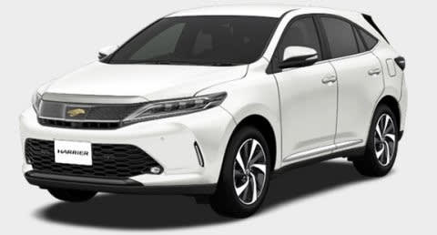

# トヨタ ハリアーのハイブリッドとターボ車を乗り比べてみた…まずはハイブリッドから

📅 投稿日時: 2017-09-28 01:44:06

えー．

なんだか最近．

頻繁に車の試乗レポートが続きますが…

現在走行距離13.5万kmの，我がBRレガシィ君．

このスキーシーズンが終わったら，

おそらく走行距離は16万kmを突破．

…さすがに買い替え時か…？？

ということで．

そろそろ気になる車を乗り比べている

今日この頃．

＃貧乏金無しなので，20万kmまで乗り続ける可能性も捨てきれないが…

ってことで．

今回の試乗車は何かというと…

トヨタ車で，レガシィやLEVORGと同じくらいの

積載容量があって，4WDで，そこそこ走って…

という選択肢で選んだ車．

そう，生き残るのは，こいつですね．

トヨタのハリアー．

今回，こいつのハイブリッドとターボに乗ってきたので，

その試乗レポートをば…

（トヨタWebページより拝借）

まず．

試乗したのは，2.5L ハイブリッド最上位グレード，PROGRESS．

この車のハイブリッドは，エスティマやアルファード

ハイブリッドと同じで，後輪にも駆動モーターがつくので．

モーター駆動タイプの4WDになります．

運転席に乗り込むと…

最上級グレードの「Metal & Leather Packeage」

ってやつらしく…

ふむ．シートは本革ですか．

…スキーウェアでは乗りにくいな…←スキーウェアのまま車に乗る人はそんなにいないって

内装のデザインは…好き嫌いが激しく分かれるかな．

ドライバーのシートポジションはかなり高く，

見晴らしがいい感じ．

リアシートも座面は高め．

リアのニースペースは…車のデカさを考えると，

もう少し広くてもいいかな？

トランクは…十分な広さだな．

ただ，背が高いので，トランク床面は高めなので．

重い荷物を持ち上げるのは苦労しそう…

運転席から前を見ると．

見晴らしの良い高いシートポジションなので，

ノーズの見切りは意外といいです．

車両感覚はつかみやすいかな．

エンジン音やエンジンのOn/Offでの振動などは

ほとんど感じず，静粛性はかなり高め．

そして，車を動かすと…

うおお！アクセルペダルやブレーキペダル，

ステアリングの操作力が，すごい軽いっ！！

アクセルなんて，リターンスプリング入れ忘れたのでは？

と思うほど軽い！

ブレーキペダルも軽く，制動力は踏力でコントロール

する感じではなく，すっと奥に入っていくブレーキペダルを

踏み込んだ量で効かせる感じ．

普段乗っているスバル車の，ブレーキを踏み込むと

グッと踏み応えが出てきて，踏む強さで制動力を

コントロールするのに慣れてるからか，

ペダルがすっと奥に入っていくのでびっくりします．

ステアリングもかなり軽い！

低速では，ほぼ反力が無いのでは？？というほど

クルクル回せます．

ものすごいアシストモーターパワー…

で，ブレーキは．

慣れれば問題ないのですが，停止前後の回生ブレーキと

メカブレーキのつなぎに，ちょっとだけ，違和感があり

ますね～．

そして，足回りは．

いやーー．

これは，トヨタクオリティ．

段差の乗り越えなどのショックを，驚くほど

伝えません．

路面のわずかな段差や継ぎ目など．

「え？段差あったの？」

って感じで，滑らかに乗り越えていきます．

車高が高い分，サスストロークもたっぷりで，

バネレートもそんなに高くなさそうなので．

かなり優しい乗り心地．

…ただ，バネレートが低く感じで．

さらに，車高も高めなので．

コーナーを攻めた時の，ステアリング操作に対する

レスポンスの早さは，それほどでもない感じ…．

…まぁ，ハリアーハイブリッドで，

ギンギンにコーナーを攻める人は，

そうそういないでしょうから．

この車の性格にはこの足があってる感じ．

エンジンパワーは…

2.5Lハイブリッドで，2.5L＆モーターパワーがあるので，

アクセルを踏んだ瞬間から，クッと加速しますが．

車重が1.8tと重めなのもあって，

おおおおお～っ！って加速ではなく．

予想よりジェントルな加速です．

＃あくまで，LEVORG2.0と比べると…というレベルで

ただ，モーターアシストが効くので，

アクセルに対する反応はすごくいいです．

細かなアクセル操作に対する反応やリニアリティが

良いし，ステアリングも軽いし，アクセルも軽いし，

街中の運転がラクチンな車ですね…

足回りも上品で，段差突き上げなども滑らかに乗り越えるし．

街中のゴーストップでは，ハイブリッドは燃費が

かなりいいので．

この車は，街中を走るにはいい感じなのではないでしょうか…

山道を攻めてみたり，雪道を走ってみたり

してないので，これ以上の評価はちょっと

難しいかな…

うーん．

山道を攻めてみたいところ…．

## 💬 コメント一覧

### 💬 コメント by (ぴよ＠太田市)
**タイトル**: アウトランダー
**投稿日**: 2017-09-28 08:56:09

三菱のレンジエクステンダーはどうだべか？

年改も何回か行われているみたいだし

ぜひ試乗レポートをお願いします

### 💬 コメント by (しんちゃん)
**タイトル**: アーバンな感じ
**投稿日**: 2017-09-29 00:15:22

試乗レポートから、見た目通りアーバンな感じを受けました。ゲレンデエキスプレスな車ではなさそうですね。20000mクラブの方々はスキーウェアのまま瞬間移動されますからね(笑)

三菱アウトランダー、アウトランダーPHEVのレポートにも期待しています。

### 💬 コメント by (Skier_S)
**タイトル**: お上品な車でした
**投稿日**: 2017-09-29 00:49:29

＞ぴよ＠太田市さま

あ，三菱アウトランダーですか…

すっかり忘れてました．

アウトランダーPHEV，確かに気になります．

近くに三菱のディーラー無いんですよね…

チャンスがあったら試乗してみますね～

＞しんちゃんさま

そうです…

スバル車と違う，超お上品な車でした．

でも，山道や雪道をガンガン攻める車じゃ

なさそうかな～，って感じ．

ハンドルを握って，ワクワクする感じは

あまりなくて…

歳を取ったら乗ってもいいかな，と思いました．

