# なんと日曜も滑りに行けず！11月第1週以来のスキーに行かない週末…そして1月25日(土)の志賀高原スキー場特派員情報

📅 投稿日時: 2025-01-26 01:23:11

🏷️ カテゴリ: [日記](cc4b5682fb7b8b144980957a978653fb0.md)

なんということだ…

本日土曜日，朝から某所に出張という

ことでスキーに行けなかったわけですが．

…今日も志賀高原は雪も良く，

昨日の予想では時々晴れ間，といって

いたけど，実際は10時ごろから2時ごろ

まで晴れていたようで…

かなり良かったみたいですね（泣）

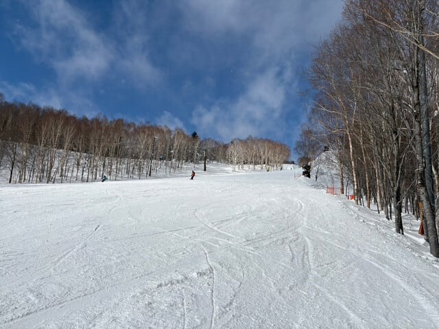

で．

私はそんないいコンディションだという報告を

うらやましがりつつ，一日必死に仕事を

したわけですが…

仕事が終わらなかったよ（激涙）

…いや．

必殺，終わったことにする

という技を使おうかと思ったけど．

その技を繰り出すにはちょっと厳しい

ところまでしか進まず．

日曜夜にスキーから帰ってきてから

仕事を仕上げるというのもかなり

無理っぽいので．

大変ムチャクチャすごく悲しいほどに

残念ながら，日曜も仕事をせざるを

得ない状況になってしまい．

土曜は仕事だけど，何とか日曜に

往復600km運転して日帰りで志賀高原へ

滑りに行く

という計画は，無謀にもついえ去ったのでした…

まぁ．

今朝も睡眠4時間しか取れなかったし．

これでまた睡眠2-3時間で朝3時過ぎに

起きて，日帰り志賀にスキーしに行って

また深夜に帰ってきて，日曜夜に

仕事してたら死んでたと思うので．

仕方がない…

でも．

私がスキーに行かないの週ってのは，

今シーズンでは11月第1週にイエティが

大雨で営業ができなくなった週以来じゃ

無かろうか…

とりあえず．

明日も泣きながら仕事しています…

で．

本日…すでに日曜に日付が変わって

26日の午前1時現在．

夜のうちに降った雪がそこそこ積もって

いるように見えますね…

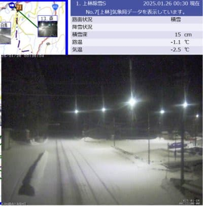

（[北信建設事務道路気象状況カメラ](http://hokushin.pref-nagano-roadcamera.jp/)より）

うーーーん．

木曜の段階では，日曜朝は10cmほどの積雪って

予想したところ．

昨日の天気図では，そこまで雪が降らなさそうな

感じに変わったので，朝までの積雪はほとんど

無し…

と修正したけど．

どうやら木曜の予想の方が正しくなりそう…

ってなことで．

本日も特派員から志賀高原の写真を送って

もらったわけですが．

朝イチではなく，朝9時過ぎの山頂の気温は

-8℃をちょい上回るくらい．

…これ，朝イチなら予想の-9℃ぴったり

だったかも？？

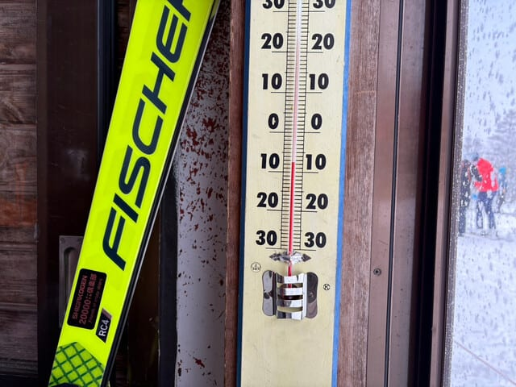

そして，朝イチは予想通り曇り空で，

雪もぱらつく天気だったところ…

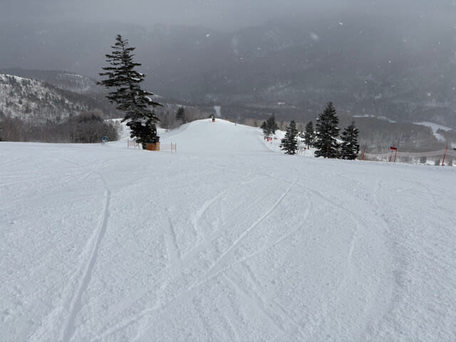

そのうち徐々に日が射し始め…

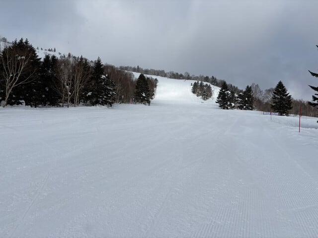

朝10時過ぎには，青空が出てきたようです！！

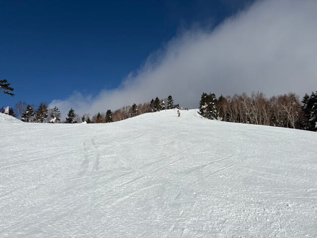

ちょっとところどころコロコロも出てきた

ところもあったようですが．

バーンは全体的に締まったハイスピード

バーンで，いい感じにエッジが噛む雪

だったようで．

昼間も最高気温が-5℃程度とそこまで

上がらず，雪質はいい感じでバーンも

午後まで荒れなかったいですね…

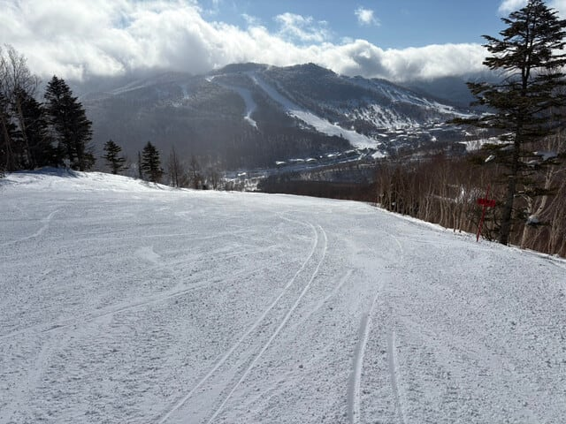

ゴンドラやリフトも，待ち時間はそんなに

長くなく，土日にしては空いてたみたい

ですが．

コース上の人口密度は，ちょい高めの

ところもあったみたいですね…

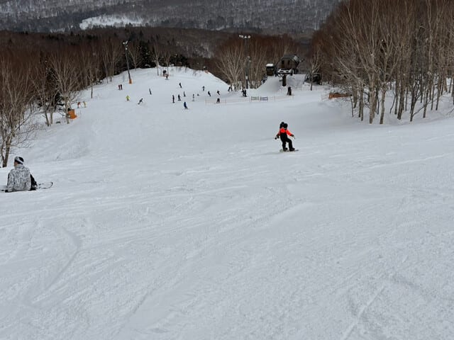

また午後は雲が出てきて，夕方には

そこそこ雪も降りだしたようですが．

とはいえ，終日バーンも荒れず，

ゴンドラもゲートから外にはみ出るまで

待つこともなく．

結構いい感じの一日だったようです…

うらやましい…

そして，この日も焼額ナイターが

営業されましたが．

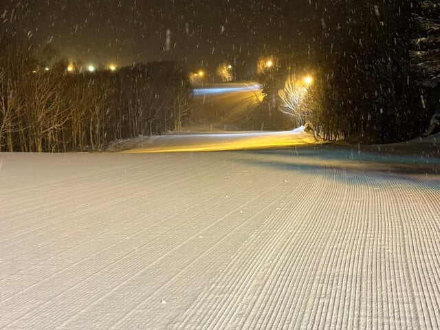

うがーーー！！

結構よさげじゃないですか～！！！

シマシマの上にうっすら新雪が乗って，

すごい美味しそうなバーンじゃない

ですか…っ！！！

ぐはーーーー！！！

こんなナイター滑りたかった…！！

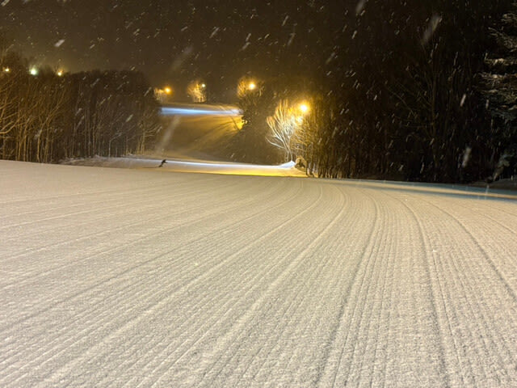

ってなことで．

ナイター時間にそこそこ雪が積もった

ようで…

これなら，明日朝までには10cm～15cm

くらいの積雪になってるかな？？

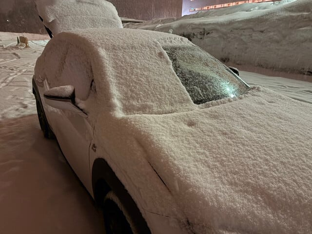

ということで．

土曜はちょい硬めだったバーンも，この

10cmの積雪でまた柔らかめのトップ

シーズンバーンに戻りそうだし．

日曜は一日曇り空ながらも，

いいコンディションが続きそうな感じ…

いいなぁ…

滑りに行きたい…

だもんで．

滑りに行きたいけど行けなかった怨念を

志賀高原に送りますので．

明日の志賀高原，猛吹雪で雪は吹き付け

風は唸り，雷鳴轟き地が割れ天が落ちるような

すごい天気になったら，

…それは滑りに行けなかった私の怨念です…

## 💬 コメント一覧

### 💬 コメント by (ねも)
**タイトル**: Unknown
**投稿日**: 2025-01-26 06:48:10

Ｓさん　残念！

珍しく志賀高原です⛷️　25日(土)は、晴れたり小雪が舞ったり、まずまずのスキー日和で楽しかった(^^*)

週末なのに人出もたいしたことなく、焼額山中心に滑りました✌️

奥志賀でたまたま入った食堂が、昨シーズンから値上げしてないようで感動！

### 💬 コメント by (富山県民)
**タイトル**: Unknown
**投稿日**: 2025-01-26 08:45:41

こんにちは。

晴天なのに仕事で行けなかったら悔しいですよね。

私も平日が快晴だったらそう思います。

### 💬 コメント by (Skier_S)
**タイトル**: 滑りに行けなかった（泣）
**投稿日**: 2025-01-27 04:44:52

＞ねもさま

私が行ってない時に志賀ですべってらっしゃいましたか…

楽しめたようで良かったですね．

せめて日曜日帰りでも行きたかった…

また志賀へお越しください！

＞富山県民さま

そこまで晴天じゃなかったようなので，ちょっとは救われた（？）感じですが…

先週みたいに雪よし，天気よしの週に行けなかったら暴れていたと思います…

