# 4月14日の志賀高原の状況詳細…春スキーですね…

📅 投稿日時: 2013-04-16 01:07:07

えー．

ということで．

日曜のゲレンデレポート，詳細版です…

んで．

土曜日ののチョー最高な，幸せな，超楽しい早朝スキーが忘れられず．

日曜も早朝に行こうとしたわけですが．

…泊りの今日は，宿の朝食を食べねばならないわけだな．

…ご飯食べてたら，7時～8時半の早朝には行けないわけだな．

うーん…朝食を抜こうか…

でも，そうしたら空腹で死んじゃう…

早朝終わってからだと，宿の朝食終わってるし…

…

うーん．

…

…そうだ！

朝7時からの朝食を超特急で15分でかきこめば，車でゲレンデに移動しても，

7時半にはヤケビのゴンドラへいける！

と．

健康にはあまりよくないような朝ごはんの早食いにより．

7時の早朝営業開始から30分遅れで，早朝の焼額のゲレンデに立っていたのでした…

で．

ゲレンデに出ると…

今日も．

見事な晴天！

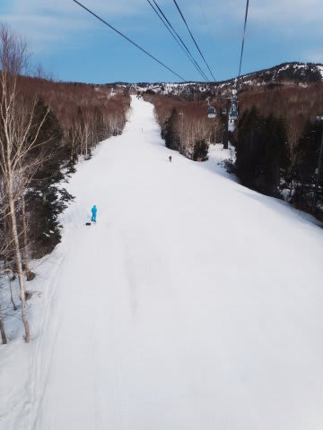

…しかし．

しかーし．

朝7時半というのに．

山頂の気温は，すでにプラス4度もあるんですが…(涙)．

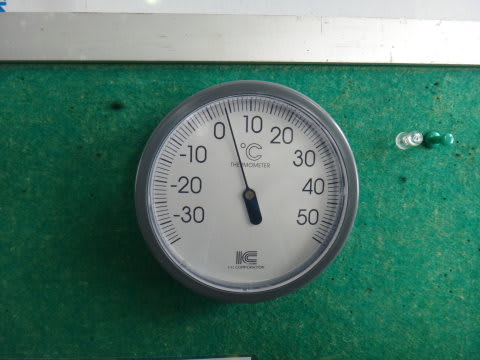

でも．早朝のゲレンデは，硬くは無いけどそこそこ締まっていて，いい感じ．

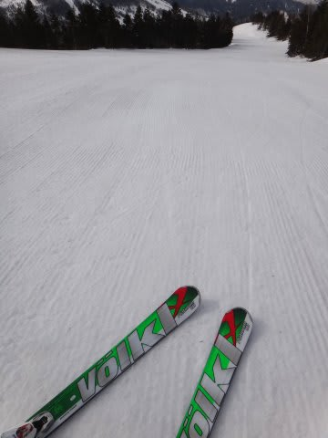

だけど…これ，早朝はいいけど，すぐ雪が緩みそう…

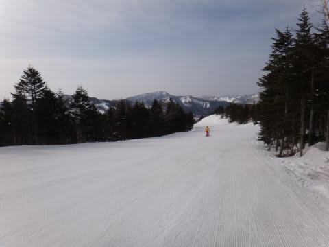

とりあえず．

少なくとも早朝の今は，ガラガラだっ！

雪もしっかり板が走る雪で，快適大回りだっ！

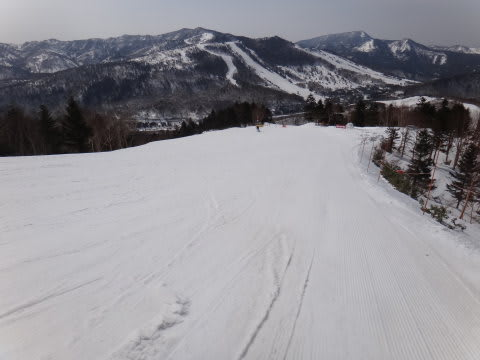

やっぱり，この時期は早朝がイイっ！

ビバ！早朝っ！

…って感じで，しばらく大回りを楽しんでましたが…

通常営業が始まると，ゲレンデの人口密度もちょっと上がり始め…

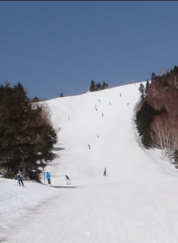

当然，雪も緩んで荒れてくるわけで…

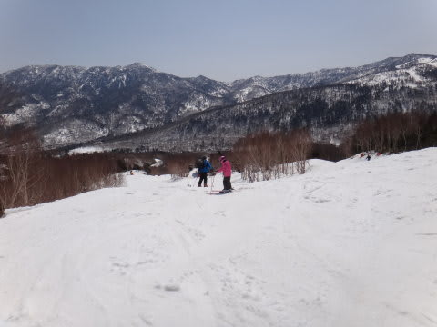

残念ながら，朝10時半にはもうこんな感じで，ゆるゆるな雪です…(悲）．

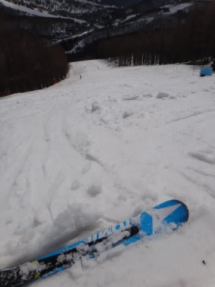

うーむ．

昼ごろには，気温もプラス10度にあがっちゃったよ…(涙)

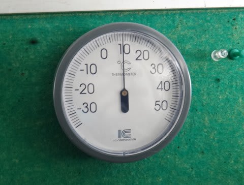

雪に汚れが浮き出し，板があまり滑らない感じに…

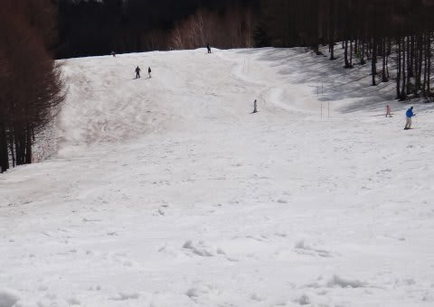

…ああ…春が．

春がやってきたなぁ…(悲）．

昼過ぎに，他のスキー場の様子も見に行ってみたけど．

ダイヤモンドはこんな感じだし…

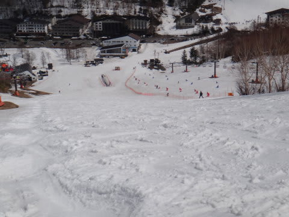

一の瀬ファミリーも…

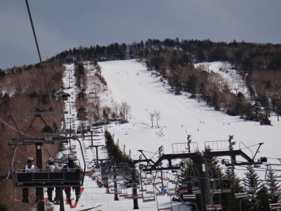

やっぱり，正面バーンはボコボコ．下半分は張り付く雪…(涙)．

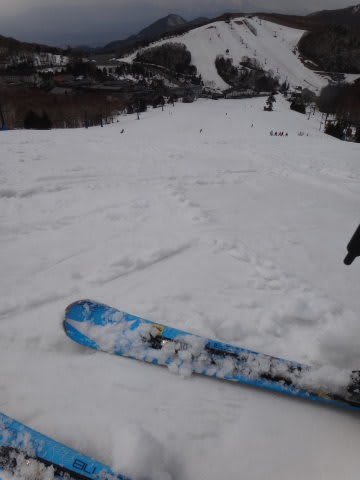

そして，パーフェクターコースにも行ってみましたが…

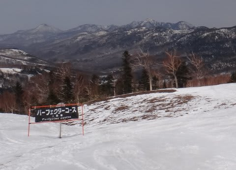

…なんだか，もうこのコースの整備は放棄したみたいですね…

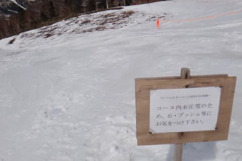

パーフェクターの急斜面は…

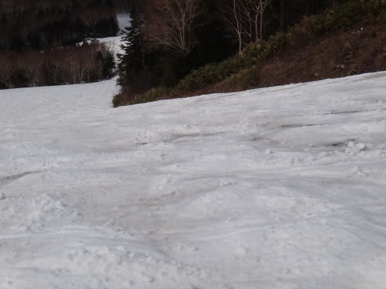

もう，結構土が現れ始め．

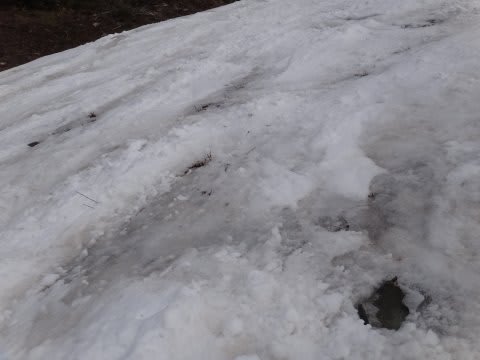

こりゃー，圧雪あきらめるわけだ…っていう感じで．

このコース，先週書いたように．

来週はもう滑れないでしょう…(涙)

去年はGW前半まで滑れたパーフェクターコースが，4月上旬で滑れなくなるとは…

ダイヤモンドの山頂の雪の減りっぷりも，例年より，1-2週間早いかな…

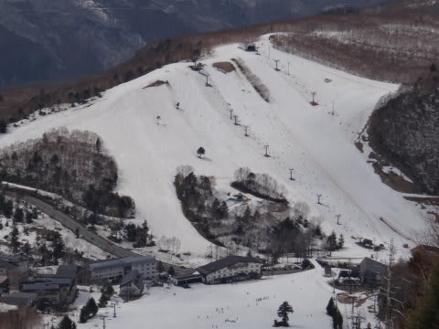

でも，先週までは．

「例年より3週間近く早いな～(涙)」…って思っていた雪解けだけど．

昨日までの冷え込みでこの一週間ほとんど雪が減らず．

なんとかGW前半までは持ちそうな予感…

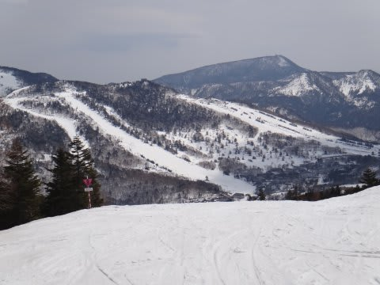

とりあえず．

この日は．

プラス10度の気温で，一部は張り付く雪になって，昼ごろにはボコボコになって

しまった典型的な4月の雪でしたけど．

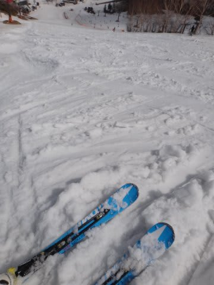

早朝～10時ごろまではそこそこ楽しめたし．

天気も良かったし．

なんにしろ，土曜は最高だったので．

先週に比べれば，

ずーーーーーーーーーーーーーーーーーーーーーーーーーーーーーーーっと

ましな週末を過ごせたのでした！
