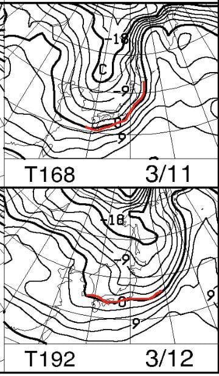

# 今日の志賀高原，吹雪で積雪20cm．明日の朝まで積もるよ！…そして，10日，11日は4月並み高温で，11日は雨だけど，12，13日はまた冷えそう！！

📅 投稿日時: 2020-03-06 00:41:11

えー．

どうやら本日の志賀高原．

昨日の記事で予想した，

　早朝から雪が降りはじめ，朝イチは

　積雪数cmだけど，昼間も雪が降り続けて

　昼間で10～20cm積もるかも？

　終日雪でかなり気温が低く，風も

　吹くため，吹雪の寒い一日．

　終日風が強いので，ゴンドラは減速，

　奥志賀ゴンドラはおそらく運休か．

…という予想が，予言レベルで当たったようですね…

予想通り早朝から雪が降り始め，

昼間だけで20cmちょい雪が積もったようです！

（[焼額山Facebook](https://ja-jp.facebook.com/yakebitaiyama/photos/a.533933973368620/2748181705277158/?type=3&theater)より）

そして，風が強くて奥志賀は終日運休だった

みたいですね…

午後は寺子屋も運休だったみたいですが．

焼額は普通に営業できたようですね．

そして．

志賀高原では，今も雪が降ってるようです！

（[焼額山Facebook](https://ja-jp.facebook.com/yakebitaiyama/photos/a.533933973368620/2748568985238430/?type=3&theater)より）

深夜0時段階で，いい感じで積もってます！

（[北信建設事務所道路気象情報ページ](http://hokushin.pref-nagano-roadcamera.jp/)より）

気温も-8.3℃と，かなり冷えてますね…！

これは…

明日は予想通り，冷え冷えパウダーで

スタートしそう！

そして，明日は午後には晴れてきそうなので…

いい感じの一日になるのでは？？

そのまま，土曜もそこそこの冷えをキープするので．

日曜朝までは，そこそこ楽しめそう．

…そう，日曜朝までは…

果たして．

日曜，どの段階で降り始めるのか？？

降るのは液体か，固体か？？

そして．

その後は，9日月曜，10日火曜と超高温の

2日間が続き．

10日は雨になりそうという昨日の予想は，

今日も変わっていないのですが．

…そのあとの，11日水曜と12日木曜…

これは，また冷えます！！

11日，12日ともに，また赤い0℃線が

志賀より南に下がるだけでなく．

11日は-6℃線が志賀にかかって，

かなり冷え込みますよ…！

そして．

地上天気図を見ると．

11日は降水域が志賀高原にかかっているので．

志賀高原にも，積雪がありそう…！

ただ，西風になりそうな気圧配置なので．

ドサドサとは降らなさそうなのが惜しいけど…

そして，12日は，高気圧が日本全域を

覆うので．

前日の冷え冷え雪が積もった後の晴天！

とりあえず．

12日は冷え冷え雪が積もったあとの，

冷え冷え晴天なので．

12日が次のねらい目ですよ～！！

…ってな感じで．

また来週，何とか冷え冷え雪が積もり，

10日の雨でやられたゲレンデが，

なんとか週末までに回復しそうですが．

…その後，3月がどんな感じかというのを，

本日発表の一か月予想図，

FCVX14から見てみると…

…ダメだ（涙）

うーーーむ．

うーーーーーーむ．

3月も，平年より高い気温が続くのか…っ！！（涙）

昨シーズンは，

2月まではGWまで営業できるかどうか…？

かなりヤバい感じだったけど．

3月から4月の奇跡の冷え込みで，

GWにかなりたっぷり雪が残ったという，

最終的には恵まれたシーズンになったのですが．

今シーズンもそうならないか願っていたんだけど…

うーむ．

このままだと厳しいか…（涙）

でも．

まだ，あきらめない．

諦めたらそこでシーズン終了ですよ

という心意気で．

そしてさらに．

天気がどうなるか…という受け身的じゃなく，

天気をどうするかという能動的な発想で．

これからの志賀高原を冷え冷えにすべく．

このBlog読者724億8千万人全員で←だから，地球人口の10倍も読者がいるのか？？

南極のペンギンも凍りつくような

寒いギャグを連呼しながら．

全身全霊の冷え冷え踊りを，

神に向かって捧げ続けましょう…！！！←何かおかしくなってきている

とりあえず，そんな中でも．

明日金曜は最高コンディションになるので．

明日志賀高原で滑る人はシアワセだと思う…

## 💬 コメント一覧

### 💬 コメント by (m&t)
**タイトル**: Unknown
**投稿日**: 2020-03-06 01:05:25

8日参戦します。志賀高原の天気を決めているSさんの力で8日午後も雪を降らせてください。そして、みんなで踊りましょう！

### 💬 コメント by (Skier_S)
**タイトル**: >m＆tさま
**投稿日**: 2020-03-06 01:33:09

大丈夫です．

みんなで踊れば雪になるはずっ！！

### 💬 コメント by (かず)
**タイトル**: Unknown
**投稿日**: 2020-03-06 06:47:48

この流れはSさん意外と今日いたりして！笑

### 💬 コメント by (ozxys.xyz)
**タイトル**: Unknown
**投稿日**: 2020-03-06 08:43:26

いつも情報ありがとうございます。

ギンレイさんが50cm積もったってお知らせしてくれましたね！

明日7日焼額になんとか出陣したい！！

出陣できたら板の画像をたよりに探してみます。

明日は焼額限定なので。

昨年、コメント書かせていただいた

「絶対に止まれない坂道がそこにある！」の者です。

昨年はワゴンの2WDだったので、雪国テクで登り切りました。今年は4WDで行くので心配ないです！！

### 💬 コメント by (新米パパさん)
**タイトル**: Unknown
**投稿日**: 2020-03-06 12:03:30

明日も参戦します。奥志賀スタートで一ノ瀬まで遠征か、車移動で。

コロナに怯えて、アルコールシートでゴンドラ拭き拭き、ランチは車でカップ麺というスタイルが定着しております。

### 💬 コメント by (かず)
**タイトル**: Unknown
**投稿日**: 2020-03-06 17:48:17

レインボーさん  朝Hさんとゴンドラ中で見かけたきりお会いできませんでした…今日は今シーズン初の昼抜きで16時まで滑りました笑  今日も時々ヤケビのゴンドラ混んだので明日どうなるのかな？？

### 💬 コメント by (ゆーき)
**タイトル**: いいなー明日
**投稿日**: 2020-03-06 22:37:33

明日はいけない。。。

日曜日はいけそう、ちょっとどこのスキー場かわからないけど、土曜が最高なんだろうなぁ。

### 💬 コメント by (西館)
**タイトル**: 3月6日(金)22:20時点
**投稿日**: 2020-03-06 23:05:10

前泊で志賀高原入りしています。

上林から上は日の当たらない所などにマーブル状の積雪があり、急行バスは道の駅「山之内」でチェーン装着しました。

蓮池から上のトンネル内は凍結しています。温度計表示は-10℃でした。

明日の早朝に志賀入りする皆様、どうぞ気をつけて上っていらしてくださいね！

### 💬 コメント by (Skier_S)
**タイトル**: 今週末は意外と良さそう
**投稿日**: 2020-03-07 00:54:25

＞m&tさま

日曜は雪は降らなさそうですが…

液体の危機は現時点ではなくなりました！

日曜，昼間は気温が上がるけど，意外と楽しめそうです．

＞かずさま

いや…金曜行きたかったんですけどね…

で．今日はゴンドラ混んだんですね．

明日，どうなるのか怖い…

＞ozxys.xyzさま

土曜にいらっしゃるのですね？

焼額でお会いしましょう～！

しかし，車を4WDにアップデートされましたか（笑）．

志賀高原では必須です…

＞新米パパさま

明日も参戦ですね？？

焼額滑ってますので，もし見つけられたらお会いしましょう～！

＞ゆーきさま

日曜も，それほどひどい天気にならなさそうです．

ぜひ志賀高原へ…！

＞西館さま

情報ありがとうございます！

登り坂，注意していきます…

