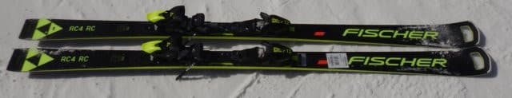
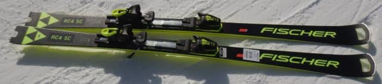
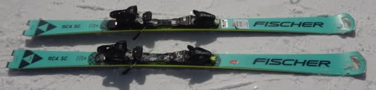
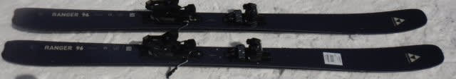

# 2023シーズンモデルのスキー板に試乗してきたよ！どんな板に乗ったのか＆クイックレポートその2

📅 投稿日時: 2022-03-16 02:23:12

えー．

最近，ゲレンデで読者の方に声をかけていただく

ことが多くなり．

「天気図どうやって読めるようになったんですか？」

とか，

「自動車関係の仕事ですか？」

とか聞かれることが多いのですが…

先日は，

「そんなに休まずひたすら滑って，

　一体何を目指してるんですか？」

と，想像を超える質問をされ，

回答に窮したSkier_Sです．

いや…

単なる娯楽で滑ってるだけで．

決して何かを目指して滑っているわけではないんですが…

とりあえず，検定も大会も目指していない，

単なるレジャースキーヤー（自称）なので．

そのあたりお間違いなきよう…

いや．

レジャースキーヤーです．

誰が何と言おうと，

私はレジャースキーヤーですので…！（強く主張しておくところ）

ってなことで．

今日はどうしたことか，特派員が数名

志賀高原を滑っていたにもかかわらず，

写真が全く送られてこなかった

という珍しい一日でした…

レポートやらライブカメラを見ると，

明け方まで雨が降り，朝イチは曇り

空だったものの．

すぐに晴れて，終日暖かい晴天だったようで．

そして，雪は緩んだものの，板が滑る

比較的いいコンディションだったようですね…

しかし，

月曜・火曜と2日連続の明け方の雨と

高温＆昼間の日差しで，

かなり雪が融けちゃったようで，残念…（涙）

でも，今週は金曜夜~土曜朝にかけて

また液体が降ってきそうなものの．

土日は平年並みの気温に戻って，

雪が降りそうな予感…！

この3連休，雪はそんなにひどくなさそう…！！

ってなことで．

本題へ．

3月5，6日の週末に開催された，エキップさんの

試乗会に参加してきたわけですが．

前回，[その1をお送りした](e1faadb497231c5eb892525f0348ecc66.md)

レジャースキーヤーによる，←ここ繰り返し主張しておくところ

どんな板に乗ったのか紹介＆簡単なレポート

の続きです…！

今回はFISCHER編．

フィッシャーの板4種類です…！

○FISCHER RC4 Worldcup RC M-track 170cm

R=17.5m の大回りベース基礎板．

良くたわんで，たわみに乗って回る板．

板をしっかり踏める人なら小回りに

近いところまでもっていけるけど，

比較的エッジグリップがしっかりしている

ので，スピードを出しても安定感あり！

ただ，スピードをガンガン出すと，自分の

滑りだと板がたわみすぎる感じ…

ガンガン飛ばす人は，プレートの強い

RC Proがおススメ．

ボチボチのスピードで体力を使いたくない

クルーズ嗜好ならM-trackのこっちです！

○FISCHER RC4 Worldcup RC Pro M/O-Plate 165cm

R=13mの小回り系基礎板．

この日の衝撃の1本…

自分が持っているSCと見た目同じだけど，

中身が違いすぎる！！！

メタルの張りがあって気持ちいいばね感の

ある板で，張りがあるので，スピードが

出た中でもそんなにたわませなければ

大回りまでOK！

それでいて踏んで行けば鋭い小回りもイケる．

荒れた斜面での安定感もあり，板が全く

ばたつかず，165cmと思えない驚きの

高速安定性も！

この板が，自分にとっては今回のぴかイチ！

○FISCHER RC4 Worldcup RC M-track 165cm

RC Proと同じ小回り基礎板のプレート違い．

こっちの方が優しい．

これもたわみが出た中でトップからテールまで

しっかりエッジが効いて回っていく板．

M/O-PlateがつくProよりずっとたわみやすい．

体重，脚力が少なめでも板をたわませて

カービング小回りができる．

たわみやすいけどグリップは強く，

しっかり踏んでいくと板がずれるの

ではなく，驚くほど弧が小さくなっていく．

低速でもコントロール性は高い．

○FISCHER RANGER 96 173cm

オールマウンテン系のセミファット板．

センター幅93cmとゲレンデでも行ける．

かなり軽い軽快な板で，張りはそこそこ強く，

スピードを出しても板がキョロキョロしない．

ゲレンデでカービング大回りも十分行けるが，

そこまでガッツリグリップする板ではなく，

エッジングを抜くと簡単にずらせる．

ゲレンデの低速でのコントロール性も良い．

太い分荒れた斜面でも蹴散らして滑れるけど，

圧雪ならやっぱり普通の板の方が

滑りやすい感じ…

## 💬 コメント一覧

### 💬 コメント by (副院長)
**タイトル**: Unknown
**投稿日**: 2022-03-16 09:16:25

S様、火曜日の特派員からの報告がなかったようですね。皆さんS様には目の毒だと思われて写真はなかったのではないかと。

朝の弱い、晴れ男の私は9時過ぎから行動はじめ、そのころには焼額と奥志賀は晴れてきました。その後ピーカンとなり、雨のおかげで妖怪も出ず、黄砂もなく、一気に4月のような陽気の春スキーが楽しめました。後ろ髪ひかれまくりながら志賀を降りました。

来シーズンはコロナも収まり気軽にお声がけしたいものです。

＞ももも様、快適な春スキーが楽しめたのではないでしょうか？私の今シーズンの役目は今回で終わりました。あとはよろしく。

### 💬 コメント by (スシネコ)
**タイトル**: Unknown
**投稿日**: 2022-03-16 13:19:05

￠(._.)メモメモ

「2023　FISCHER RC4 Worldcup SC Pro M.O-Plate 165cm」

### 💬 コメント by (レインボー74)
**タイトル**: Unknown
**投稿日**: 2022-03-16 14:06:08

水曜日の志賀高原情報

朝の上林+2℃。暖かい晴れの日。

朝イチの白樺は硬めでしたが、以降はゆるゆるでしたがよく滑りました。

おかげでオリンピックで私のシーズン最高速がでました。満足です。

ちなみにワックスは車用のスーパーレインエックスだけでした。

気になる妖怪ですが、昼前に人の踏んでないコースで少し出現した程度で、快適な一日(午前中だけだけど)を送れました。

### 💬 コメント by (Skier_S)
**タイトル**: 3連休の後半2日は冷えるよ！
**投稿日**: 2022-03-17 03:08:23

＞副院長さま

火曜も良かったんですね…

月・火とも雨が降ったのに，営業開始までに止んで晴れるとは，

運が強い…！！

今シーズン，お疲れ様でした！！

＞スシネコさま

SC Proは良かった…

ヤバい．物欲を刺激する…

＞レインボー74さま

え！今日の雪で最高速だったんですか…！！

それも，スーパレインXを板に塗って…

驚きです．

### 💬 コメント by (おおすぎ)
**タイトル**: Unknown
**投稿日**: 2022-03-17 20:51:42

[2023　FISCHER RC4 Worldcup SC Pro M.O-Plate 165cm]・・・

S様のオススメは外れ無しなので、ついつい「ポチっ！」って逝ってしまいます・・・

営業上手ですね♪

### 💬 コメント by (Skier_S)
**タイトル**: ＞おおすぎさま
**投稿日**: 2022-03-19 00:09:35

来季モデルのFISCER SCはいいですよ！！

かなり強めの板ですが，ハイスピードで気持ちいいので

脚力がある・スピードを出す人にはおススメです！

