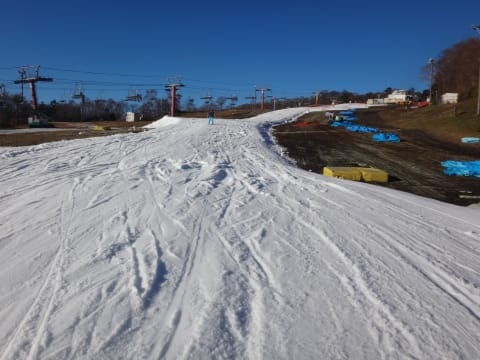

# 11月21日，3連休初日も，なぜかYeti…暖かいし，予想より空いてたよ！

📅 投稿日時: 2015-11-22 00:54:02

🏷️ カテゴリ: [2016スキー滑走日記](c70c67ed5248e9432b899dcd5747048bb.md)

えー．

ということで．

なぜか．

2016シーズンインしてから．

7日連続のイエティです．

…今日は，アサマ2000で滑るつもりだったのに…

もう，ひたすらイエティです（涙）

なぜ，7日間も…

ここまでくると，

「あれ？スキーって，雪の廊下を滑るスポーツじゃなかったっけ？」

っていう気分になってきます．

自然の広いコースを滑るものであることを，

忘れつつある今日この頃．

とりあえず．今日のイエティの状況をば…

えー．

朝8時のオープン時に，イエティに到着したわけですが．

車の温度計はプラス6℃と，あったかかったんですが…

深夜は氷点下に冷えたのかな？

日陰には，一部霜が残ってました…

で．

朝イチのゲレンデは．

晴天っ！！！

3連休なのに，朝イチはガラガラっ！！

…朝から日差しが強く，雪は緩み気味だけど…

コース幅は，ところどころ，先週より広がった部分が

ある感じで．

ところどころ狭いままのところがあるものの．

少しずつコースは改善しているかな？？

雪は十分厚く，下地が出てくるようなところは

ほとんど無かった，ってのがよかったかな．

で．

今週から，リフトを降りたすぐ下，幅が広がった

ところの，一部が区切られて，

こんな感じの初心者コースになっており．

ムービングベルトを使って，長さ100m程度の

区切られたエリアを

ぐるぐるできるようになったましたね…．

という感じで．

午前9時までは，リフト待ちも少なく．

晴天なのに．

3連休なのに．

結構いいよ！

けど，午前10時ごろには，

やはりコース上の人が増え始め…

リフト待ちも伸びたけど．

でも，並行したペアリフトも動いていたので．

午前中はせいぜい最大でも3分待ち程度．

タイミングによっては，1分も待たなくてよい状況で．

3連休と考えれば，これは上出来でしょう！

昼ごろには，時々雲がかかるときもあったけど…

でも．

なんだか

11月下旬と思えないほど，

異常に暖かいんですけど？？（涙）

…おかげで．

ゲレンデの雪は，ちと滑りが悪かった…（悲）．

そして．

このスキー場の常．

午後になると，人が増えていき，

午後2時から3時ごろにピークが…

…なんだ，この人口密度は（泣）．

リフト待ちも，午後2時以降は，タイミングによっては

最大5分近く待ったかな…

…

…

そして．

なぜか．

やっぱり今日も行ってしまった，

ナイターへ…

やはり，このスキー場．

ナイター，混むんですけど…

今日は，クワッドと並行したペアリフトが

動いていたというのに．

ナイターのリフト待ち，5分近かったかな…

ナイターはちょっと肌寒かったけど．

でも，11月の夜としては冷え込みが足りない感じで．

うーーむ．

本格的冷え込みは，いつやってくるのか？？

って感じで．

他のスキー場がオープンしていない，

晴天の3連休初日．

リフト最大10分待ちを覚悟していたんですけど…

午後とナイターは混んだものの，

それでも予想よりは空いていて．

午前中は結構ガラガラだったし．

まぁ，楽しめたかな～．

## 💬 コメント一覧

### 💬 コメント by (れー)
**タイトル**: 幻覚かU+2049U+FE0E
**投稿日**: 2015-11-22 08:32:31

シーズン初滑りでした。

そして初娘～（笑）

ご一緒させていただきありがとうございました。

その後私…ナイターでいるはずのないS様親子が滑っている幻覚を見たんです…

疲れてたのかなぁ～(^_^;)

### 💬 コメント by (ヒロちゃん)
**タイトル**: 生霊みた
**投稿日**: 2015-11-22 09:12:08

想定ないでしたが、ナイターで素敵な、オレンジと赤ヘルの、親子発見。声かけそびれ、早い上がりでしたね笑。また、どこかで、ご一緒しましよ。

月曜は、残念ですが、いきませんよ。笑

### 💬 コメント by (Skier_S)
**タイトル**: 行っちゃいました…ナイター．
**投稿日**: 2015-11-22 23:10:48

＞れーさま

昨日はありがとうございました～！

見ちゃいましたか…幻覚．

いやー．

幻覚ですよね．

幻覚…

＞ひろちゃんさま

いや，声をかけてもらえれば…

娘は「また会いたいなぁ」って言ってたんですが…

何時ごろまで滑ってたんですか？

こちらは7時半過ぎに上がりました．

