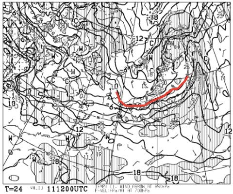
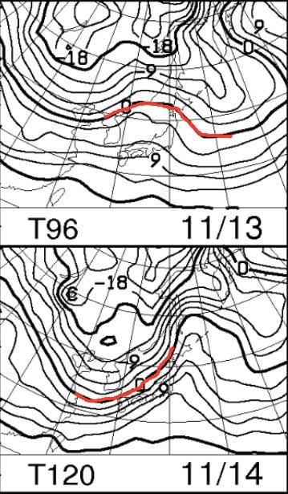
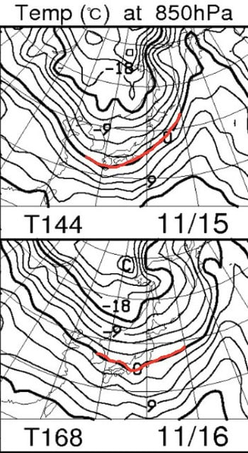
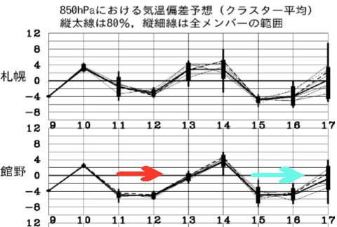
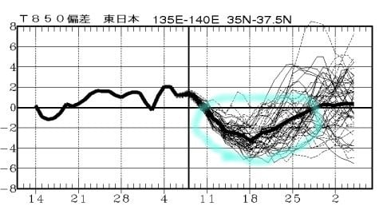
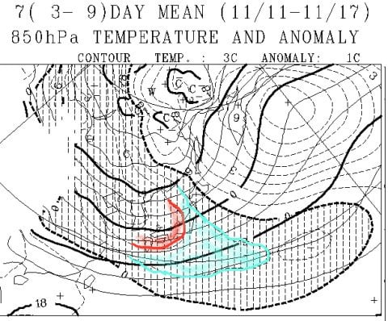
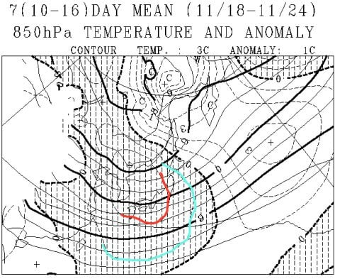
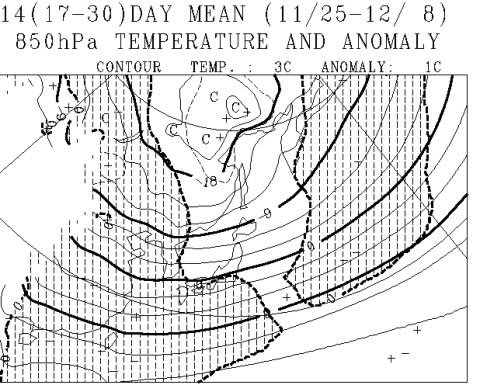

# この11月は冷えるのか？？…一か月予想図を読み解いてみた

📅 投稿日時: 2017-11-11 05:01:26

🏷️ カテゴリ: [スキー天気予想](c6554f5c3c106093b511a8daae23757e8.md)

えー．

まだ焼額のホームページのシーズン終了日が

4月8日のまま直っておらず．

ホントに4月中に終わってしまうのでは…

と，心配しているSkier_Sです．

Skilineも終わるし，リフトも減っていくし．

…なんか最近，いいニュースがないなぁ…

ってことで．

せめて，この11月がガンガン冷え込んで．

スキー場にどっさり雪が積もってくれそうなら．

そんな中でも，数少ないいいニュースになるかも…？？

ということで．

一か月予想図を見てみるのだ！

…果たして．今後一か月の天気は．

いいニュースになるのか否か！？？

…の，前に．

明日，11日の850hpa気温図を見てみると…

うむ？0℃線が，太平洋近くまで下がるよ！！

これは，11日から12日朝にかけて．

結構冷えて，スキー場はまた積雪がありそうです！！

ただ，その後．

13，14日はこんな感じで，

ちょっと0℃線は一旦北上して，

冷え込みは緩みますが…

来ます．

そのあとは，来ますよ～！

なんと，15，16日は．

0℃線が太平洋側まで下がるので．

うむ．これは，またガンガン冷え込んで，

雪になるパターンですよっ！！

こんな感じで，赤矢印で示した11，12日と，

青矢印の15，16日．

どちらも平年比5度くらいは冷えそうなので．

11，12日と15，16日．

結構冷えますよ～！

日本海側のスキー場，そこそこの積雪量が

期待できるかも…

このままなら，23日オープンのスキー場は，予定通り

行けそうな感じ…

ってな感じで．

この11月中旬までは，そこそこ冷えてくれそうだけど…

それ以降も冷えてくれて，シーズンインにまともな

ゲレンデができるのかどうか．気になるところなので．

…1か月予想図を見てみるのだ．

一か月の気温傾向を見てみると…

をを！！！

水色で囲った部分．

「冷えるよ～！」と予告された，11月11日から

大体11月30日までの期間．

ずっと平年より気温が冷えそうじゃないですか！！

これは…

期待できる．

去年，おととしと．

シーズンイン時は雪不足気味だったけど．

今シーズンは大丈夫そうな予感…

もう少し，詳細を見てみると…

11月11日～17日までの一週間平均の850hpa気温図．

…こんな感じで．

平年比マイナス1℃の水色の線どころか．

平年比マイナス2℃の赤線が志賀高原にかかってますよ！？？

一週間平均で平年比マイナス2℃って…

かなりすごいレベルの冷え込みです．これは．

そして．

11月18日～24日までの1週間の予想も…

まだ志賀高原には，-2℃線が掛かってるよ！

これは…この週もかなりの冷え込み．

11月は，これからしばらく寒そうな予感…

で．

ラスト，11月25日から12月8日までの2週間では．

850hpa気温平均値は…

うーむ．

平年比プラスマイナスゼロの，網掛け部分とそれ以外の部分の

区切る点線．

ここが志賀高原にちょうどかかっているので…

2週間の平均で言えば，ぴったり平年並み，

という感じでしょうか．

…本音を言えばこの時期にガッツリ冷え込んでほしいけど．

まぁ，平年比プラスにならないだけマシかな…

ってことで．

11月11日以降，11月いっぱいはかなり冷え気味で．

平年に比べると，寒い11月になりそう！

その後，12月になってからは冷え込みは緩む，

といった感じでしょうか．

とりあえず．

11月はかなり冷え冷えになりそうで，

一安心…

ここしばらくいいニュースが続いてなかったので．

久々の，スキーヤーにとってのいいニュースだったかな～．

## 💬 コメント一覧

### 💬 コメント by (Goku)
**タイトル**: 歓喜団
**投稿日**: 2017-11-11 09:37:18

歓喜団、じゃなくて寒気団が来るんですか！

素晴らしい～

もしかして、18日のシーズン券解禁日に熊の湯が滑れるかもしれませんね♪

暗いニュースばかりの志賀高原、せめて雪くらいドッサリ降ってほしいものです。

### 💬 コメント by (FCAMEL)
**タイトル**: リフト新設
**投稿日**: 2017-11-11 13:37:51

お久しぶりです。

今シーズンもよろしくお願いします。

リフトといえばコースが増えるわけではないので、

あまりメリットないですが、

一の瀬の陸橋のそばにベルトコンベアーの代わりの新しいリフトができてますね。

営業的には法坂よりあそこに作ったほうが確かに利用する人は多そうですが。。。

### 💬 コメント by (Skier_S)
**タイトル**: これからしばらく，冷えますよ～！
**投稿日**: 2017-11-11 23:39:43

＞Gokuさま

来ますよ～歓喜団！！

18日に熊の湯，行けるんじゃないでしょうか…

15，16日に冷えた後，17日に一旦緩むけど．

また18から冷えるようです…

ホントに，せめて雪はどっさり積もってほしいところ！

＞FCAMELさま

お！お久しぶりです！

そうなんです．

ダイヤのあそこにリフトがあったら便利かもしれないけど…

時間によっては，乗車時間が短いわりに，

すごい待ちの行列がつくリフトになるかも？

とりあえず，ダイヤの新リフト降り場は，

サンキッド時代から比較したら，かなり広い

スペースが取れるよう作り替えなくてはならないので．

どんな感じになっているのか，

見るのが楽しみです…

