# 2015年10月　子連れで西表へダイビング旅行その12…2日目の2本目のダイビング

📅 投稿日時: 2016-09-07 03:49:28

🏷️ カテゴリ: [ダイビング日記](ce3a7a8d424d112fce83ee85c81a0e344.md)

ということで．

相変わらずこんな時間に帰宅ですが．

…明日，朝起きられるか心配ですが．

…とりあえず，今日もダイビングレポートに

行くのだ！

---

ってなわけで．

2日目の2本目のダイビングを

スタートしたわけですが．

ここは，こんな感じの砂地の上に…

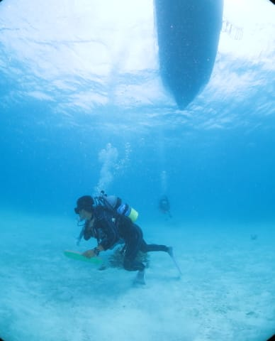

こーゆー感じのサンゴのある小さい根が

ポツポツ点在している感じの，

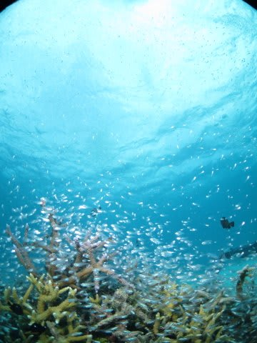

私が結構好きな癒し系のんびりポイントです…

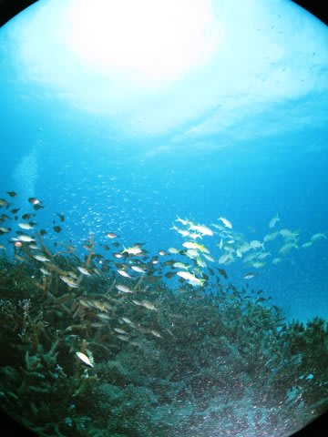

そして，砂地の上を移動して…

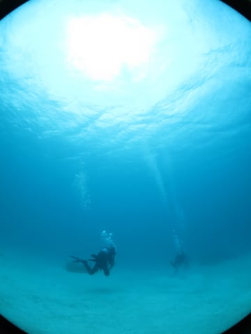

また，違う根へと移動していきます．

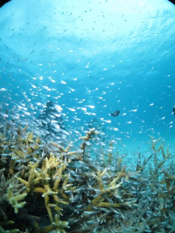

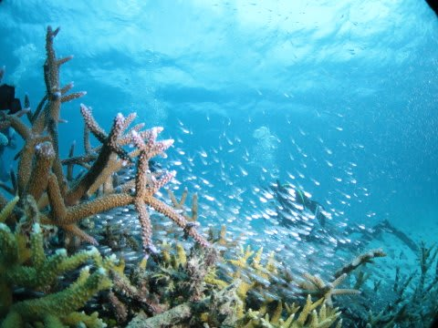

ふむ．

この根は，キンメモドキもついてますが…

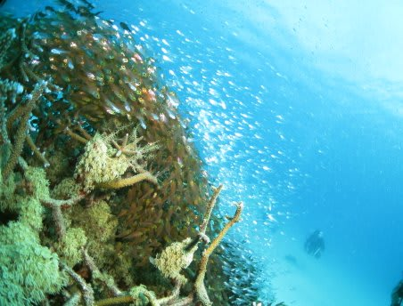

なぜかハタンポもいっぱいいますね…

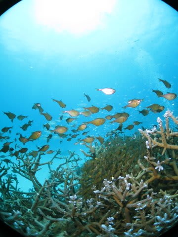

うーむ．

残念ながら．

ハタンポは写真映えしないなぁ…

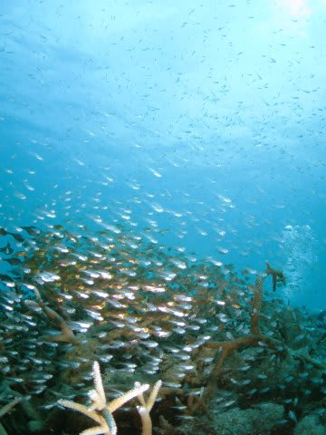

そして．

スカシテンジクダイだと思っていた，

この透明な魚の中に…

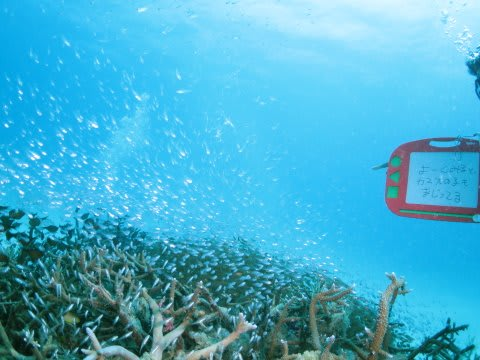

え？

カマスの子供が混じってるって…？？

…確かに．

じっくり見ると分かりますが．

写真には写せませんでした…

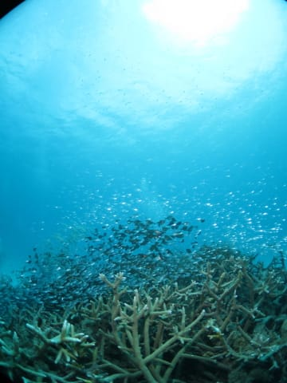

そして．

また，いくつかの根を回り…

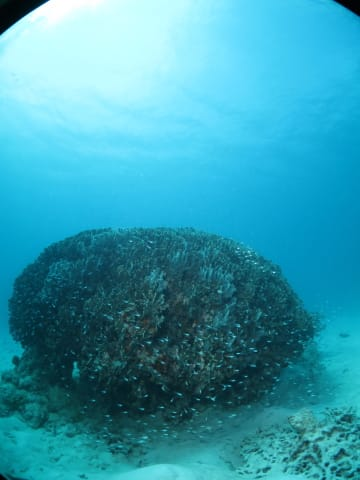

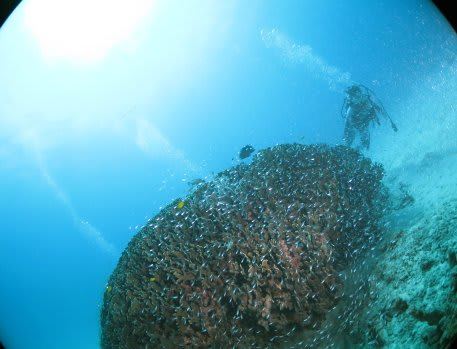

そのあとは．

オーナーガイドさんのマクロモノ紹介が

てんこ盛りで続きます．

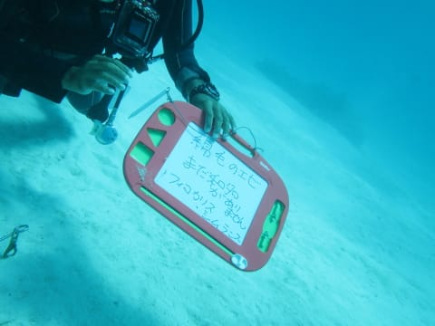

はぁ．

一部で話題らしい，フィコカリス・シムランスですか…

実物を初めて見ましたが．

…これは，教えられないと

エビ，ではなく．

「ゴミ」にしか見えませんね（笑）

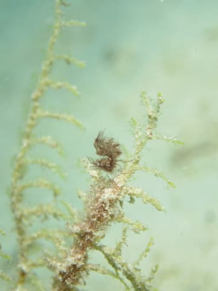

真ん中の，ちょっと赤っぽいフワフワしたのが

それです．

そして．

トラフシャコに…

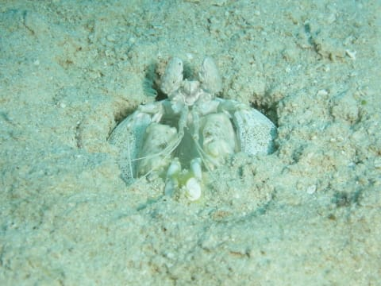

ふむ？

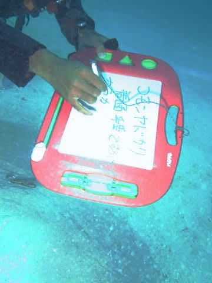

コモンヤドカリですか…

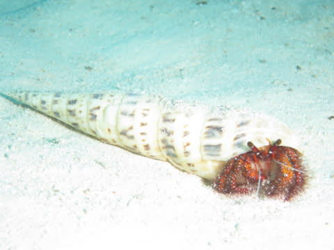

こんな感じで．

いろんなマクロものを見せてもらったりしつつ…

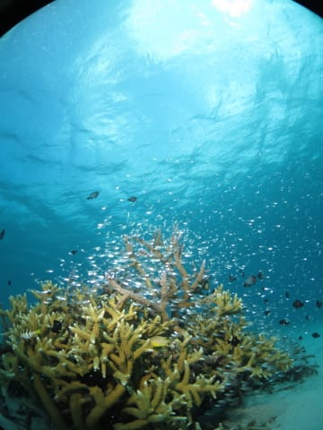

のんびり癒し系の景色を眺めます．

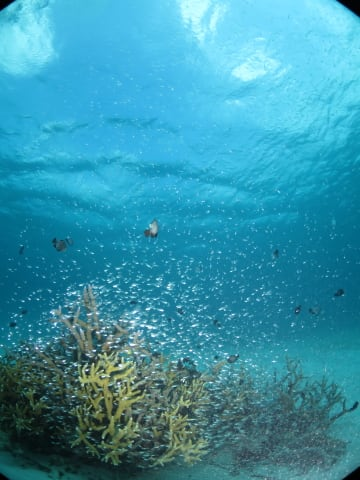

うん．

太陽光が射すと，海の中もきれいだな！

ってことで．

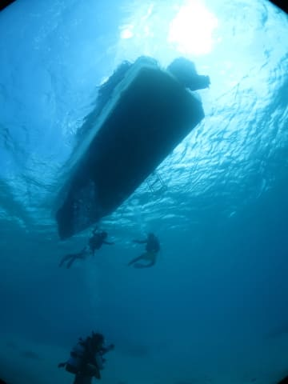

ダイブタイムたっぷり60分．

堪能できた2本目のダイビングでした…

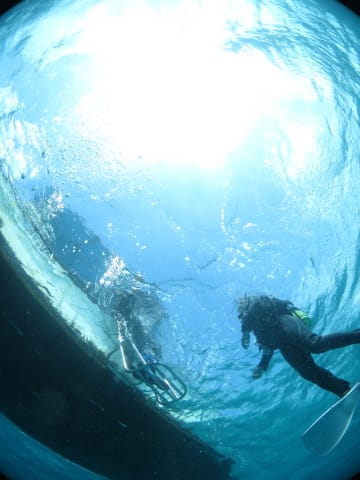

## 💬 コメント一覧

### 💬 コメント by (kon)
**タイトル**: 焼額シーズン券
**投稿日**: 2016-09-07 16:12:27

会長、お久しぶりです。

もうシーズンまで３か月を切りました。

焼額フリークの会長は焼額シーズン券悩むところですね。

シーズンで数回、ゴンドラストップで他のゲレンデに移動もありますので、そこいらも計算に入れてください。

### 💬 コメント by (Skier_S)
**タイトル**: konさま
**投稿日**: 2016-09-08 02:02:45

志賀のシーズンインまで，あと3か月

切りましたね…

短いようで長いオフシーズンです…

焼額シーズン券ですが，やはりGWまで

滑れないと，4月以降10日券などを購入する

必要があるので…

やっぱり共通シーズン券の方が安そう，という

結論に達しています．

まぁ，なんだかんだ言って，昨シーズンも

雪質が悪かった日とか，結構一の瀬方面へ

脱出してましたし（笑）

ということで，来シーズンもちょくちょく一の瀬へ

顔を出すと思います～！

