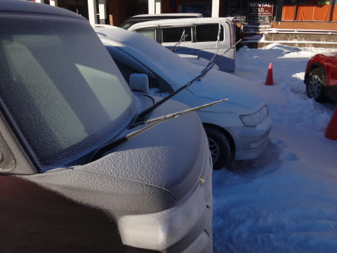
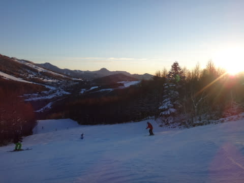

# 12月20日，日曜日の志賀高原・焼額山は…天気は良かったけど，雪が…（涙）．

📅 投稿日時: 2015-12-20 23:34:06

ってことで．

日曜日の本日も，

志賀高原で滑っていたわけですが．

…足りない．

雪が足りないのだっ！

土曜の夜からの積雪は，

雀の涙というか．

プランクトンの涙程度の，

わずか，この程度…

足りない．圧倒的に降雪が足りない…（涙）

結局，焼額ゴンドラは今日も動かず…（残念）．

第2ゴンドラのパノラマコース．

一見雪があるように見えますが…

よく見てみると，こんな感じで土が出てて．

…うーん．滑れるようになるには，

まだまだ降雪が無いと厳しそう…

とりあえず．

雪は降らなかったものの．

そのかわり，日曜は朝からすっきり晴天！

朝イチの第2高速側のゲレンデは…

うはははははははっ！

ピカピカシマシマじゃないかっ！

これは最高っ！

と，飛び出したものの．

あれ？

わずか1-2本滑ったところで．

殺人コロコロが大量発生しちゃったんですが…っ！（涙）

おそらく．「妖怪コロコロばらまき」が

大量にばらまいたと思われる殺人コロコロが．

コースいっぱいにあふれてます（泣）．

怖い．

怖いよ，このコース…

スピード出したら死にそう…

そして，今日もコース上は混みました…（悲）．

本来，全面オープンになっても不思議じゃなかったこの週末．

そろそろ人も増えてきたのに，まだ滑れるリフトが少なく．

かなり人が集中しちゃってます…

午前10時ごろに，第2高速はピーク5分待ち以上．

第4ロマンスは最大10分近く待ったのかな…？？

昼ごろはこの程度，5分弱の待ちでした．

うーむ．4ロマ側の方が，氷のコロコロが無くて．

雪はいいんだけどな～．

でも，リフト待ちが長いし，低速リフトってのが…

って感じで．

午後はちょっと人も減って，

第2高速は1分待ち程度になったので，

午後は第2高速をひたすらグルグル！←ホントは第2ゴンドラをグルグルしてるはずだったのに…（涙）

でも…

リフト待ちは減ったけど．

午後もゲレンデの人は多めで．

さらに…

ふがぁっ！！

ゲレンデがかなり荒れてきたんですが！

凸凹で飛ばされるんですがっ！

それも．

エッジが立たない固い下地に，山が盛り上がったような

なかなかエキサイティングなバーン状況！

ツルツル斜面に流されたあと，雪だまりの山に飛ばされる

という，かなりの修行バーンだっ！

…これは．

これは，バランス感覚＆反射の早さを鍛えるトレーニングに

もってこいかも…っ！←無理やり何とかポジティブに捉えようと努力してみる

という感じで．

混雑＆午前は氷のコロコロ＆午後はアイスバーン+凸凹…

と，かなりやられまくった今日一日．

ちょっと残念な感じではありましたが．

やっぱり，日が暮れるリフトストップまで滑った，

Skier_Sだったのでした…

あー．しかし．

雪が足りないっ！

21日，ちょっと重めの雪がチラチラ降るけど…

23日までには劇的改善は望み薄かな…

…それどころか．24日は雨になりそうな予想…

ダメだ…

今シーズンはいったい，どうしたというのだ…っ！！？？

…スキーヤーの皆様．

これからしばらく，

日ごろの行いを，神のように良くしていただきますよう．

よろしくお願い申し上げます…←まず，自分の行いを良くすべきでは？（自己突込み）

## 💬 コメント一覧

### 💬 コメント by (れお)
**タイトル**: 志賀ですらこんな感じとは（泣）
**投稿日**: 2015-12-21 14:20:26

う～ん、残念な感じですね～。

私も、日曜日に、かぐらか中央道のスキー場に初滑り行くかで悩んだのですが、混雑と少雪を予想して止めにしました…（涙）

12月後半の焼額でもこんな感じって悲し過ぎますね…。

15年ぐらい前も雪不足だった記憶かあるのですが、ここまででは無かった感じがします。

来週の日月と志賀に太板持って行きたいので、それまで日頃の行いに気を付けます～!!

### 💬 コメント by (komu)
**タイトル**: イエテイは
**投稿日**: 2015-12-22 00:30:23

雪あるよ、広いよ、そこそこ空いてる、いや密度は少ないと感じるよ…

でも飽きるよ…

### 💬 コメント by (Skier_S)
**タイトル**: もう少し雪が欲しい…
**投稿日**: 2015-12-22 01:45:38

＞れおさま

いやー．

残念な感じです…

かつて，クリスマス寒波までゴンドラが

動かなかった年がありましたが，それに近い

感じになってきました（涙）．

25日から冷えそうなので，それに期待です．

…でも，太板出せるまでになるかな～

＞komuさま

お仕事お疲れ様です…

この週末もYetiですか…

飽きますよね…

今シーズンいっぱい，忙しそうなのでしょうか？？

