# 4月24日，日曜の志賀高原詳細モードその2…GWも営業予定の渋峠・熊の湯の状況は？？

📅 投稿日時: 2016-04-27 03:43:22

🏷️ カテゴリ: [2016スキー滑走日記](c70c67ed5248e9432b899dcd5747048bb.md)

というわけで．

今週末，29日から．

「ごーるでんうぃーく」

と呼ばれる期間がやってくるわけですが．

その初日の29日…

うむ？？？

0℃線が，志賀高原より南？？

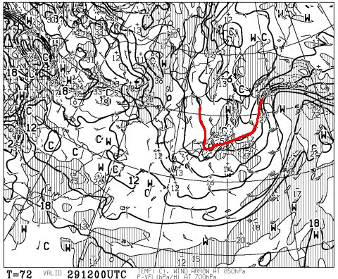

うむむむむむ？？？

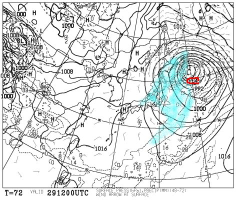

なんだ，この980hpaクラスの低気圧は…？？？

…ということで．

27日の夜から降り始めた雨は．

28日一日降り続き，ゲレンデを壊滅状態にした後．

29日に，意味のない雪に変わりそうです…（ほとんど積もらないけど（涙））

29日の朝は雨か雪か微妙なみぞれっぽい感じですが．

昼は完全に雪かも…

寒いよ！！

…とりあえず．

このGW最初の3連休の天気予想詳細を，

また明日やりますので，

しばしお待ちを…

んで．

今日は，日曜の志賀高原の積雪がどんなもんだったかの

詳細レポート，[昨日に続いて](eff3009e2fd0b93c44f1975b7ddb75327.md)2日目です～．

本日は，今週末も営業する，渋峠と熊の湯のレポートです…

＃今日もご無体時間に帰宅なので，写真たっぷり

＃コメント短く，です．

えー．

今週末も営業するはずの渋峠ですが．

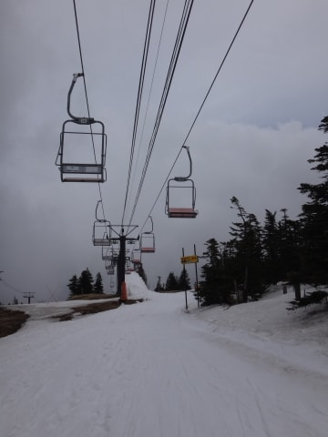

滑れるのは上から見てリフトの右側，ゲミュートコースのみ．

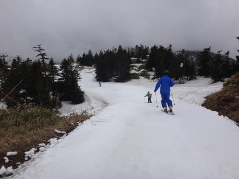

上から見てリフト左側，ウェイバーコースは

こんな感じで，すでに終わってます…

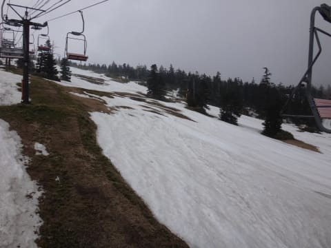

もう，どこがコースだったかわからないくらいで，

雪はつながってません（涙）．

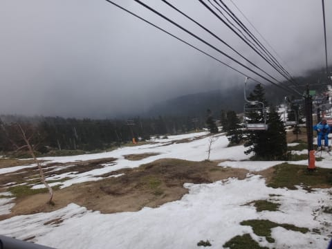

で，ゲミュートコースも…

決して幅広く滑れるわけではないなぁ…（泣）

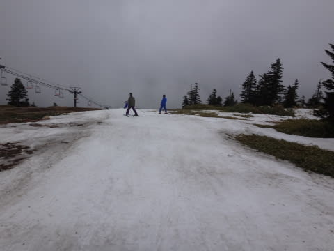

コースは硫安でかなりがっちり固められていて…

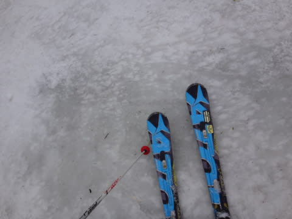

固いところと柔らかいところがまだらに混ざった感じ．

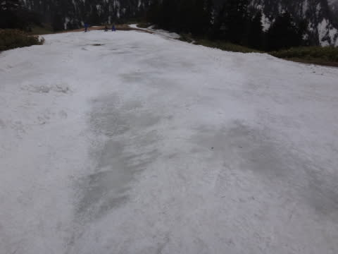

ところどころ雪も薄くなり，

かなり滑り難かったです…（涙）．

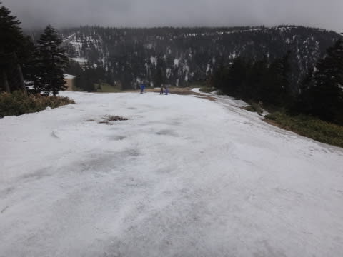

一番細いところは，横から見るとこんな感じで．

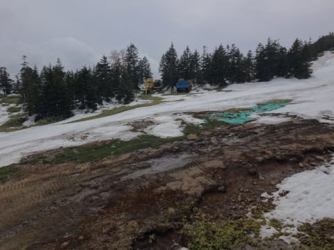

うーむ．

渋峠も，廊下だったか…（残念）．

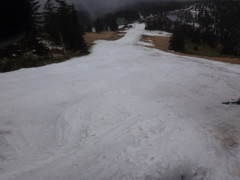

ということで．

あまり楽しいと言える状況ではなかった渋峠を脱出し．

熊の湯へ逃げてみました…

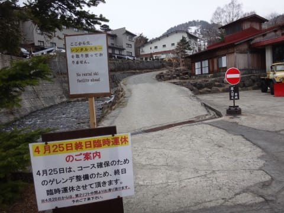

熊の湯は…

ふむ．

下の部分は，結構幅がありますね～．

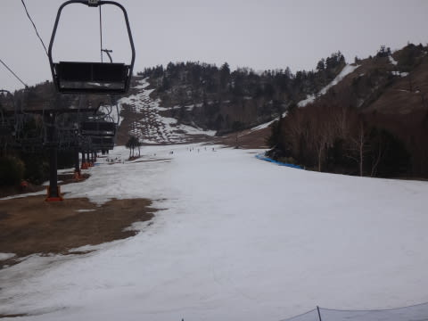

雪がついているのは，馬の背と第2緩斜面のみ．

それ以外は，滑れません…

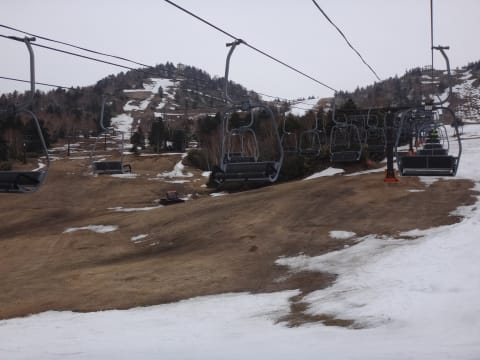

熊の湯スタッフの努力の賜物か，

おそらくこのゲレンデが，今の志賀で

最もまともに滑れるコースかも？？

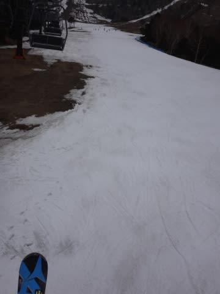

しかし，馬の背から緩斜面に下りてくるあたりは

もうやばいか…

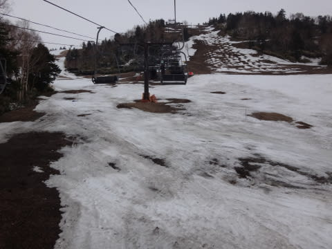

この写真手前部分，もう切れそう．

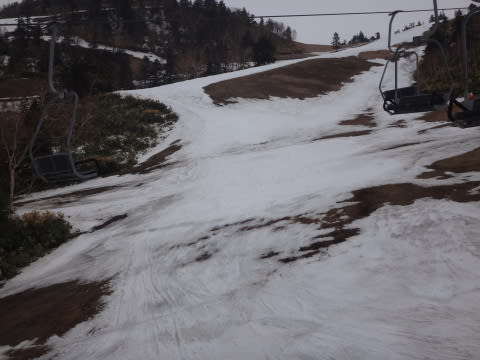

上から見ると…

これは，ちと悲惨な感じですね…（涙）．

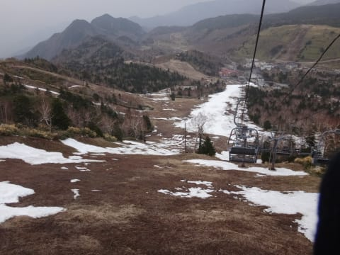

リフトを降りてコースに出ると…

いや，ブッシュがあるのは，もうわかってるから…

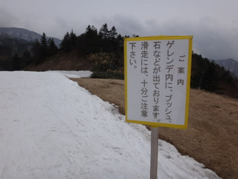

しかし，第2山頂から馬の背も，

きれいに真っ白な雪がついてますよ．

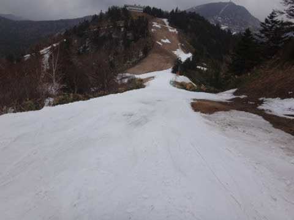

馬の背は…

うーむ，紐に近い状態になってるか…．

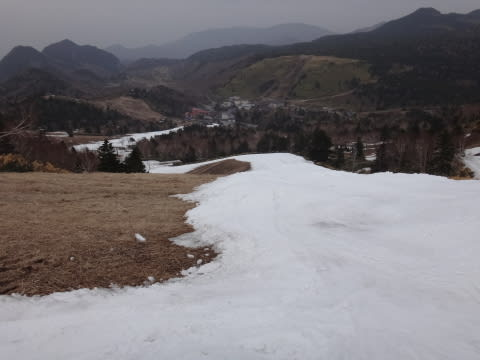

全面コブになっていて，コブ溝は穴が

空きかけてるけど…

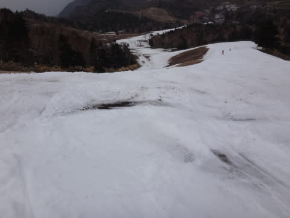

でも，一の瀬よりはずっと雪があるのかな～

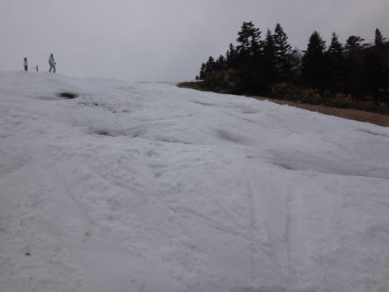

この馬の背も，この日で営業終了なんですねぇ

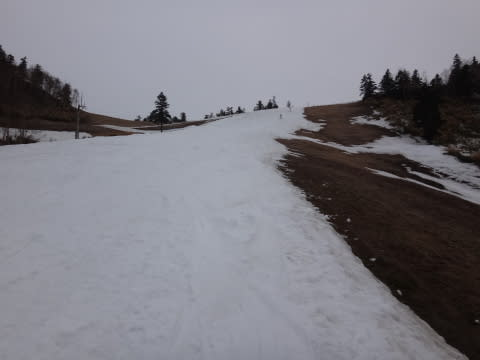

馬の背から緩斜面への移動部分は…

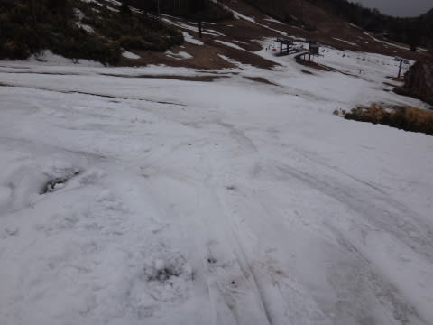

うむ．もう切れそう．

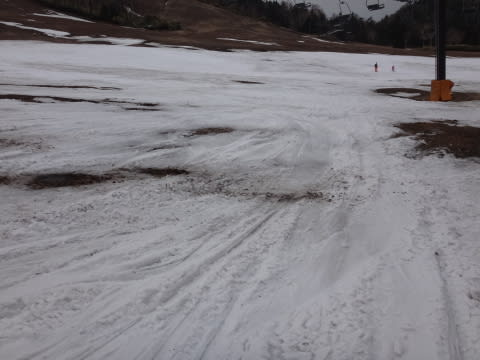

馬の背はまだ雪があるけど．

この部分の雪が薄いから，山頂からの滑走は

日曜で終わりにして，

まだ雪がある馬の背から緩斜面に雪を下ろそう…

という戦略ですね．

GWまでしっかり営業しようという，熊の湯スタッフの

熱意（執念？）を感じずにはいられない…

下半分のコース，第2緩斜面は．

水が溜まってしまっていたところもあったものの

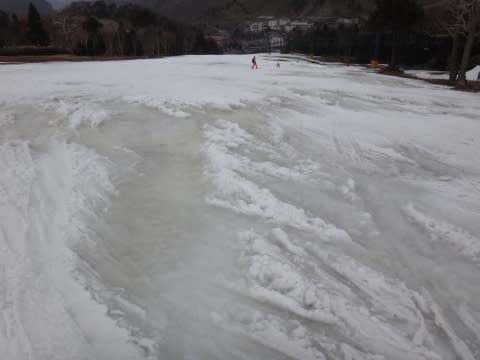

コース幅も広く，雪もまだしっかりついているので．

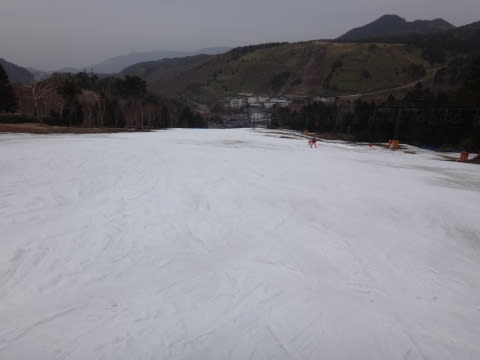

志賀高原では，一番ここがマシだったかな～．

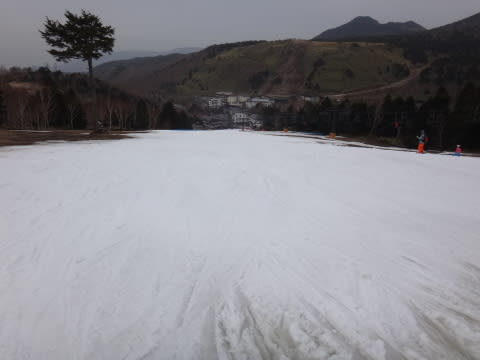

…ということで．

この日曜の状態を振り返ると．

熊の湯が一番まともだったわけですが．

…はてさて．

残された熊の湯下半分が，28日の大雨にどこまで耐えて，

どれだけまともな状態で残るのやら…

## 💬 コメント一覧

### 💬 コメント by (Tomoko.Y)
**タイトル**: 24日のかぐら
**投稿日**: 2016-04-27 08:46:25

24日はかぐらに行ってきました。

日曜のせいか、リフトは行列でしたが駐車場思ったより混んでいなかったです。

テクニカルは土とブッシュを避けながらゆっくり下山する感じ(滑走とは言えない)でした。

ジャイアントはもう少しましですが、コブの中に土が出ているところがあり飛び込まないよう要注意。

午後のメインゲレンデはコブ畑もしくは超ナチュラルバーンと化し、もはや整地はありません。

GWは予定が入りスキーに行けないので、5月半ばに月山を考えています～。

### 💬 コメント by (Skier_S)
**タイトル**: Tomoko.Yさま
**投稿日**: 2016-04-28 01:30:59

あら…

かぐらもそこまで雪が減りましたか（涙）．

例年のGW終了後の雪の量ですね…

あぁ…

GW終わりまでがぎりぎりな感じでしょうか…

でも，GWまでもっただけ良かったとしておく

べきでしょうねぇ…

