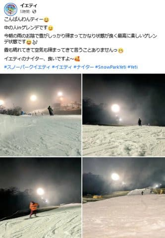
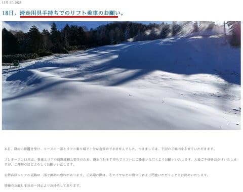
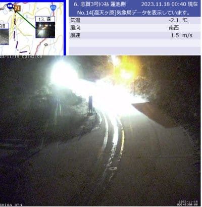

# 今日の雨はそれほどひどくなく，イエティはナイターまで通常営業したみたい．そして横手も予定通り明日プレオープン！

📅 投稿日時: 2023-11-18 01:10:25

🏷️ カテゴリ: [日記](cc4b5682fb7b8b144980957a978653fb0.md)

今日も帰宅が深夜12時直前…（涙）

電車で座れないまま，片道2時間の

出張先から帰ってきて

ちょいと疲れ気味のSkier_Sです．

…この1週間もしんどかった…

それでも滑りに行く！

明日，滑りに行くのだ！！

もう，今週は週末のスキーだけを

心の支えにして，平日を乗り切って

きたのだ！

今日はこれからスキーの準備をしたり

なんだりしなきゃならないけど，

それでも睡眠5時間は取れるのだ！

今週一番長い時間寝られそうなのだ！

ということで．明日またイエティに行く

予定なのですが…

どうやら，今日のイエティは思ったほど

ひどい雨にならず．

朝はちゃんと予定10時にオープンした後，

ナイターまで中断なく営業したみたい

ですね～！

そして，意外とコースがやられてません…

雨の後でこれなら，ほぼコースは被害が

なかった感じですね…！

雨でコースが途切れたりするんじゃないかと

思いましたが，まったくそんな心配は

なかったようです．

（[スノーパークイエティFacebook](https://www.facebook.com/YetiSnowtown/)より）

ってなことで．

思ったより雨がひどくなかったおかげで．

18日の横手山も，無事プレオープンする

みたいです…！！

ただし，リフト乗り場・降り場の雪が十分

着けられず，板を持ってのリフト乗車に

なるみたいですが…

（[横手山スキー場ホームページ](https://yokoteyama2307.com/2023/11/17/18%e6%97%a5%e3%80%81%e6%bb%91%e8%b5%b0%e7%94%a8%e5%85%b7%e6%89%8b%e6%8c%81%e3%81%a1%e3%81%a7%e3%81%ae%e3%83%aa%e3%83%95%e3%83%88%e4%b9%97%e8%bb%8a%e3%81%ae%e3%81%8a%e9%a1%98%e3%81%84%e3%80%82/)より）

で．

明日志賀高原に行く方もいらっしゃると

思いますが．

志賀高原ですが，深夜1時現在，路面は

積雪してます！

明日も気温はマイナスキープだと

思うので，志賀高原の上り坂，

運転にくれぐれもご注意を…！

（わかりにくいけど，路面に雪が積もってます…！）

（[北信建設事務所道路気象情報ページ](http://hokushin.pref-nagano-roadcamera.jp/)より）

ただ…

明日の土曜は冷えますが，西風なので

志賀高原ではほとんど雪が積もらない

かな～（涙）

日曜はそこそこ冷えるけど雪は降らないし．

ちょっと冷えが弱まるので昼間は人工降雪が

打てなさそう．

20日の月曜がちょっと天然雪が

積もるかな～…

その後，21，22，23と気温が上がり

人工降雪が打てないので，新たにオープンする

スキー場はなさそうだけど…

24日から，なんだかちょっと冷えそうな予感…！

24，25日はちょっと冷えて雪が積もりそう

なので，そこに期待…

とりあえず，明日は．

今日の雨を乗り切ったイエティに行って，

滑ってます～！！
