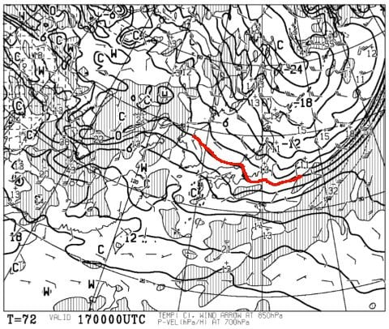
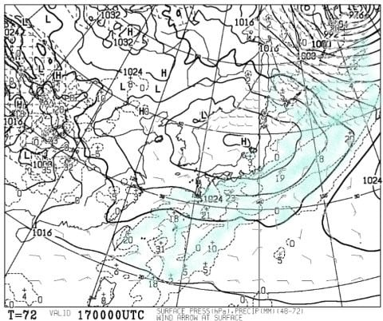
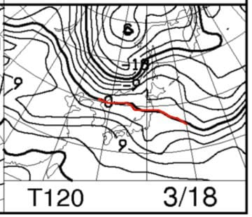
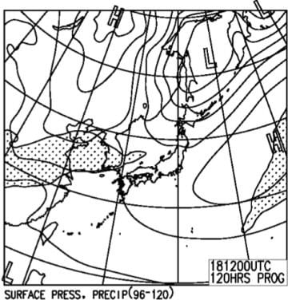

# 3月17，18日の週末の志賀高原の天気は…土日とも晴れてくれそうかな．日曜は春の陽気

📅 投稿日時: 2018-03-15 06:32:48

🏷️ カテゴリ: [スキー天気予想](c6554f5c3c106093b511a8daae23757e8.md)

ダメだ…

今日もとんでもない時間の更新になってますが．

月曜平日スキーの影響が…

とりあえず．

水曜深夜（というか，もう木曜朝か…（涙）

定番の週末の天気予想です！

えー．

まずは，土曜日17日の850hpa気温ですが．

うむ．

この日はまだ赤い0℃線は志賀高原より南．

-3℃線が志賀高原にかかっているくらいなので．

この時期としては平均的な気温で，

朝は-5℃程度の冷え込みかな．

ただ，昼間はぎりぎりプラス気温に

上がっちゃいそうかな…

やはり3月中旬．

2月のように，昼間も冷え冷えってわけでは

なさそうです．

あぁ…春ですね…

そして，土曜の地上天気図は．

高気圧に覆われてますね．

志賀近辺にわずかに降水域が予想されてるので，

金曜夜からちょっと雪がぱらつき…

朝方はちょっと雲がかかるかもしれませんが，

昼間は晴れそうな感じ．

で，日曜18日の850hpa気温ですが…

げげげげ．

この日は，赤い0℃線は志賀より北に

上がっちゃいますね…（涙）

志賀には+3℃線が掛かる程度なので．

昼間は山頂でも+5℃以上に上がっちゃうかも？？

…これは．

日曜は春の雪になることを覚悟した方がいいかも…

日曜の地上天気図を見ると．

網掛けの降水域は志賀に掛かってないので．

すっきり晴れそう…

うーーーーむ．

気温が上がって晴れそうだから…

強烈な日差しで雪がダメになっていく

パターンっぽい…（泣）

晴れてくれるのはいいんだけど，

そろそろ雪が降ってくれないとヤバそう…

ってな感じで．

まとめると．

17日土曜：前日からわずかに雪がちらつくか？朝は雲が多い．

　朝の通常営業開始のころから晴れてくるかな．

　朝イチの気温は-5℃以下とそこそこ冷え込み，

　朝イチは締まった圧雪で，結構楽しめそう．

　昼間は0℃をちょっと超える程度まで気温が上がるか…

　日も射すので，東～南の日が当たる斜面は雪がちょっと

　緩みそう．

　日が当たらない斜面は緩まずに済みそうだけど，

　その代り昼ごろには下地の固いのがところどころ

　出てくる斜面になるか…

　日が当たる斜面は午後には荒れ荒れになり，

　夕方はそれが固まる手ごわい斜面に．

　日が当たるか当たらないかで全然雪質が

　違うので，滑るバーンを選んだ方が良さそう．

18日日曜：朝から晴れ！放射冷却で朝イチは-3℃程度まで

　冷え込んでるかな？

　朝イチは比較的締まった圧雪バーン．

　ただ，朝早くから気温が上がり始め，強い日差しと

　相まって雪が緩み始める．

　昼間は+5℃近くまで上がり，重い春の雪になっていく．

　一の瀬ファミリーなんかの西斜面は緩むのが

　遅そうだけど，焼額は早くからヤバくなるかも…

　午後は春の重い雪が蹴散らされた荒れた斜面になるかな．

　…春ですねぇ…（涙）

ってな感じで．

2日とも基本的に晴れそうで．

日曜は3月下旬～4月上旬並みの陽気になりそう．

いや，もう晴れなくてもいいから，

積雪が欲しい…（懇願）
