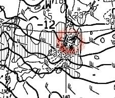

# 1月19，20日の週末の志賀高原の天気は…土曜は雪のち晴れ間も，日曜は終日雪降りかな？

📅 投稿日時: 2019-01-17 03:11:07

🏷️ カテゴリ: [スキー天気予想](c6554f5c3c106093b511a8daae23757e8.md)

えー．

今シーズンになってからこのBlogを

読み始めたという，

…こんなBlogにたどり着いてしまってご愁傷さまです

と思わず声をかけたくなるような，

まだ汚されないピュアな心をお持ちな

新規読者の方も多そうなので．

注：このBlogを読み続けると，ゲレンデに来たら

　リフト営業開始から終了まで，ひたすら止まらず

　休まずトップスピードで滑り続けなくてはならない

　という，謎の思想に毒されていく副作用があるようです

そういう方々のために，改めて

自己紹介しておきますが．

気象関係の仕事もしていなければ，

気象予報士を目指したことも全く無い

Skier_Sです．

…単にスキー場の天気を知りたいという

執念により，経験的に天気図の読み方を

体得していっただけで．

志賀高原以外の天気も予想できなければ，

そもそも夏の天気図が読めないという，

極めて偏った天気図の読み方しか

できません(笑)．

ってな感じで．

今日は水曜深夜恒例の，週末の志賀高原の

天気予想，行ってみましょう！

…ちょっと今回，週末の前の天気がどうなるか

知りたい方がいるようなので．

17日木曜からの予報もおまけで着けておきます…

まず．

木曜17日，夜9時の500hpa気温図ですが．

うむ！？？

そこそこの雪が降る目安の，500hpaの-30℃線．

（TVとかで，上空5000mで-30℃の寒気…って言ってるやつ）

この，赤く印した-30℃線が．

志賀高原より南まで下がってますよ！？？？

17日木曜，夜9時の地上天気図を見てみると．

日本海側に，水色で塗った寒気の吹き出しの

降水域がかかっているので…

17日の夜は，結構降りそうですね…！

降り始めは昼ぐらいか…

とりあえず，木曜どこかのタイミングで雪が

降りはじめ．

17日夜は雪が降り続けそう！

そして．金曜18日，夜9時の500hpa気温図は．

うむ．

この日もギリギリ，赤く塗った-30℃線が

志賀にかかっているので．

志賀は18日終日，雪が降りそう…！

ただ，地上天気図を見てみると．

…これは，等圧線が縦縞じゃなく，

右下がりなので．

志賀高原にはドサドサ雪が降りにくい，

西風パターンですね…（ちょい涙）

とはいえ．

ドサドサ降らないまでも，

17日夜から18日にかけては，雪が

降り続けそうな天気図なんですが…

この日の850hpa図を拡大してみると．

なに…？？

赤く囲った部分，風速50ノット！？？？

風速50knotって…風速約25mですね…

うむ．

18日．

ちょいと天気は荒れそうです．

強風でゴンドラが動かないリスクが

高いです…（残念）

そして．

19日土曜日の，500hpa気温図を見てみると．

土曜日には，もう-30℃の寒気は津軽海峡くらいまで

北上しちゃってますね．

850hpa気温図を見ると．

水色に塗った-3℃線が志賀高原よりわずかに

南にあるくらいなので．

志賀高原の最高気温は-3℃程度と，

この時期としては比較的暖かく，

先週3連休と同じくらいの

穏やかな感じの一日になりそう…

土曜の夜9時の地上天気図を見てみると．

うむ．

高気圧が張り出してきているので，

午前中まではおそらく18日の寒気の残りで

雪がぱらつきそうだけど．

昼ごろには寒気も去って雪も止み．

運が良ければ，夕方には晴れ間も見えてくるかも！

で．

20日の日曜ですが．

850hpa気温図を見ると，水色の-6℃線が

志賀高原より南．

むしろ，-9℃線が志賀高原に近づいてる

くらいなので．

この日は，結構冷え冷えになりそう…

そして，地上天気図は…

うむ．

縦縞ですね．

このままの天気図なら．

志賀高原でも，結構降りそうですね…

ただ．

FZCX50の850hpa気温偏差予想を見ると．

20日の部分．

水色矢印で示すように，ばらつきが大きいので…

まだ，どんな天気になるのか予想は難しい

感じです．

…しかし．

16日～18日までの，赤矢印で記した部分．

平年より2度程度低い気温が続いて．

冷え冷え期間になっていることが分かりますね～．

うーむ．

17日夜から18日．

荒れるけど，雪が積もってくれるかな～．

ってな感じで．

まとめると．

19日土曜：朝の気温は-8～9℃と冷え気味．

　雪降りの天気でスタート．前日からの積雪は，

　ブーツパフ程度．運が良ければ脛パフまで行って

　くれるか．

　朝は圧雪コースも，圧雪の上にうっすら新雪が

　乗っている．

　最高気温は-3～-5℃程度．昼ごろには雪は止み，

　夕方には日も射してくるかも．

　柔らかい雪が乗っているので，午後はコースは

　凸凹になってくるかな…

　でも，雪質はトップシーズンのいい雪をキープ！

20日日曜：朝は曇り空スタートか，あるいは雪が降り始めているか…

　朝の気温は-10℃を下回る，冷える一日．

　午前中から雪が本格的に降り始める．

　だけど，降り始めは朝からなので，朝のパウダーは

　期待薄．

　気温は終日冷え冷え，雪は夜まで降り続けそう．

って感じですが．

…まだ，20日の日曜の予想はブレる可能性が

高いです．

だもんで，直前にまた最終予想したいと思います…

## 💬 コメント一覧

### 💬 コメント by (ノーザンレインボー)
**タイトル**: はじめまして
**投稿日**: 2019-01-17 05:27:02

2年ほど前に天気予想からこのブログを読み始めました。そのうちに魔術にかかり、気がつけば今シーズン、志賀高原のシーズン券とスバル車を購入するという、我が家計にとっては暴挙をしでかしてしまいました。おかげさまでサイコーに楽しいです。これからも応援していますので、お体をお大事に頑張ってください。

### 💬 コメント by (かず)
**タイトル**: Unknown
**投稿日**: 2019-01-17 07:41:12

お忙しいところありがとうございます　月曜は高速代考えるとベストな状態で望みたいです　週末は奥志賀スタートが多いですが今シーズン奥志賀ゴンドラ止まる回数かなり少ない気がします…また報告します

### 💬 コメント by (おおすぎ)
**タイトル**: そんなこと・・・あるかな
**投稿日**: 2019-01-17 11:05:00

こんにちは、天気予報も毎週欠かさず見るようになりました（笑）

うちの娘も最近、お子さんの記事を読むようになり、「スキーは朝から晩まで滑るもの」と体得したようです♪

（こちらの身体が持ちそうにありません・・・まだ修行が足りないようです！！）

先週末軽プリに行ったのですが、かなり混んでいて、駐車場が満杯であふれておりました！！

プラス新幹線組も到着してごった返しておりましたよ。

最近は、日帰り・近場スキー場が人気なのでしょうか・・・

雪質は、全くの人口雪100％で、ちっとも楽しくないんですけどねぇ～（爆）

### 💬 コメント by (ホンダ)
**タイトル**: 今日はサイコー
**投稿日**: 2019-01-17 21:03:20

今日ヤケビ来ちゃいました。平日サイコーでしたね。某レインボークラブの方々と朝少し滑りました。楽しかったです。何とか天気もちましたが、今モサモサ降ってきました。明日は新雪かなあ？週末お待ちしてますよー。

### 💬 コメント by (新潟のスキーヤー)
**タイトル**: Unknown
**投稿日**: 2019-01-17 21:13:48

えぇー！！ 

Sサンが …

志賀高原に居ない…

そんな週末もあるのですね！

このブログを拝見していると、

Sサンは焼額の１ゴンに住んでいると言うか、

志賀高原の一部になっていて、週末に行けばお会いできるとものと、勝手に思い込んでいました！笑

今回はタイミングが悪かったみたいですね！

残念ですが…またの機会に！(^^;

### 💬 コメント by (takaaturyou)
**タイトル**: はじめまして。
**投稿日**: 2019-01-17 21:30:44

昨年も何度かお見かけしましたが、お声掛けするタイミングがあいませんでした。

19日に行きますので、勇気を出してお声掛けしたいと思います！

宜しくお願いします。

### 💬 コメント by (Skier_S)
**タイトル**: 明日の朝はひざパフパウダー！…のはず
**投稿日**: 2019-01-18 03:35:21

＞ノーザンレインボーさま

…そうですか．

このBlogに最大限毒されてしまっているようですね…ご愁傷様です(笑)．

でも．それで幸せになれたなら，

私も嬉しいです～！

志賀に通ってらっしゃるなら，ぜひ今度，

焼額でお会いしましょう！

銀のお札をお渡しします～！

＞かずさま

日曜夜から月曜にかけては，ドサドサってほどじゃ

無いけど，積もりそうです．

今の天気図なら，月曜朝までに20cmくらいでしょうか．

ただ，まだ詳細天気図が出てないので，月曜の積雪は

正しく予想できません…

で．

奥志賀ですが，ゴンドラ運行責任者が変わったらしく，

なるべく止めない方向で，風が強くても重りを乗せて運行しているようです…

＞おおすぎさま

スキーは朝から晩までですか…

かなり毒されてますね(笑)．

しかし，トップシーズンの軽井沢には行ったことが

無いのですが，そんなに混んでるんですね…！

その一部でも，志賀高原に流れてほしいところです．

＞ホンダさま

えええええ！

平日スキーですか！！

うらやましすぎる…

ガラガラですか．

朝は晴れてたんですよね…

いいなぁ…

私も平日に滑りたい…

＞新潟のスキーヤーさま

そうなんですよ…

何シーズンぶりか分かりませんが，トップシーズンに

スキーをしない週末を過ごします（涙）

数シーズンに1回のこんなチャンスに当たるとは，

何か「持ってらっしゃる」のかもしれませんね(笑)．

また別の機会に，休日に志賀高原に来るチャンスを

ぜひ設けてください…

今回はすみませんでした．

＞takaaturyouさま

ああああ～！！！！

すみません．

ごめんなさい．

今週末は，実に数シーズンぶりの，トップシーズンの週末に

スキーに行けない週末となってしまい…（涙）

19，20日と志賀には行けません…（泣）．

去年も何度か目撃されているようですので，

今シーズンもまだ何度かいらっしゃいますよね？

ぜひ，次の機会にお会いしましょう…

ちなみに，ウェアが変わってますので，ちょっと見つけにくくなってるかもです．

他人からよく言われますが，このBlogの通りの

何も怖くない人間ですから，お気楽にお声をかけてください…

もし私が他の人と一緒に滑っていても，大体みなさん

Blog読者ですから，他の読者に会うことを楽しみに

している人ばかりですので，ためらわず声をかけて

いただければと思います．

お会いできるのをお待ちしています～！

### 💬 コメント by (若杉勲71)
**タイトル**: 志賀高原情報
**投稿日**: 2019-01-18 13:13:12

今日は雪質最高、熱々のホンダご夫妻や、加藤ご夫妻ともご一緒できて、最高の１日でした。

某レインボークラブとは、毎年100日すべるばかが、スキーラインがなくなったため、毎日朝一番から滑って、虹、じゃなく２時にやめる老人クラブです。

今日、ホンダご夫妻と話していて命名を思いつきました。

### 💬 コメント by (yama)
**タイトル**: 奥志賀
**投稿日**: 2019-01-18 20:54:06

奥志賀ですが、昨年まではゲートまで混んでも半分くらいしかゴンドラを出さなかったけど今年はゴンドラを全て出すようにしています。ゴンドラを多くするタイミングがまだまだですがゴンドラ待ちは減りました。８時から営業するアーリーバードも焼額山よりすいています。

### 💬 コメント by (Skier_S)
**タイトル**: 今週末，楽しんできてください
**投稿日**: 2019-01-18 23:44:14

＞若杉さま

なるほど～．

それでレインボークラブですか！！！

なかなかいいネーミングですね(笑)．

＞yamaさま

今年は奥志賀，結構努力してますよね…

焼額も頑張って，ゴンドラのスピードを上げてほしい

ところ…

