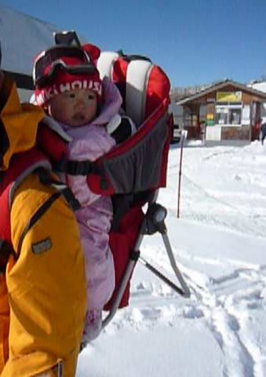

# 子連れスキーのすゝめ…

📅 投稿日時: 2015-10-30 01:32:59

子供が1歳の時から，ガンガン子連れでスキーに

行ってるわが家ですが．

子連れダイビング旅行記は詳細に書いているものの．

なぜか，「子連れスキーって，どんなの？」

ってレポートは，書いたことがなく．

で，今回．

読者のゆうこさんからのリクエストもあったので．

我が家での子連れスキー，どんな感じでやってきたのかを

書いてみようかな…と．

これから子連れスキーに行こう，って人の参考に

なれば幸いです…←いや，特殊すぎて他の人の参考にならないって

とりあえず．

まず，子供が生まれた年は…．

さすがに生まれたばかりの2か月や3か月児のころには，

連れて行っておらず．

＃首も座ってないし…(^^;

生まれた次のシーズン，1歳になった年に…

スキー場デビュー！

…と，なったわけですね．

我が家は，ウェア，手袋はスキー専用に買いましたが．

長靴や厚手の靴下，ニット帽などは，普段から

防寒用に使っているやつでした．

経験上，天気の悪いときは外で遊ばない，

と割り切れば．

スキー用のスペシャルな防寒具は要らないと

思うんですが．

雪遊びをするので，手袋だけはスキー用品店で

売っている，そこそこのモノを買っておいた方が

よいなぁ…

というのが我が家の経験です．

毛糸の手袋だと，すぐ濡れて冷たくなるので…

とりあえず，1歳の最初のころは，

日帰りからのチャレンジでした．

日帰りで行ったスキー場は，ブランシュたかやま．

ここは，子連れ専用休憩所があり，子連れ以外は

入れない，こんなカーペット敷きのスペースが

あるので，おススメっ！

こんな感じで，子連れ専用休憩所はカーペット敷きなので，

毛布を持って来れば昼寝もできるし．

他にも子供がいるので，子供同士で遊んだりして，

ゲレンデにいなくても，子供は楽しめます…

で．

実は，このブランシュの子連れ休憩所で

良かったのは，親同士の情報交換．

子供を持ったお母さんがいっぱいいるので，

子連れスキーに役立つ情報などをもらえて，

良かった思い出が…

んで．

我が家では．

1歳から，娘を背負って滑ってましたね～．

使ったのは，こんな感じのベビーキャリー．

LafumaのWALKIDというモデルなんですが…

詳細は[こちら](ee06aac468465c028bc5fcfb0f34c91ce.md)を見てみてください…

今はもうこのモデルは売ってないのかな？？

でも，同じようなベビーキャリーは登山用品屋さんに

行けば，いろいろ売ってます．

あー．

おんぶひもとか，そういうので背負って滑るのは厳しいかな．

ベビーキャリーなら，リフト乗り降りの際に，バックパックみたいに

背中からすっと外して，リフトの横に乗せたりできますが．

おんぶひもだといちいち付け外しが大変だし．

やはり子供がガードされている，ベビーキャリーの方が

安心ですね～．

背負うときは，子供用のゴーグルがあった方がいいです．

ゴーグルがないと，風で目があけてられず，

前が見えなくなるので，スピードを出すと子供が嫌がり

ますから…．

そして．

日帰りを何回かチャレンジして，

泊まりスキーに行ってみましたが．

泊まりの時は，アーリーチェックイン，レイトチェックアウトが

できる宿が楽．

子供が外に出るのは，天気が良い時のみに限って．

それ以外は，部屋でのんびり…ってのがベスト．

天気が悪い時に外に連れ出して，寒いところが嫌いに

なるようなことは絶対避けたいところ．

基本的に，朝に部屋に入ったあとは，どちらかが

部屋で子供の面倒を見る感じで，夫婦交代で滑ります．

天気が良ければ，時々外に連れ出しますが．

天気が悪いと外に出さず，子供は一日宿から出ないことも．

そのため，子供の屋内用遊び道具．

お絵かきセットなどをいっぱい持って行きましたね～．

必殺はポータブルDVDプレイヤー．

宿のTVにつないだり，往復の車の中で

お気に入りのTV番組を見られて，かなり

役立ちました…

で．

天気が良いときは，外に連れ出して，

1-2時間雪遊びして，時々背負って滑る感じ．

雪遊びはお砂場セットがあるとGood!!

我が家では，ベビーキャリーの小物入れに，

常にお砂場セットを入れてました．

で，背負って滑るのは，午前・午後それぞれ

せいぜい1-2時間くらいでしたか．

2歳のシーズンも大体同じ感じで，

基本的に娘は宿で，天気が良ければ時々

外に連れ出して，雪遊び＆背負って滑り…

って感じでした．

でも．

うちの娘は，基本的に背負って滑るとすごい喜びましたね～．

立ち止まると「止まらないで～」と，

滑り続けることを要求したり（笑）．

で，しばらく滑っていると．

振動が気持ちよいのか，ほぼ100％寝てしまうという…

大きな転機は，3歳のシーズン．

最初は，背負って滑っていたけど…

シーズン途中から，スキーを履かせてみたわけで．

この時．

秘密兵器，「[トライスキー](ee1fe22aee6c9eafdf693254a70b223be.md)」を使ってみたら．

なんと．

スキー2日目，わずか30分滑らせたところで，

[自由に止まれるようになって](efd51d380b145a639f682fe9e2ec3f810.md)．

次の日，スキー3日目には．一の瀬クワッドリフトを1本，

[一人で滑るようになっちゃいました…](ef37cc7d9e89a9024b6505cba0aa5ff82.md)

スキー歴3日目で，いきなり一の瀬クワッド3-4本ぶっ続けで

滑るようになってしまったわけで．

素晴らしい，トライスキーの威力…

あと，ずっと背負われていたので．

「スキーって，こうやって滑っていたよね～」

とか言って滑たりして．

…どうやら，自分で滑ってなくても．

背負われて滑っていると，スキーに慣れてるのか，

上達が早い気がします．

ってことで．

自分で滑れるようになったあとは．

あれだけ「乗せて～！」と言っていた

ベビーキャリーには，もうまったく乗ろうと

しなくなり．

娘は，あっという間に父親の背中から卒業して

行きました…（ちょっと寂しかったかも）

って感じで．

3歳以降は，親子で滑るようになったわけですが．

まぁ，5歳くらいまでは，滑るのは

やっぱり天気がいい時だけかな～．

今では．

朝から晩まで滑り続け．

ゴンドラが営業終了しても，ハイクアップで滑りたがり．

帰り道には「温泉に寄って！」

というような，すっかり父親のコピーのようになって

しまった，わが娘です…

うーん．

あんまりおもしろくない文章になっちゃったけど．

…子連れスキーに行こうとしている方の

役に立ちましたでしょうか？

＃質問歓迎です．コメント欄へどうぞ～！

## 💬 コメント一覧

### 💬 コメント by (ゆうこ)
**タイトル**: ありがとうございます。
**投稿日**: 2015-10-30 13:57:46

記事まで書いてくださり、感激です。

ありがとうございます。

日帰りスキーに、教えていただいたスキー場行ってきたいと思います。

今年の冬は、まだ生後半年くらいなので、基本的には室内で夫婦どちらかと遊んで待っていてもらおうと思います。

冬が楽しみです。

また質問があったらさせていただくかもしれません。よろしくお願いいたします。

### 💬 コメント by (KENKEN)
**タイトル**: 子供が小さい頃は
**投稿日**: 2015-10-30 22:12:19

来年以降の話かと思いますがスノーコンベア(名前は違うかも？)があるスキー場もおすすめです。

ソリ遊びや最初のスキー練習をやるのに必須ですよ。

でないと親が引っ張りあげるだけでへとへとになります。

(子供の乗ったソリを引き上げるのは本当修行です）

あとSさんが書いている通りトライスキーは秘密兵器です。

あっと言う間に滑れるようになりますよ。

あとは子供用の道具はお下がりを譲って貰えるといいですね。

１,2年でサイズが合わず使えなくなるので。

### 💬 コメント by (Skier_S)
**タイトル**: ゆうこさま
**投稿日**: 2015-10-31 01:00:02

この記事が何かに役立てば幸いです～．

ブランシュたかやまですが，スキーのみで

ボード禁止のスキー場ですので，ご注意を…

1歳になる前だと，宿から外に出すのも

厳しい感じですね…

天気のいいときに抱っこしてちょっと散歩

するくらいが精いっぱいかな．

夫婦交代でのスキーになりますね～．

で，KENKENさんも書いてくれてますが，

1歳以降になってきたらソリにも乗れますし．

（一人で乗れるようになるのは2歳以降かな…）

コンベアがあるスキー場がいいかも．

一の瀬ダイヤモンドの下にもあります．

一の瀬の宿に泊まったら，無料利用券が

もらえますよ～！

### 💬 コメント by (Skier_S)
**タイトル**: KENKENさま
**投稿日**: 2015-10-31 01:01:48

そうですよね～．

親がそり引っ張って歩くと

疲れますよね…（＾＾；

我が家は，娘のスキー道具は

ほとんど親戚のお古をもらってます…

＃親は新品なのに（笑）．

### 💬 コメント by (yukka)
**タイトル**: 初めまして
**投稿日**: 2021-01-23 23:08:24

初めてコメント失礼します。

今年子供が１歳を過ぎ、ベビーキャリアでスキーをしたくて情報を集めていたので記事がとても詳しく書いててとても嬉しく参考にさせてもらってます。

昨年夏にベビーキャリアを購入、低山や湿原を少し散策してまわりましたが、やはり一緒にスキーをしたいのです！！

ただ、リフトやゴンドラに乗るのにどうしたらいいのか

？１歳前後の赤ちゃんをリフトに乗せて怖がって泣いたら？そもそもいいの

？と疑問ばかりです。

もしよかったら、リフト事情のところも詳しく教えて頂けたら嬉しいです。

### 💬 コメント by (Skier_S)
**タイトル**: >yukkaさま
**投稿日**: 2021-01-24 03:24:03

コメントありがとうございます～！

リフトに乗るときは，当然2人乗り以上のリフトで，

横の席はあけておいてもらうのが大前提で…

乗る直前にベビーキャリーを背中から外して片方の肩に掛けた形にしておいて，

椅子に座ったらベビーキャリーを自分の横の席に置いてました．

降りる時も同様に，片方の肩にかけてリフトから降りて，

その後に背中に担ぎなおす感じです．

わが娘はリフト大好きで，リフトの高いところから見える景色を喜んでましたよ～！

リフトも，特に減速してもらわなくても普通に乗り降りできました…

ゴンドラの時も，ベビーキャリーに乗せたままゴンドラの椅子の上に置いてました…

ただ，動かなくて寒くなるので防寒をしっかりと！

あと，前が見えないといやがるので，ゴーグルは必須です！

ゴーグルが無いと，顔も寒いですから．

とりあえず，ベビーキャリーに乗せたまま，普通にゴンドラやリフトに

乗ってましたよ～！

### 💬 コメント by (Skier_S)
**タイトル**: ＞yukkaさま
**投稿日**: 2021-01-24 05:02:34

リフトやゴンドラの乗り方含めて，yukkaさま向けに記事書きました～！

読んでみてください．

https://blog.goo.ne.jp/tsakamot2001/e/6aadde97d856dee772ae7d54d406b608

### 💬 コメント by (ねも)
**タイトル**: Unknown
**投稿日**: 2025-04-08 06:02:34

あちこち失礼します。

このブログで、初めて普通の人にも役立つ情報を見ました(笑)

今はお嬢さんはスキー(やボード)しないんですか？

### 💬 コメント by (Skier_S)
**タイトル**: ＞ねもさま
**投稿日**: 2025-04-09 02:12:46

うちの娘はまだスキーやってますよ！

先々週は家族でスキーしてましたよ～！！

さすがに高校生になると土日もいろいろ拘束されるし，試験とかもあり

なかなか一緒にスキーに行けませんが…

