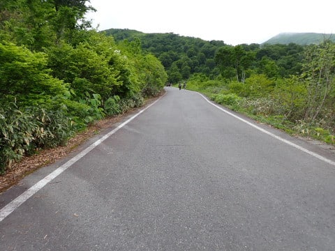
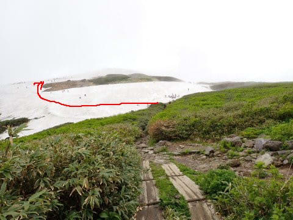
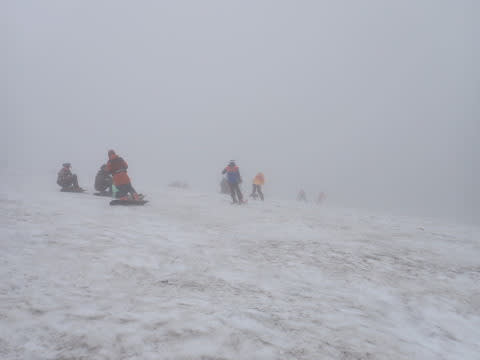
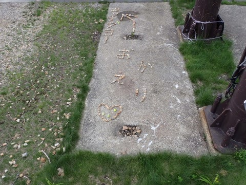

# 2023/6/25(日)の月山スキー場詳細レポート！…滑れるのはTバーのみ，長さ100m．滑れるだけありがたいけど，これにて私はシーズン終了！

📅 投稿日時: 2023-06-27 04:58:38

ということで．

今日もなぜかとんでもない時間に

更新していますが（涙）．

昨日速報した，日曜の月山の詳細

レポートです～！！

まず．

リフトがもう滑れず，上のTバーしか

滑れなくなった月山．

Tバーの営業開始は9時から9時半なので，

リフト営業開始の8時よりちょっと遅めに

到着しますが…

この写真の手前側エリアは結構車が入っている

ように見えるけど．

駐車場の奥はガラガラで，全体では駐車場の

半分くらいしか埋まってない感じ．

さらに車も半数以上は登山じゃないかな…？

ってなことで．

リフト乗り場へ駐車場からとことこ

10分ほど歩いて向かいますが…

道の雪は完全になくなりましたね．

この3週間で，一気に雪がなくなくなったよ…

で．

今日はやっぱりスキー客は少ないようで．

リフト券売り場は朝8時半ごろでも

ガラガラ！

ちなみに，リフト券は往復乗車1500円です．

リフトはTバーに行くための往復だけなので，

当然リフトもガラガラ．

リフトに乗って山頂に向かいますが…

リフトは夏用の低い位置に架け変わってます．

んで，リフトから大斜面方向を見ると…

大斜面，途中で途切れてますね（涙）

昨日書いたように，大斜面へのトラバースも

切れているので…

さすがに大斜面はもう完全に滑るのは無理な

感じ．

で，リフトが山頂に近づきますが…

…山頂，ガスってるよ（涙）

そして，リフトを降りてから，雪がある

ところまで結構歩きますし…

さらに雪があるところに到着してからも，

Tバーの下まで，矢印に沿ったルートを

結構登らなくてはなりません…（泣）

板を担いで，ひいこら登っていくと…

リフトを降りてから10分以上かかって，

やっとTバー乗り場が見えてきます…

振り返ると．

リフト降り場からは，結構登ってきています…

…ここに着いたころには，

「疲れた．もう帰ろうか」と思うくらい

疲れます…

（ホントにここで帰ったりしないけど）

で．朝9時過ぎの，Tバー運行開始のころは

まだガラガラ！

まずはTバーに乗りますか！

Tバーは1回200円，11回券2000円．

一日券3000円です

ただ．

コースの長さは100mくらいで．

かなり短いです…

Tバー乗り場から見ると．

向こう側で人が固まっているのが

Tバー降り場なので．

この写真で，長さが大体想像つくかと…

コースは当然圧雪も入らないので．

人がある程度滑って雪の表面が踏まれるまでは，

汚れて荒れてかなり滑りにくい感じ…

まぁ，でも．

この時期スキーで滑れるだけ幸せ！

コースには，それほど深くないけど

しっかりコブラインも作られていて．

コブラインは朝は浅かったものの，

昼頃には多くの人に掘削されて，

ちゃんと深めのラインになってました！

そして．

コース上には，狭い領域の中に

モーグルスキーヤーだけではなく，

レーサーから基礎スキーヤーまでの

幅広いジャンルのスキーバ〇が集まって

滑ってる感じ…

この時期まで滑ろうという根性がバカ

すごい←あなたが他人事みたいに言う権利はない

ただ…

天気は時折，濃いめのガスが流れてくるのが

惜しかったけど…

午前中は大体こんな感じで，うっすら

ガスが出るものの，コースは見渡せたし．

昼頃になると，ガスが上がって視界が良く

なってきました～！！

だのに，Tバーはそんなに混んでおらず…

平均的にはこんな感じで．

ピークでもこの程度だったので…

かなりのハイペースでぐるぐるできました！

もう，夏ともいえるこの時期．

天気が良くなってくると，景色もよくて．

スキーだけじゃなく，夏スキーの

雰囲気を楽しむだけでも十分満足

できる感じですね…！！！

ってなことで．

昼過ぎには，日帰りであることを考えて

ちょっと早めに切り上げ，Tバーを

後にして，リフト降り場へ向かって

降りていきますが…

うーん．

まだあと1週間は問題なく滑れそうな

雪がありますね…！！

リフトに乗って下山しますが…

振り返って見ると，まだ7月になっても

滑れそうな感じ…！

ってな感じで．

リフトにて下山…

お疲れさまでした！！

ってなことで．

今の時期，まだ板を履いて100m以上滑れて．

ハイクアップしなくてもTバーで登れるという

ありがたさを感じつつも．

100m滑るだけに，すごい高い交通費と

ものすごい時間をかけるのは辛いので．

残念ながら，これにて，私のスキーシーズンは

終わりとします…（泣）

トータル滑走日数47日か…

あと20日は滑りたかった…（涙）

とりあえず．

私の2023シーズン，終了です！！！

## 💬 コメント一覧

### 💬 コメント by (metabo-joker)
**タイトル**: Unknown
**投稿日**: 2023-06-27 12:30:30

お疲れ様！

相変わらず凄いですね。

### 💬 コメント by (スシネコ)
**タイトル**: Unknown
**投稿日**: 2023-06-27 12:52:11

シーズンオフ、お疲れ様でした。

そして次のシーズンインまであと４か月ですか・・・ｺﾞｼｺﾞｼ(-_＼)(/_-)三( ﾟДﾟ)ｽ､ｽｹﾞｰ!

### 💬 コメント by (Skier_S)
**タイトル**: シーズン終了！
**投稿日**: 2023-06-28 00:45:23

＞metabo-jokerさま

無事日帰り月山行ってきました～！

6月2回日帰り月山はなかなか厳しかったです（笑）．

＞スシネコさま

シーズン，無事終わりました…！

菅平が10月21日ごろのオープンなので，私のシーズンオフはおそらく4か月を切ると思います…！

### 💬 コメント by (炎の北海道民)
**タイトル**: Unknown
**投稿日**: 2023-06-29 12:40:05

今年の役務終了、お疲れ様でした。

夏の丸沼スキー場は行かないのですか？

### 💬 コメント by (Skier_S)
**タイトル**: ＞炎の北海道民さま
**投稿日**: 2023-06-30 02:45:19

昔は夏もグラススキーとかグレステンとかやってましたが…

プラスノーやPislabふくめ，冬のスキーのようにそれそのものを楽しむものではなく，

冬のスキーのトレーニングのためにやるものだ…

ということがわかってきて，やらなくなりました．

私の求める娯楽性がないんですよね…

