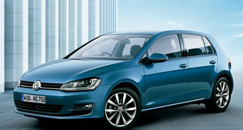

# VWのゴルフの試乗レポート…次は1.4LのTSI Highline！

📅 投稿日時: 2014-06-18 01:11:55

で．

[先日は，1.2LのComfortlineの試乗レポート](ea37d0cee05789caaf9ebaf869fc3c1c4.md)でしたが．

本日は，GOLFの上級グレード，1.4L Highlineの

試乗レポートです．

カタログ数値ではリッター20km近く走るらしい，

欧州ダウンサイジングターボの実力やいかに？

では，どうぞ～！

----

VW GOLF 1.4L TSI Highline

試乗した最初，

エンジンのパワー感が．

「あれ？1.2Lとさしてかわらないか…？」

と思ったけど．

踏んでいくと，ワンテンポのターボラグのあと，

「おーーーっと！」

ってびっくりするくらいの加速感を見せます．

明確なターボラグがあり，踏み込んでブーストが

上がると，トルクが出てきますね～．

車重が軽いからか，レガシィ2.5よりもずーーーっと

軽快に登り坂を登っていきます…．

でも．ブーストが上がってないうちは1.2と同等．

ワンテンポ遅れて，過剰なほどのトルクが

立ち上がってくる感じ．

DSGは，1.2Lと同じで，たいへんよくできてます．

…CVT，いらんじゃないか．

変速ショックは全く無く．

CVT変速より早くギヤ比が変わって．

レスポンスがいい感じ．

でも．

意外とパドルシフト操作時のフィーリングは，

レガシィのCVTのマニュアルモードとあんまり変わらず．

…普段乗ってるレガシィのマニュアルモードは，

結構頑張ってるのかな～？

んで．

足回りの完成度は，1.2Lからさらにワンランクアップ！

ボディーは過剰なほどガッチリしています．

結構強めのダンパーがかっちり効いた，

しっかり感があります．

ブッシュに頼っていない，ダンパーがきっちり

動いてダンピングしている感じ．

それなのに，しなやかさをも感じさせる足で，

路面のうねり．継ぎ目などの乗り越えを

「感じさせない」，欧州の高級車っぽい仕上がり．

ウェーブ状の凸凹を乗り越えた時のダンピング，

安定感はクラスを超えるものがありますねー．

ただ．横Gがかかった領域で，サスがストロークすると，

わずかにラインの揺らぎが出ましたが．

…意外と大きめのコンプライアンスステア要素が

あるのか，対地キャンバー変化の影響か…

まぁ，でも全く不安はないレベルです．

って感じで．

決してワクワクドキドキさせる車ではないですけど．

走る・曲がる・止まるに関して．

かなりガッチリしっかり作りこまれていて．

さすがドイツ車…

と思わせる，異常なほど完成度の高い

車でした．

…世界中のCセグが，この車をベンチマークに

する意味がよく分かった…

でも．FF車なのに，軽く300万オーバー（涙）．

我が家にはちょっと無理な車ですな～（残念）．

## 💬 コメント一覧

### 💬 コメント by (komu)
**タイトル**: 月山リフト
**投稿日**: 2014-06-18 23:06:18

なんと!

月山リフトが支柱の亀裂とかで20日までリフト運休らしいです。ブロク情報ですが、一応ご報告です。

### 💬 コメント by (komu)
**タイトル**: 訂正
**投稿日**: 2014-06-18 23:08:27

6月20日から7月12日までだそうです。

### 💬 コメント by (Skier_S)
**タイトル**: komuさま
**投稿日**: 2014-06-19 02:10:01

ええええええええええ～っ！！！！

えええええええ～っ！！！！

えええ～っ！！！

そ，それは…

そんなばかなっ！

ががががーーーん！

それは…

なんてこったいっ！！！！（超涙）

だめだ…

ダメだ．

死ぬ～っ！！！

