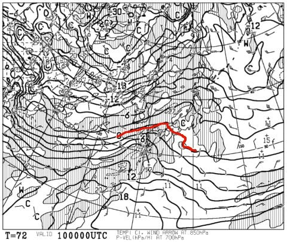
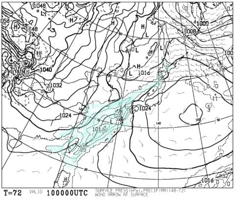
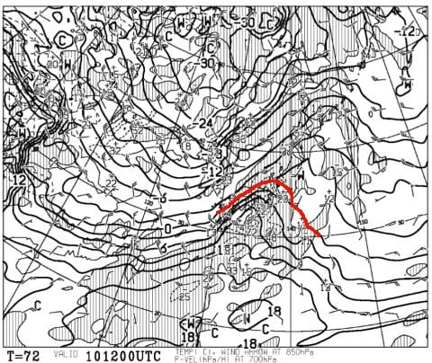
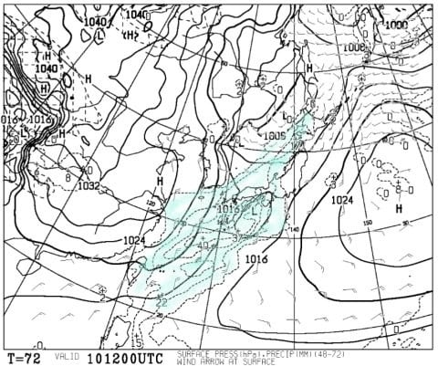
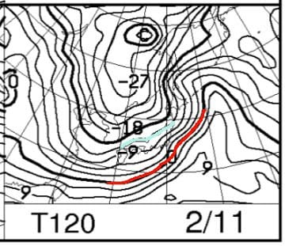
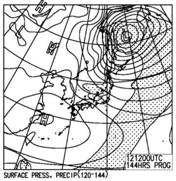
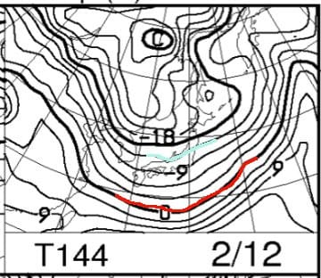

# 今週末は3連休！2月10，11，12日の志賀高原スキー場の天気は…やっぱり10日が微妙．11，12日は激冷え！11日は雪降り，12日は晴れるか…

📅 投稿日時: 2018-02-08 00:06:36

🏷️ カテゴリ: [スキー天気予想](c6554f5c3c106093b511a8daae23757e8.md)

やっぱり志賀高原は西風が続き．

ちょっと雪が降ってくれてるけど，

そんなに積もっていないようですね…（涙）．

でも．

今週末は3連休ですっ！！！

…なぜか，私は土曜は休みじゃないんですが（泣）．

とりあえず．

この3連休の志賀高原は，どんな天気なのか．

いつも通り予想してみましょうか…

えー．

まず．

3連休初日，10日朝9時の850hpa気温ですが…

まだ，朝9時だと．

赤く印した0℃線は志賀高原より南にありますね．

そして，10日朝9時の地上天気図を見てみると…

うむ．

まだ降水域は志賀高原にかかっていません．

…ってなわけで．

10日の朝は，気温が高めなものの．

朝はまだ氷点下で．

意外と穏やかな天気で始まりそうです…

で．

10日の夜9時の850hpa気温を見てみると…

うーーーーーむ．

うーーーむ．

微妙…

0℃線がぎりぎり志賀高原に

かかっているかどうか…

このあと，0℃線がわずかでも北にずれると．

…アウトっぽい．

きわどい…

そして．

10日夜9時の予想地上天気図は…

まだぎりぎり，志賀高原に降水域がかかってないか…

でも．

9時を過ぎてから，夜中に降り出しますね．

その降り始めが，雨か，雪か…

きわどい．

実に，きわどい．

ってなわけなので．

10日の志賀高原．

今の天気図のままならナイター終了の9時までは

降らないでいてくれそうだけど．

そのあとは…かなりきわどい感じ．

あ，10日の昼間は南風が強くなっていくので．

午後には，焼額第2ゴンドラは減速になるかも．

で．

3連休中日，11日の850hpa気温を見てみると．

…また，この日は極端に冷えますね．

0℃線は南下して，志賀高原には水色の

-12℃線が近づいてきてます…

これだと，焼額山頂は-10℃以下の冷え込み

ですよ！？？

極端だ．

10日と比べて極端すぎる…

そして，11日の地上天気図は．

うーーーむ．微妙．

志賀高原上空の等圧線が，きれいな縦縞じゃなく，

右下がり．

…これは，西風パターンなので．

志賀高原にあまり雪が降らない天気図です…

でも．

11日朝は，志賀もちょっと雪が積もるかな？？

続いて，3連休最終日．

12日の850hpa気温図は…

これもまた冷えそうですね．

赤い0℃線は小笠原～沖縄くらいまで下がってますし．

志賀高原は-12℃線が掛かってます．

これは，志賀高原の朝は-15度レベルに冷え込みそう．

12日の地上天気図を見ると．

うーむ．

この日も等圧線は右下がり…

西風パターンですね．

だもんで．

この日は雪が降らず，太陽が射すかも？？

ってことで．

まとめると．

10日土曜日：朝は晴れかな？

　朝の気温はこの時期としては高めの-3℃程度．

　前日からの積雪は無く，朝イチはきれいな

　圧雪が楽しめそう．

　午前中はおそらく結構いいコンディション．

　でも，昼を過ぎると気温が上がり，南風も強くなるので．

　午後は焼額第2ゴンドラは減速運転になるかな…

　奥志賀ゴンドラもヤバいかも．

　午後には雲が増えていき，

　リフトストップのころには曇り空かな．

　おそらく，ナイター終了までは，降らずにもちそう．

　そうであれば，土曜は気温が高めなものの．

　そこそこ楽しめるかな．

　で．

　夜遅くのどこかのタイミングで…

　降りはじめます．

　雨か雪か，かなり微妙な感じ…

　運が良ければ雪．

　運が悪ければ…標高が低いところは液体か…

11日日曜：土曜の夜が雨だったとしても，明け方には

　雪に変わり，朝までに積雪がありそう．

　積雪量は…ブーツパフくらいか？

　朝のうちは圧雪バーンは柔らかめの圧雪．

　非圧雪コースは，雨が降った場合には

　固い下地の上に新雪が乗った，

　ちょい難し目のバーン．

　天気は雪がちらついたり止んだり．

　午後は，雪がかなり荒れて凸凹バーンに．

　…もし，雨が降った場合には．

　急斜面やこぶの溝は固い下地が出てきそう…

12日月曜：朝は曇りか，太陽が顔をのぞかせるか…

　まだ微妙．

　気温は，朝の山頂は-15度近くまで冷えそう！

　朝イチは冷え冷え圧雪で楽しめるかな．

　11日の積雪量次第だけど，昼に向かって急斜面は

　表面の雪がはがれて，固い下地が出てくるか…

　午後は全体的にちょいと荒れたバーンになりそう．

　今のところ西風なので，天気は晴れ時々曇り

　程度かな…

　この日は寒いよ！最高気温も-10℃以下だよ！！

ってなわけで．

10日は昼間は天気はもちそうかな…

夜に雨にならなければ，11日以降は激烈

冷え冷えで，雪質は良さそうなんだけど…

とりあえず．

10日夜，まだ予断を許さない状況なので…

そうです．

信心深いスキーヤーは，まだまだ情熱的に

踊り続けないといけません！

10日夜は雨にならず，冷え冷えの雪になれ踊り

を，天気の神に捧げ続けるのです！！

## 💬 コメント一覧

### 💬 コメント by (かず)
**タイトル**: Unknown
**投稿日**: 2018-02-08 17:10:09

今日来てしまいました　笑　パウダーではなかったですが　朝圧雪最高でしたよ

### 💬 コメント by (サトシ父)
**タイトル**: 同じく…
**投稿日**: 2018-02-08 19:49:14

私も土曜日出勤です(涙)

日曜日はカミさんと息子の3人でヤケビに参戦いたします！

### 💬 コメント by (はっち)
**タイトル**: Unknown
**投稿日**: 2018-02-08 20:55:29

自分は月曜は普通に出勤日。

3連休ということで混雑しそうなので、今週はヤケビはパスです。。。

### 💬 コメント by (Skier_S)
**タイトル**: 雪が降らない…
**投稿日**: 2018-02-09 01:07:33

＞かずさま

すみません…

7日夜は，上空に半端ない寒気が入っているので，

西風でも積もる！

と思ったところ．

7日夕方にちょっと降っただけだったようで…

いや．

ホントに久々パウダーが滑りたいですね～！

＞サトシ父さま

私は日，月と1泊2日で志賀に出没しています

日曜日，焼額で滑ってますのでよろしくお願いします～！

＞はっちさま

ありゃ．

3連休じゃないんですね…

我が家もそうですが（笑）

志賀なら，3連休でも蓮池やサンバレーに

行けば混まない気もします…

