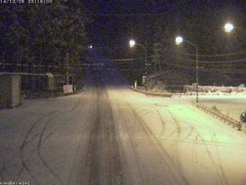

# 明日は予告通り志賀高原なわけだが

📅 投稿日時: 2014-12-05 23:31:14

えー．

予告通り．

明日から，1泊2日志賀高原なのですが．

…ただ．明日滑れるのは．

熊の湯の下半分，

高天ヶ原下半分のトリプルリフト，

一の瀬下半分のペアリフト，

焼額の4ロマ…

の4本だけみたいです（涙）．

うーーーーーーむ．

うーーーーむ．

もう少しどさっと降ってほしいところ…

…

祈りが足りないのかな？？？

で．

今の志賀高原．

雪が降ってるようで．

上林チェーンベースが，すでにこんな感じなので．

…明日の朝．

登り坂は予想通り

かなり本格的な雪道になってるとおもいますので．

志賀に行く方は，ご注意を…．

でも，積もっている雪の量はそれほどでもなくて．

天然雪でゲレンデがオープンできるほどの

積雪じゃないんですよね…（涙）．

とりあえず，この週末の天気ですが．

一昨日の予想通りで．

土曜：前日からの自然降雪は20cmほど

　志賀高原の登り坂は，完全本格的な雪道なので，

　冷え冷え，雪が降ったりやんだり．時折強く降る一日．

　ゲレンデは，人工降雪以外のコースはまだオープン無理かな～．

　でも，人工降雪の上に，柔らかい冷え冷えパウダーの天然雪が

　積もったいいコンディション．

　

日曜：前日の夜から，10cmほど積雪があるかな？

　この日の朝は，雪降りで始まります．

　昼に向かって雪は弱まり，午後は晴れ間がちらつくかも．

　この日も寒いよ！　

という感じですね～．

とりあえず．

土曜に50cmほど天然雪が積もるよう，祈ってみようかな…（無駄な努力）

## 💬 コメント一覧

### 💬 コメント by (れお)
**タイトル**: 焼額山
**投稿日**: 2014-12-06 21:41:38

Sさんご無沙汰しております!!

私は、明日が今シーズン初スキーですが、二ゴンが動くようですね♪

熊の湯も上から滑れるようですし、やっぱり明日は志賀かな～。八方尾根かで迷ってたんですが…。 

今年も、面白い志賀レポートお願いします～♪

### 💬 コメント by (Skier_S)
**タイトル**: れおさま
**投稿日**: 2014-12-06 22:19:26

ああああ～！！

ホントだ！

明日から2ゴン動くんですね！

第2高速より先に，2ゴンが動くとは…

明日は絶対ヤケビにいくぞっ！！

今日のレポートはたった今書き上げました…

