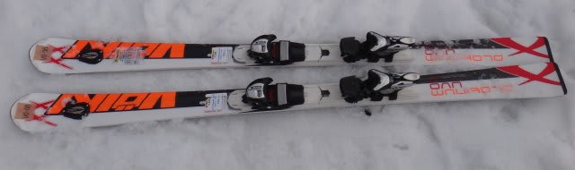
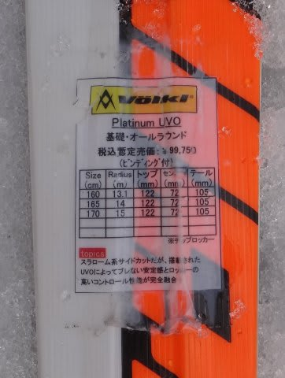
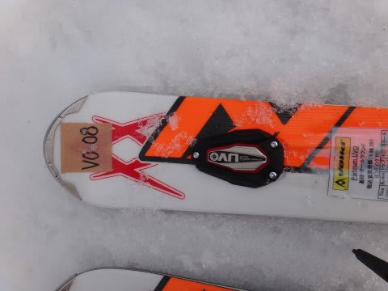

# 2014シーズンモデルのスキー試乗レポートファイナル…Volkl編3

📅 投稿日時: 2013-06-07 01:28:56

ということで．

長らく続いた，プロジェクトXシリーズも一区切りがついたところで．

2ヶ月に渡って続いた，2014モデルのスキー試乗インプレッションも

今回が最終回になります…

最後は，フォルクルのプラチナムUVOです．

では，どうぞ～

----

Volkl

PLATINUM UVO 160cm

基礎オールラウンド．

この板の特徴は，板の先端部分に固定されている振動吸収デバイス，UVOなんですが…

この，板に貼り付けてある黒っぽい縁取りのものがそれです．

この，UVOが重いってわけではないとは思うんですが…

この板，VOLKLのPlatinumシリーズを特徴付けている，「持ったときの軽さ」が

あんまり感じられません．

他のPlatinumシリーズの板を持ったときに，誰もが驚くであろう

「うお？」って軽さはないですね～．

で．履いてみたところ．

Platinum SDほどではないけど，しっかりした強い張りを感じます．

SDみたいなコア材が強く突っ張るような張りではなく，

メタルのバネっぽい，圧がたまる張りです．

滑り出すと…UVOが効いているのか，160cmとは思えない安定感．

荒れた斜面でも，足に伝わってくる振動は少なめ．

でも…Platinum CDも驚くべき振動吸収性をもっているので，

感じとしてUVOとCDの振動吸収具合は，それほど変わらないかも…?

サイドカーブは13mってことで，小回り用っぽいサイドカーブに感じますが…

板の安定感がそこそこ強く，返りもSDほど早くないので，キュンキュン

回ってくる感じではないですね～

小回りも大回りもどっちもそこそこいける，中庸オールラウンドって感じです．

ちょっと今回試乗したのが160cmって短めだったので，大回りをするにはちょっと

物足りない感じもありましたが，エッジグリップもしっかりしているので，

165cmを選べば，そこそこの小回りから大回りまでいける，まさにオールラウンド板に

なるかなぁ，って感じ．

…ただ．

何か．

何か，刺激が足りない．

これといった特徴が見当たらないのが，この板の弱みかも…．

## 💬 コメント一覧

### 💬 コメント by (komu)
**タイトル**: 月山
**投稿日**: 2013-06-07 02:50:32

よーし車が決まったのでスキーネタに戻りますか(・Д・)ノ

これから月山いってきます。

### 💬 コメント by (Skier_S)
**タイトル**: komuさま
**投稿日**: 2013-06-08 04:00:07

えーーー！

月山ですかっ！

いいですね～．

私は来週15，16日に月山の予定です．

またどんなだったか教えてください…

### 💬 コメント by (komu)
**タイトル**: 月山いってきました
**投稿日**: 2013-06-08 23:49:51

初月山から今戻りました。

Ｓさん情報からから察するにきっと苦行かも´д` ;と思ってましたが…

月山最高＼(^o^)／*\(^o^)/*

初日は駐車場から歩くの大変だし、ブヨの大群に襲われるしリフト乗る前は本当にどうなるかと思ってましたが、板履いてリフト乗り降り出来るし、天敵のコブは柔らかくて滑りやすいし、何より景色が素晴らしかった。

一泊二日でしたがもっと滑りたかったなあ～

Ｓさんブログ読者で良かった＼(^o^)／

ちなみに来週は板履いてリフトは微妙です。

でも…神奈川東部からでも日帰りしようという距離ではありませんでした。

### 💬 コメント by (Skier_S)
**タイトル**: komuさま
**投稿日**: 2013-06-09 21:25:08

あら～

来週は，板履いてリフトは厳しそうですか…

来週に突撃の予定だったんですが…

月山，神奈川南部からでも，その気になれば日帰りは

余裕で可能かと思っていたんですが（笑）．

来週はさすがに1泊2日の予定です．

### 💬 コメント by (komu)
**タイトル**: その気にならないとなあ～
**投稿日**: 2013-06-09 22:15:54

確かに志賀高原も日帰りなどあり得ないと思ってましたが、慣れるとなんて事はないですから(=゜ω゜)ノ（重症だ…）

月山、来週も行きたくなってきた。

いってしまおうかなヽ(´o｀；

### 💬 コメント by (Skier_S)
**タイトル**: さすがに2週連続は…
**投稿日**: 2013-06-10 00:38:49

私も，2週連続月山は人生1度しかやったことが

ありません…

まず，

・月山に行ってしまった

というバリアを超えて，普通ではない人になってしまい，

・月山に続けていくようになってしまった

というところで，「終わった人」になってしまうわけですね…（笑）．

次の週末は，私も滑る予定です！

