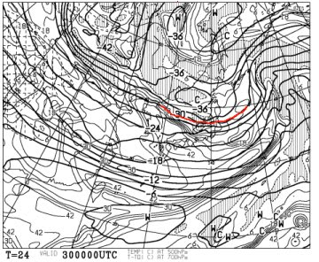
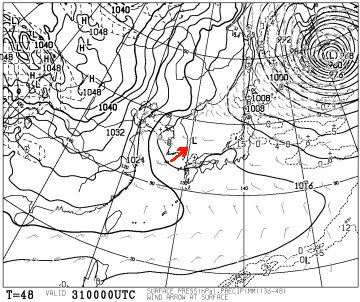
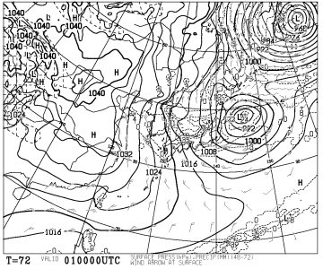
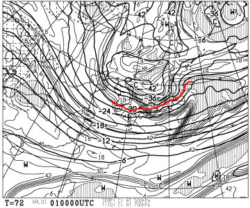
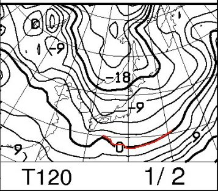
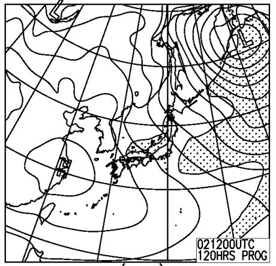

# 今日はスキーに行ってないので…この正月の天気予想でもしてみようか

📅 投稿日時: 2014-12-29 22:25:36

今日は一日スキーに行かず，自宅でいろいろやっていた

Skier_Sです．

今日は，志賀高原は，やっぱりかなり湿った雪が

降ったようで…（涙）．

かぐらとかの新潟エリアでは，雨になったところも

多かったようで…（残念）

うーむ．

明日の雪質，大丈夫かな～．．．

とりあえず．

明日，30日の天気は…

うむ．

こんな感じで，かなりの雪の目安である，

500hpaの-30℃の寒気が入ってますので…

明日は，終日雪がちらつく一日になりそうですな．

朝のうちは，固めの締まった圧雪の上にうっすら新雪．

そのあと，一日中，冷えたいい雪が降り続きます…

時折雪は止むものの，太陽は拝めず．

午後に向かって，ゲレンデはボコボコになり．

視界が悪いのと相まって，ちょっと滑りにくい

コンディションかな．

31日は．

…

…うーーーーーん．

これは，難しい…

運が良ければ，午前中から日が射すかも．

おそらく，曇り．

いや，ふつうなら，曇りと言っておいた方が無難だけど．

晴れるかも，と予告しておきましょう．

時折，雪雲が飛んできて，雪がちらつく一瞬も

あるかも知れませんが…

いや，予想をむずかしくしているのは，この矢印で示す低気圧．

専門的に言うと，こいつが500hpa図の5400mのかすかなトラフに対応する

低気圧なんですが…

こいつがどう発達していくかがまだ読みにくい段階．

南側に雲が広がっていけば，志賀も曇りになるかも…

ってところで．

曇りか晴れか，まだハーフ＆ハーフって感じです．

まぁ，夕方に向かっては崩れていきます．

そして．

1日ですが．

…この日は，残念ながら，初日の出は拝めませんが…

来ます．

この日は来ます

こんな感じで，見事な冬型の天気図で．

そして．

500hpa図には，そこそこの雪の-30℃どころか，

どか雪の目安の-36℃線が！

…これは，来ます．

…この日は．

朝はパフパフパウダーです！

パウダーねらい目！

終日エンドレスパウダー供給日でしょう．

パウダー狙いは，1日に来るべし．

…でも．

天気は悪く，雪は降り続け，圧雪ゲレンデは，午後はもさもさして

滑りにくいでしょうけど…

そして．

2日も，こんな感じで．

850hpaの0度線ははるか南だし．

地上天気図も，こんな感じで冬型だし．

この日も，朝はパウダーが積もってるかな．

1日ほどではないにしろ，この日も冷えて，寒くて．

終日雪が降り続けるでしょう…

で．

3，4日は，ですね．

…今のままの予想なら，3日の昼頃から晴れだして，

4日は晴れ…

という予想なんですが．

…まだ，このあたりの予想精度は低い段階．

どうなるか，数値予想でもかなりばらつきが大きく，

現段階では正確な予想は難しいです．

ってことで．

まとめると．

30日：朝から雪が降ったりやんだり．朝は固めの圧雪にうっすら新雪．

　気温は平年並み．午後に向かって，積もった雪が蹴散らされて，

　曇って視界が悪いのと相まって滑りにくいバーン状況に…

　でも，昨日の湿雪は隠れていき，雪質は良くなる．

31日：…微妙だけど．晴れたり曇ったりかな…

　朝はピカピカシマシマ圧雪！

　運が良ければ，朝から晴れ．気温はちょい高め．

　そこそこ過ごしやすい，いいコンディション．

　午後から天気は崩れだし，夕方は雪になるかな．

1日：前日の夕方以降から降り始めた雪がドサドサ積もり，

　朝は冷え冷えパフパフパウダーデー！

　終日パウダー供給が続く，パウダーフリークにはたまんない

　一日！

　…でも．裏を返すと．天気が悪い一日…

　寒くて凍える雪が吹き付けます．

　午後は，圧雪ゲレンデはもさもさした滑りにくい状況に…

　でも，冷え冷えのいい雪が降り続け，パフパフ好きにはいい一日．

2日：この日も朝はパウダーが積もってます！

　前日より積雪は少ないだろうけど…

　この日も，終日雪．降りは前日より弱く，降ったりやんだり．

　冷え冷えで雪質は最高でしょう．

　やっぱり午後は，圧雪ゲレンデは荒れちゃうかな…

3日：午前中は雪が残り，昼頃から晴れてくれるかな～．

　晴れのタイミングが早いようなら，結構ねらい目の一日．

4日：今の予想のままだったら，晴れ．

　最高のピカピカ圧雪！

…って感じかな～．

初日の出は拝めなさそうだけど，1日のパウダーに期待！

とりあえず．

明日から6日間．

志賀高原にこもります…

## 💬 コメント一覧

### 💬 コメント by (すぎぃ)
**タイトル**: Unknown
**投稿日**: 2014-12-30 11:16:35

私も志賀が好きなので

毎々Ｂｌｏｇ楽しみに拝見させていただいております。

今朝も第一ゴンドラ故障ですね

故障が頻繁過ぎます。

お仕事気象予報士ですか

気圧配置のことに詳しいので

６日間楽しんで下さいませ。

### 💬 コメント by (Skier_S)
**タイトル**: すぎぃさま
**投稿日**: 2014-12-30 22:12:26

今日は第1ゴンドラがだめでしたね…

すぐ動いたので，第2ゴンドラほど致命的では

なさそうですが（笑）

仕事は，気象関係とはまったく関係がないんです…

スキー場の天気が気になりすぎて，いろいろ調べて

いるうちに身に着けてしまった特技です（汗）

志賀高原の天気，それも季節限定でしか

予想ができない偏った能力です（＾＾；

また，焼額で見かけましたらよろしくです．

