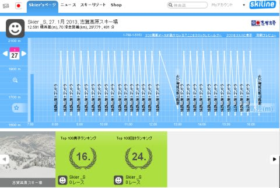
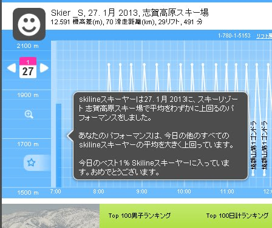
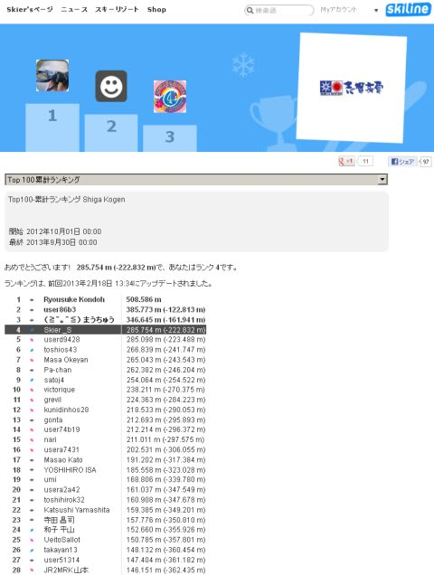

# 現在の志賀高原の，2013シーズン滑走標高差ランキング

📅 投稿日時: 2013-02-19 00:36:40

🏷️ カテゴリ: [スキー雑談](c1f9d2cb7478308da16419928ea3945e9.md)

ということで．

12月第1週以来．

毎週，志賀高原に通っている私なんですが．

ご存知のように．

志賀高原のリフト券．

こーんな感じで，

ウェブページにアクセスすれば，

何月何日にどのようにリフトに乗ったかを表示してくれるという．

大変便利な

[Skilineっていうシステムがある](eb2a0029115b8205c8168295e2d9d49ef.md)わけですけど．

今シーズンから，微妙にいくつか機能が追加されてますね～

ふーむ．

この日の志賀高原の全スキーヤーの滑走標高差の，上位何％に入るかが出るように

なったみたいですね～．

でも，「おめでとうございます」って…

いったい，何がめでたいんでしょうね～？(笑）．

さてさて．

で．

さらに．

昨シーズンは，一日の滑走標高差のランキングだけだったのが．

今シーズンから，シーズン積算での滑走標高差のランキングも出るようになったんですが．

…4位，ですか．

まー，子連れで滑りに行く日はあんまり本数が滑れないけど．そのわりには健闘しているのかな．

…でも．

私以上に志賀高原を滑っている人が，まだ3人いるんですね…

上には上がいますね…

一体，どういう人たちなんでしょう！？？

＃うち一人は，いつも同じ宿で見かけている人のような気がするが…

## 💬 コメント一覧

### 💬 コメント by (いか)
**タイトル**: Unknown
**投稿日**: 2013-02-19 01:26:18

この機能、楽しいですよね！

色んな所で導入してほしいなあ、と個人的には思っています。

いつも行く八方だと、乗ったリフトとその時間しかわからないので視覚化できません^^;

先ほど見たところ、昨シーズンの志賀高原の男子のランキングに載っていました…笑(総合ではダメ)

### 💬 コメント by (Unknown)
**タイトル**: Unknown
**投稿日**: 2013-02-19 16:36:57

めでたいって、そりゃアナタ！！

「おめでたい」という、そのまんまの意味だと（違？）

私の場合、そんな細かいノコギリ状になりません（笑）

ときどきなが～～～い休憩が入ってるのがバレる形になります（汗）

### 💬 コメント by (Skier_S)
**タイトル**: Skiline
**投稿日**: 2013-02-20 01:49:29

>いかさま

いやー．

楽しいですよね．この機能．

私のような記録マニアにはたまりません…

男子ランキングって，昨シーズンではなく今シーズンですかね…？

私は，今シーズンの一日滑走標高差，今シーズンは24位です．

昨シーズンは10位だったんですが…

>Unknownさま

名前がありませんけど…もしかすると，ひろりんさんですかね？

（まちがえてたらごめんなさい)

…しかし．

おめでとうって…

「おめでたい」って意味だったら…妙に納得かも(笑）．

で，私ののこぎりも，ちゃんと昼休みが入ってますよ～．

### 💬 コメント by (ひろりん)
**タイトル**: Unknown
**投稿日**: 2013-02-20 13:45:33

なぜわかった？？（笑）

あ、IPですね・・・

名無し投稿申し訳なかったです（汗）

昼休み・・・うん、滑走時間考慮して30分ですね・・・

私が同じグループだったら反乱起こす短さですｗｗｗｗ

### 💬 コメント by (Skier_S)
**タイトル**: ひろりんさま
**投稿日**: 2013-02-21 03:38:30

いや，IPではなく，文体でなんとなく分かりました…

昼休み，30分だと反乱起こしちゃいますか(笑）．

上位の人たちは，みんな昼休みを取ってないので，昼に休んでいる私はまだ健全かと…

昼休みとらないなんて，反乱どころかクーデターもんですね(笑）．

