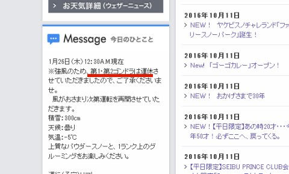
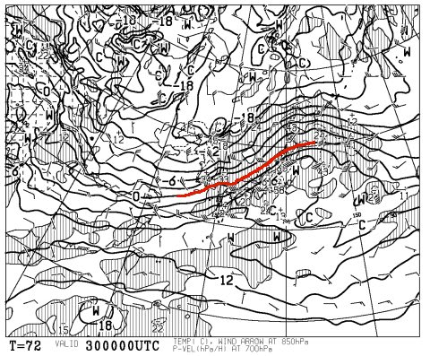
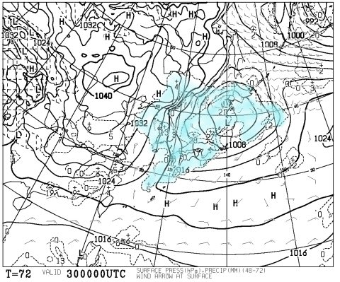

# そして，今週末も当然志賀高原を滑ってるわけですが

📅 投稿日時: 2017-01-27 23:43:37

ということで．

本日，金曜日．

　27日の午前中は，この低気圧に向かって

　見事な南風が吹くので．

　金曜朝はゴンドラが運休しそうな気配…

と，予想しましたが．

意外と午前中はもったものの，昼ごろには

焼額第1，第2ゴンドラ，奥志賀ゴンドラ，高天ヶ原ゴンドラが止まり．

その他も，寺子屋や熊の湯はリフトも全面止まったようですね…

（焼額山スキー場ホームページより）

でも．

みなさん．

安心してください．

明日は天気も落ち着きます…

ってか．

水曜に予想した通り．

土日とも基本的に晴れて，最高のスキー日和です．

ついさっき，夜の間ちょっと降っていた雪も止んだみたいで，

明日の朝は，新雪無しのピカピカ圧雪になります！

それも，水曜の予想より気温は冷えて．

土曜は昼間もしっかりマイナス気温キープ！

…これは．

かなり恵まれたコンディションになるんじゃないかな～．

で．

日曜は．

やっぱり気温が上がって，雪はちょっと緩みそうだけど．

でも，終日晴れて気持ちいい天気ですね～！

…しかし．

30日の月曜日は…

あり？？

なに？

850hpaの+6℃線が志賀高原に？？

そして…地上天気図は．

…こ，これは…

危険…

まぁ，志賀高原の標高なら．

降り始めはみぞれっぽいけど，じき

雪になる…って降り方だと思うんだけど…

うーむ．

まぁ．この土日は天気が良いので．

楽しみましょう！

あと4時間後に出発です～！

＃また3時間ちょいしか寝られない…（涙）

## 💬 コメント一覧

### 💬 コメント by (yama)
**タイトル**: 20000メートルクラブ
**投稿日**: 2017-01-28 20:35:14

本日８時15分に宿をでましたが、すでにクワッドが動いていて、何時もの人達の姿がなく急いで飛び乗りました。最初はポジションの確認などをしてゆっくり滑っていたのですが、いつのまにかチャレンジモードに何故かコンスケさんに追いつき、追い越し71本ほど乗っていました。maeさんにナイター行けばトップ間違いないと言われましたが、ナイターはS様に任せます。明日は奥志賀に行って天才少女に会って来たいと思います。

### 💬 コメント by (Skier_S)
**タイトル**: yamaさま
**投稿日**: 2017-01-28 21:38:20

KonSukeさんが，yamaさん71本滑ってるんじゃないか…

と話していましたが．

ホントに71本行ったんですね…！

すごい…私にはできません（笑）．

71本滑っても，今シーズントップじゃないんですか？？

トップ争い，すさまじすぎます…

私は明日は一の瀬スタートで，娘と寺子屋や東舘

西舘など志賀高原ツアーでのんびりスキーの予定です…

### 💬 コメント by (yama)
**タイトル**: 会長には負けます
**投稿日**: 2017-01-28 22:55:18

S様には、今年イエティで雨の中、７７本滑った記録があるはずです。シーズンインの時期とは言え真似できません。スキーラインでは一の瀬の最高は７３本だったはずです。mae様、通りすがり様が達成していると思います。

### 💬 コメント by (Kon Suke)
**タイトル**: かないません
**投稿日**: 2017-01-29 00:21:38

20000メートルクラブ凄すぎです。

滑るのが好きか、リフトに乗るのが好きが・・・・。

最近わからなくなりました。

Ｓさんはもちろん滑るのが好きですよね？

### 💬 コメント by (Skier_S)
**タイトル**: 恐るべし，20000mクラブ…
**投稿日**: 2017-01-30 01:52:59

＞yamaさま

一日標高差トップ奪取，おめでとうございます！

奥志賀と一の瀬の両方で20000m越えを

達成している人は少ないのではないでしょうか？？

…しかし，Yeti77本とファミリークワッド71本は

比較になりませんから（笑）

疲労度が違いすぎます…

＞KonSukeさま

20000mクラブ，ホントにすごすぎます…

ってか，KonSukeさんも「凄すぎる」人なんですが（笑）．

私は…滑るのが好き（なはず）ですが…

でも，傍から見ると「1ゴンに乗るのが好きな人」

と思われている気が…（＾＾；

