# コドモとコモド！子連れダイブクルーズ27　コドモとコモドドラゴン！？

📅 投稿日時: 2011-07-31 00:05:11

うーむ．

徒然スキーヤー日記という名前とは全くズレて．

ダイバー日記と化しているこのBlog.

スキーヤーでこんなマニアックなダイビング日記を

読んでる人がいるんだろうか？？？？

…と，思いながらも続けます．

「長げーよ」というクレームも聞こえそうですが．

そのようなクレームは聞こえなかったことにして．

まだまだ続きます…

----

…というわけで．

昼食が終わったころ，

船はコモドドラゴン見物の地へやってきました．

ゲスト全員，ボートに乗ってコモドドラゴン見物へ出発！

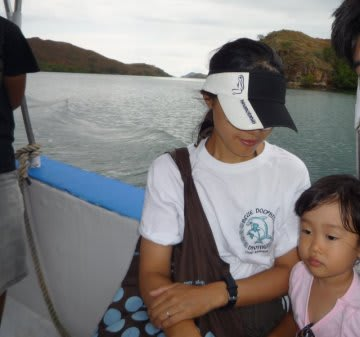

ボートで5分ほど．コモドドラゴンのいる島へ上陸です．

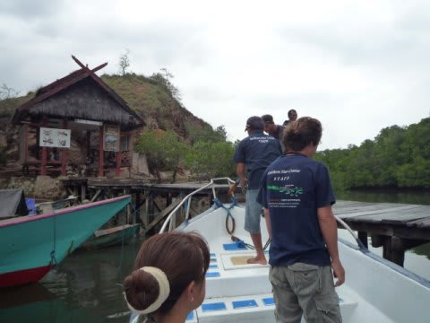

桟橋に上陸すると…

周りにはカニクイザルがいますねー．

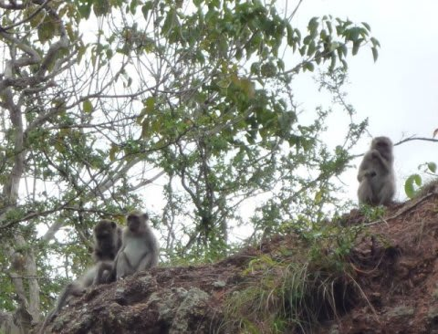

まず，内陸部のレンジャーハウスへ向かいます．

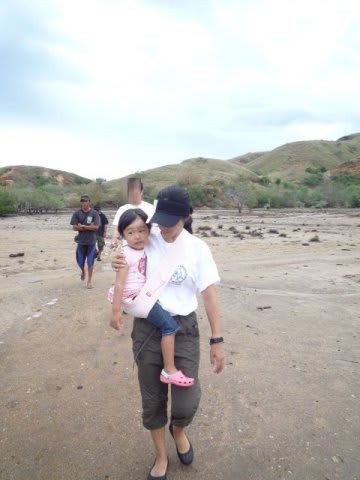

…一昨年はなかった建物が結構増えてるなぁ．

新しいゲストハウスや食堂を作っているようです…

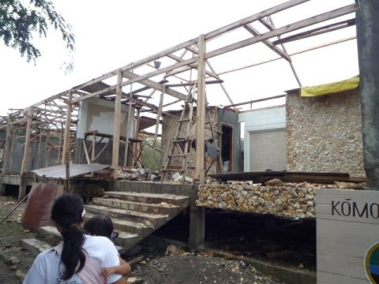

前回来たときは，掘っ立て小屋みたいな建物が3件ほど建ってるだけ

だったけど，新しい建物が増えたなぁ．

んで．

いつもどおり，この建物の周りで…

寝てますね．

やつらが．

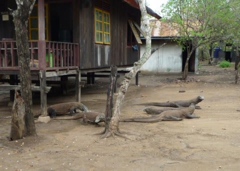

世界最大のトカゲ，コモド近辺のいくつかの島にしか生息しないという…

絶滅危惧種，コモドドラゴンのお出ましです．

なんか，普通に，ゲストハウスの軒下でくつろいでますね～

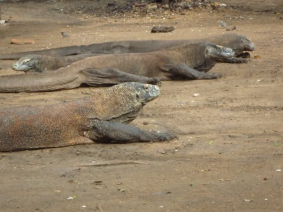

で．初めてこのクルーズに来た時からの念願であった，

「娘と一緒にコモドドラゴンを見に来る！」

という夢が．

宿題が．

果たせました…

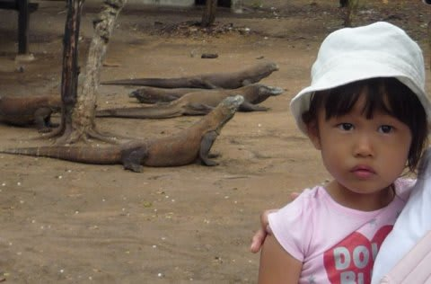

念願の，「コドモとコモドドラゴン」のツーショットです！

…でも．

娘はドラゴンを見ても，何の反応もなし．

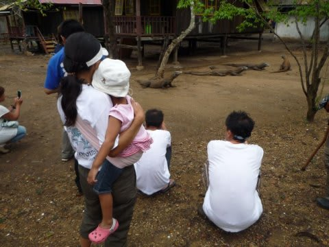

娘～っ！

いま，お前の目の前にいるのは，世界的にきわめて

珍しい生き物なんだぞ！

ここまでこないと絶対見れないものなんだぞ！！！

…あたりまえですが，珍しがっているようなリアクションは

まったく無かったという…

近所で猫を見かけた時のほうがよっぽどうれしそうなんだけど…

K澤さんのレクチャーを受けつつドラゴンをじっくり眺めた後は，

島の中を散策します．

卵を育てているドラゴンを眺めてから，

高台に登ります．

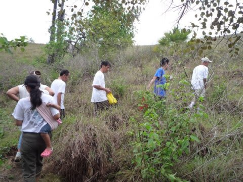

娘を肩車して歩いていたけど，ちょいと疲れる…

何とかてっぺんまで上がると…

景色がいいですね～．

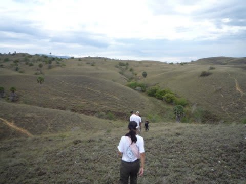

その跡は，コモドドラゴンの巣穴の跡やら，食事の跡などを巡って…

ボートに乗って船に戻ります．

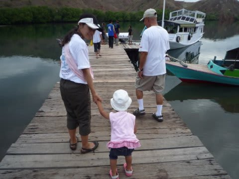

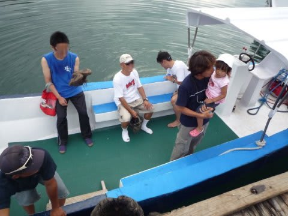

いやー．

普通のダイビングクルーズと違って，こういう陸上観光も

セットになっているのが，コモドクルーズのいいところですね．
