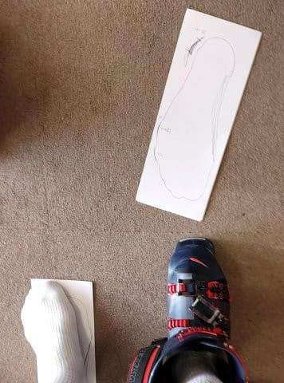

# 長岡のエキップさんで，ニューブーツ・’21モデルREXXAM R-EVO 130Mを作ってみた…その3

📅 投稿日時: 2021-01-15 02:45:47

ということで．

本日も，地元在住特派員から志賀高原

の状況が届いていますので，皆さんへ紹介！

…まず．

今日はあさイチが-3℃と，これまでに

比べれば気温は高めではあったようですが…

あさイチはすっきり晴天で…

なんと！

すごいいい感じの無人シマシマバーンじゃ

無いですかっ！！

そして，無人のフラットバーン！

うおおおお！

滑りたいっ！

この日は奥志賀も…

ジャイアントもほぼ無人で．

昼過ぎまでは天気も良く，良かった

ようですね…

写真は無いのですが，午後2時過ぎから

3時過ぎまでは，ちょっとガスったようです．

とはいえ．

ほぼ無人で，雪は午後になっても全く荒れず，

いい感じのフラットバーンだったようで．

うーん．

今日も恵まれた一日だったようです…

いいなぁ…

でも．

晴れるのは明日の金曜まで．

土曜午前も晴れるかもしれないけど，

土曜は風が強く，午後は雪降りになります…

そして，日曜は一日雪降りですね．

…いや．予報間違えてました．

土日の志賀高原は，槍とミサイルが降るんでした！！

…という，悔し紛れの一言を残して，

本題へ．

[前回の，長岡のエキップさんでのスキーブーツ作製記](e66af8f871cff365679d8f906ba863327.md)の

続きです…！

ってなわけで，

1回目の訪問で，ブーツを選んで，足型を取った後は．

次までにシェル出しをする…

ということになり.

やってきた，2回目．

まずは最初に，シェル出しされた

ブーツを履いてみますが…

うーむ．

まだちょっと当たる部分があり，

数か所微調整の削りを入れてもらいます．

調整後のブーツを履くと…

見事にすっぽりとはまった感じで．

「おぉ！？？」

と，思わず声が出てしまうくらい！

そして，足型にぴったり合ったシェルを

履くと…

前回は硬いと思っていたブーツ，それほど

硬くない．

冬の冷え具合を考えると，これで

ちょうどいいかも…！！

当たり出しをしたシェルを履いて，

カント調整をしたあと，

さらにブーツを履いた状態での

脚の動きを念入りに見てもらいます．

その結果を見て，インソールの整形に

入るのですが…

暖めて柔らかくなったインソールを

足型の台の上で足に合わせ，形をつけて

冷やして整形して．

（整形済みのインソール)

その後，インソールの裏にウレタンを貼って，

角度を合わせて削っていきます．

インソールの裏の接着剤が乾くまでに

時間があったので．

その間にブーツを履いてみて．

やはりちょっと気になった足首の

ホールドが甘い感じがしたので

コメントすると．

足首のホールドを高める手として

「タングにカーペット貼って，

　タングの厚みを足す」

という技が繰り出されました…！

…昔，私の足首が細いのを見た

今は無き某スキーで，タングのみ

フォーミングってのをやりましたが…

今回は，タングにこんな感じの

灰色のカーペットを貼って，タングの

厚みをアップ！

鈴木社長，ちゃんとREXXAM用の

タングの型紙を自作してあり，

この手法は結構使うようです…

実際，カーペットを貼った後に

ブーツを履くと…

うおお！

足首のホールド感が全然違う！

…これ，かなり効くよ！！

…ってな感じで．

タングの調整や，リヤスポイラーの

調整などをしたあと，

インソールの裏に貼ったウレタンの

削りが出来上がりました！

(写真の青い部分)

インソール単体で足を載せてみながら，

青い部分を削って微調整を繰り返し，

かかとの部分の左右の傾きを

調整していきます…

そんな感じで，インソール単体での

調整が終わったら，ブーツに入れて，

最後の確認！

最後はスタンスを合わせて徹底的に

下肢の動きのチェックが入り…

鈴木社長のOKが出ました！

これで完成です！

履いた感じのホールド感も，これまでの

ブーツより圧倒的に良いし．

当たるところも全然ないし．

私としても，これでOK！

…ということで．

無事ブーツが出来上がりました～！

いやー．

1日目は3時間ちょい，

2日目は4時間近く．

これだけ一人のお客さんに時間をかけるとは

すごい…

驚くのは．

これだけやって，お値段はブーツ

購入費＆インソール代金のみ．

それもちょっと値引きが有って．

工賃は一切なし．

ってなことで．

長岡まで2往復して仕上げたブーツ．

果たしてそれだけの価値はあったのか？

ブーツのインプレッションは，

また後日，お楽しみに…！

（[続く](e3075b660005b16ea867e1a7cfa899be0.md)）

PS.エキップさんで見た，「REXXAMのサンダル」が

インパクト強かった…

ちょっと欲しいかも

## 💬 コメント一覧

### 💬 コメント by (レインボー73)
**タイトル**: Unknown
**投稿日**: 2021-01-15 15:28:39

金曜日の志賀高原情報

朝から徐々にヤケビブルーが深く美しくなっていき、誰もが上手くなれる快適斜面とあわせて、幸せ度三重丸の一日でした。

プリンスカードを持っていると10分早くゴンドラに乗れるミニファーストトラックで、8時20分に２ゴン乗車。１ゴンには叶わないので、いつものようにパノラマからカラマツで二高乗車。技術の高いヤケビの圧雪のおかげで、昇天しましまバーンのオンパレード。なんて滑りやすい！

オリンピックもＧＳも仲間で滑ればなお楽し。

そして、本日の目的地、昨日まで臨時休業だったタンネの森のチウホテルへ。美味しいビーフシチュー定食950円は、私の知る限り志賀ナンパーワン。go to eat が効かないのは残念だけど、それでも安くて美味しい。いつも行ってたファミリーの蕎麦屋がなくなった今、今年の我らの主役はチウホテル。ただ、今年は客不足のためか、臨時休業が多いので注意してくださいね。

その後、友人とタンネで、お互い新調した板を交換して履いたりしてたのしんで、レインボー少し前までで帰りました。

板ってそれぞれにいい所があって、いろいろ履くと本当に勉強になりますね。そんなことがやっとわかりかけているレインボーでした。（しょぼ！）

### 💬 コメント by (Northfox)
**タイトル**: Unknown
**投稿日**: 2021-01-15 19:37:36

エキップさん良いですね。

記事読んでいて私もブーツを作ってもらいたくなりました。お金貯めていつかは。

そう、いつか は。今年行くなんてことにならないよう自制しないといけません。(^^;

### 💬 コメント by (Skier_S)
**タイトル**: 早くコロナが収まりますように…！
**投稿日**: 2021-01-16 02:22:49

＞レインボー73さま

今日は昼間それほど気温が上がらなかったのですね！

昇天シマシマ，滑りたい…！

そして，志賀でも臨時休業が増えていますか…（涙）

あと，いろんなスキー履くのは楽しいですよね．

私もブーツサイズが同じ人とは，ほぼ確実に板を交換して滑ってます（笑）．

＞Northfoxさま

エキップさん，いいですよ～！

今すぐ行ってください（笑）．

### 💬 コメント by (炎の北海道民)
**タイトル**: Unknown
**投稿日**: 2021-01-16 22:20:16

こんばんは。

早くそのブーツの滑走感覚を知りたいです。

自分だったら、こっそり近場のスキー場に行っちゃうなぁ。

### 💬 コメント by (Skier_S)
**タイトル**: ＞炎の北海道民さま
**投稿日**: 2021-01-17 03:55:22

お久しぶりです～！

また，滑走レポート書きますので，お待ちください．

近場にスキー場があればいいですね…

関東は緊急事態宣言なので，とりあえずじっとしておきます(笑)

