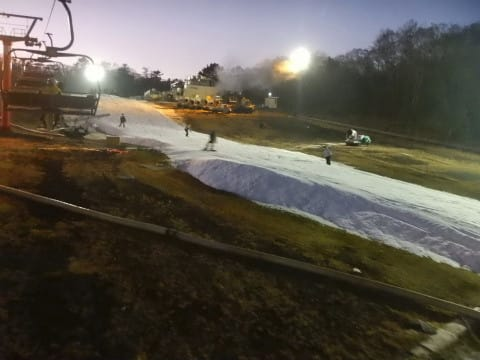

# 2020/11/21(土)のイエティ詳細レポート…天気は晴れ時々曇り，気温高めだけどコースに穴は開かず，それほど混まず．

📅 投稿日時: 2020-11-23 00:01:57

🏷️ カテゴリ: [2021スキー滑走日記](c2b0fc073d6357d3b786f6ca655147f7d.md)

えー．

やはり，19日~20日の高温はかなり効いたみたいで．

本日の一の瀬ファミリーの写真を見ると．

せっかく打った人工雪，ほぼ完全に

消滅してますね…（涙）

（[志賀高原リゾート開発Facebook](https://www.facebook.com/ShigaKogen.Ski/photos/pcb.3451551268294385/3451551154961063/?type=3&theater)より）

そして．

横手山はやっぱり予想通り3連休の

営業を諦めたようです（涙）

それだけじゃなく，月・火と人工降雪が

打てたとしても，週末まで営業しなさそうな

感じになってきました…（泣）．

（[横手山スキー場ホームページ](https://yokoteyama2307.com/news/11235/)より）

どうやら，春先まで雪をもたせることを優先に，

先週末みたいな薄い状態で，無理やり

週半ばにオープンしない方針に切り替えた

ようですね．

よっぽど冷えて，天然雪が積もるような

ことがあれば，週半ばでもオープンする

のかと思いますが…

今の天気図を見る限り，その可能性は

薄そうです（涙）

ということで．

横手山も今週いっぱい無理でしょう…

で．

28，29日の週末はオープンできそうか？？

と気になるところですが．

どうも，最新の週間予想を見ると，

冷え始めが29日になりそうで．

…これ，28，29日の週末に間に合わない

じゃん（涙）

でもまぁ，29日以降冷えてくれそうなので．

冷えないよりマシか…

12月5日の焼額オープンの週に期待かな！？？

…というところで．

今日は3連休の中日で混みそうだったので，

Yetiには行かず，家で車にワックス塗ったり

家の仕事をやったり何だりで過ごしたのですが．

また明日，Yetiで滑ってきます～！

とりあえず．

昨日のイエティの詳細レポートに行ってみましょうか…

えー．

まず．

あさイチは9時のオープン30分くらい前，

8時半ごろからチケット売り場はオープン．

いつもだと10分前くらいまで開かないのに，

最近は早く開くようになりましたね…

そして，10分ちょい前にはゲートの

中に入れるようになり．

ゲレンデ前でオープン時間まで待機します．

コース整備を眺めながら，９時の

コースオープンを待ちますが．

…ゲレンデには，かなり大量に

硫安を撒いてますね…

ってなことで．

9時のゲレンデオープンと同時に，

コースに飛び出す！

コース上は…

晴天シマシマで，硫安が効いてかなり

いい感じの硬いバーン！

うほーーーー！

これは…

今シーズン一番のバーン！！

今日来て良かった～！！

…あさイチの2本ほどは，

ガラガラのフルスピードで楽しめる

いい感じのバーンでしたが．

太陽が照っていたため，コースは

すぐに緩んじゃいました（涙）

そして，オープン30分後の9時半過ぎには，

ぼちぼちと人が増え始め…

そして，10時にはリフト待ち5分越え（泣）

とはいえ，すぐにペアリフトも動き出し，

クワッド＆ペアの2本体制となったので，

クワッドリフトも待ち時間5分以上に

伸びることは無く，ペアリフトは終日

待ち時間0だったのですが．

ただ，2本のリフトで人が送り込まれる

ゲレンデは…

人口密度が上がってきてしまい，

ちょっと快感度が低い感じに（涙）

そして，天気も良く，気温も暖かさを

感じるほどだったので…

ゲレンデの雪も，11時ごろには板の

滑りが悪くなってきて…

ところどころブレーキがかかるような

雪になってきました（涙）

とはいえ，コース幅は先週より広がった

感じで．

20日の雨でかなりやられたはずなのに，

穴が開いて茶色くなっているような

ところもなく．

人口密度は高かったものの，

まぁリフト待ちも平均的にこの程度，

5分前後だったので．

最大40分待ち，平均20分待ちだったらしい，

軽井沢よりマシかな…

最高でもこのくらいの待ち時間．

クワッドを待つのが嫌なら，

横のペアリフトまで歩けば，

板をもって乗らなきゃならないけど

待ち時間0で乗れるし．

かぐらも鹿沢もアサマもオープンしなかった

この週末，おそらくイエティが一番

状況が良かったのかも…

夕方になると，ちょっとコースは

荒れ気味になってきたけど．

でも，凸凹になるというわけでも無く…

雪が一番薄い部分でも，十分な厚みが

あり．

９時オープンからコース整備が入る

夕方16時まで，しっかり滑ってきたの

でした…

…そして．

当然のごとく，16時からコース整備が

入るとなれば．

シマシマハンターの私としては．

17時コースオープンのナイター一番

シマシマを狙わずばなるまい！！

…と，17時のコースオープンに並び…

行くぜ，ナイター一番乗り！！

…って前に一人いて2番手でしたが．

でも，硫安が効きまくったフラット

シマシマをいただき！！！！

うおおおお！

気持いい！

この1本だけのために，今日来た甲斐が

あったよ…！！

と，1本目は気持ちよかったものの．

2本目にはもう人が増え始め…

残念ながら，3本目には昼間と

同じ人口密度になってきました（涙）

ホントにこのスキー場，昼間より

ナイターの方が混むという，不思議な

スキー場だこと…

ナイターオープンから1時間，18時には

コースも完全に荒れてしまい．

そして，リフト待ちも昼間のピーク同等か

それを超える，5分以上の待ち時間と

なってきたので．

18時過ぎに退散したのでした…

ということで．

中1日はさみましたが．

また明日，イエティ滑ってきます～！

## 💬 コメント一覧

### 💬 コメント by (Northfox)
**タイトル**: う～～～ん
**投稿日**: 2020-11-23 10:16:04

28-29に志賀高原を予定していたのですが．．．悩ましいです。

### 💬 コメント by (Skier_S)
**タイトル**: ＞Northfoxさま
**投稿日**: 2020-11-24 02:01:30

横手はオープンすると思いますが．

一の瀬・熊の湯は微妙ですね…

明日24日以降，それほど人工雪が打てるチャンスがなさそうなので，

25日朝の時点の雪の出来高次第でほぼ決まるような気がしてます．

