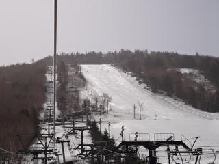

# 5月2日　志賀高原スキー場

📅 投稿日時: 2011-05-02 19:26:43

🏷️ カテゴリ: [2011スキー滑走日記](ca488c98cfb9169941c3e73770dcefb56.md)

今日は．

昨日，一昨日の雨の2日間の憂さを晴らすかのような晴れ！！

朝イチの一の瀬は，アイスバーンでちょいと固めでしたが．

9時過ぎには適度な固さに．

10時半ごろには一気に緩み始めました…

どうでもいいんですが，がらがらです．

ゲレンデに人がいません．

寂しいくらいです．

GWとはいえ，谷間はこんなに寂しいのか…

大回りしたい放題です．

雪の量は，やっぱり志賀は多いですね～．

一の瀬ファミリー下半分もぜんぜん土が出てません．

高天ヶ原のこぶ側，普段ならGWには雪がなくなっている

ことが多いんですが．

今年は雪があるどころか，こぶ溝にまだ土が出てきてないので，

ラインがいっぱい滑れます．

GWにここまで雪が残ったのは，あんまり記憶にないなぁ…

寺子屋もまだぜんぜん土が出てくる気配はありません．

それどころか．普通ならこの時期，汚れが浮いて

板が走らない雪になるものですが．

結構汚れが少なく，どぼどぼの水っぽい雪になることもなく．

割とよい感じのコンディションです．

一の瀬ファミリーの上半分も，普通のGWの夕方だと，

すごいでこぼこになって，削れたところは下地の氷が

出てきて，かろうじて土が出てくるのを防いでいるか，

土が顔を出し始める…というものですが．

今年はぜんぜん．

荒れはしたものの，普通の4月上旬の荒れ具合です．

さらに．一の瀬から見える焼額は，営業はしていませんが，

いつもならこの時期に土が丸見えになっているオリンピック

コースや白樺コースが完全に真っ白です．

うーーん．

今年，ぜひ焼額にGWまで営業してほしかった！！！

とりあえず．

志賀は，このGWもコンディションいいです．
