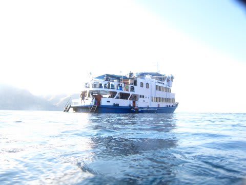
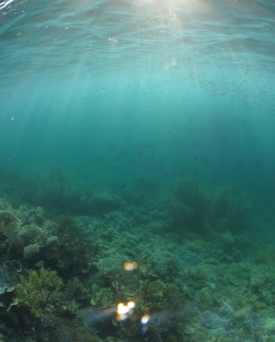
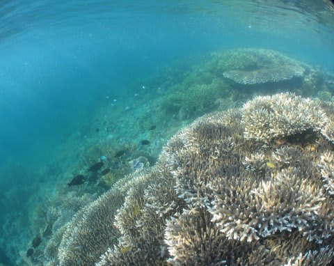
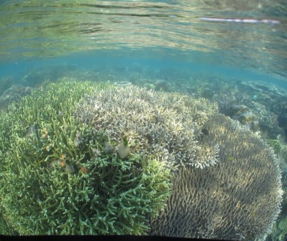
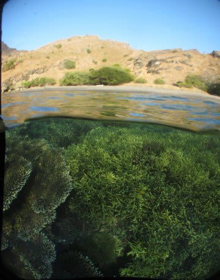
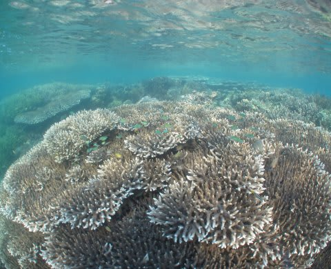
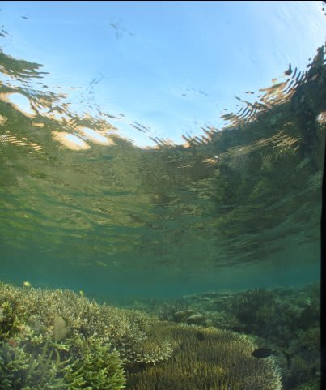
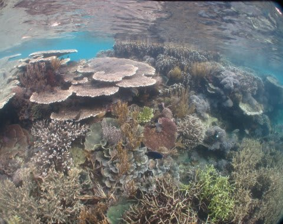

# 子連れコモドダイビングクルーズagain　その22　シュノーケリングも十分満足

📅 投稿日時: 2011-09-21 01:12:14

本日．石垣潜ってますが．

台風の影響のため．冬みたいな北風で．

普段入ったことのないポイントに入ってます．

天気もあんまりよくない…

また，こちらは追ってレポートするとしまして．

とりあえず，コモドレポート続きます…

---------

で．

3本目を潜ってもまだ4時．

流れもないところに本船が停泊しているんで．

娘を本船の周りで泳がせてみますかね…

と思ったけど．

娘は．珊瑚が怖いのか．

「泳がないよ～」

とのこと．

自分一人でシュノーケリングへ．

さっき潜ったポイントの安全停止をしたところ．

すごい珊瑚が綺麗だったので．

本船からエンヤコラと5分ほど泳いで向かいます．

かなり本気で5分ほど泳ぐと．

さっき潜った沈船の上に到達．

いやー．

このポイント．珊瑚が綺麗ですね．

シュノーケリングでこんなきれいな珊瑚が見えるとは…

半水面写真にもチャレンジ．

あまりにも綺麗だったので．

もう少し漂っていたかったけど

40分以上漂っていたでしょうか．

そろそろ4本目の時間なので，本船へ，

また，エンヤコラと泳いで戻ります．

…結構疲れた．

でも，これから4本目なんですねー．

海から上がったらすぐブリーフィング．

ポイントは，さっきと同じRehok Serah.

妻は，娘とお留守番です．

で．また同じポイントへ潜るので，

ボートでたった今戻ってきた道を逆走．

…ちょっと，なんだか．

一生懸命戻ってきたのが無駄になった気が…

とりあえず，ニシキテグリの産卵行動を見るための，サンセット～ナイトダイビングへ．Ｇｏ！
